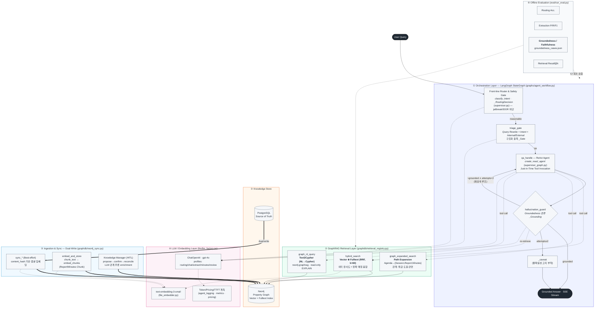

# Agentic GraphRAG Workflow

> Workmaite 백엔드(`backend/fastapi`)의 실제 구현을 근거로 도출한 종합 AI 아키텍처.
> 핵심 설계 원칙: **LangGraph 기반 상태 그래프 오케스트레이션 + Neo4j 하이브리드 GraphRAG 검색 + 사후 근거성(Groundedness) 검증의 폐회로(closed-loop) 통합.**

---

## 1. 종합 아키텍처 (Comprehensive Architecture)

---

## 2. 슬라이드 추천 문구 (Slide Copy)

### 제목 / 부제
- **제목:** Agentic GraphRAG Workflow
- **부제:** *Self-Verifying Knowledge Agent over a Hybrid Property Graph*
- **한 줄 요약:** "검색·추론·검증을 폐회로로 결합한 에이전트형 GraphRAG — 환각을 사후 검증하고 재검색으로 교정한다."

### 핵심 메시지 (Bullet Points)
- **상태 그래프 오케스트레이션 (LangGraph):** 단일 `triage_gate`가 질의 재작성·의도 분류·내부/외부 판별을 동시 수행하여 LLM 호출을 최소화하고, ReAct 에이전트가 도구를 *Just-in-Time*으로 호출한다.
- **하이브리드 GraphRAG 검색:** 벡터 의미 검색과 전문(fulltext) 검색을 **상호순위융합(Reciprocal Rank Fusion)** 으로 결합하고, 그래프 경로 확장(Path Expansion)과 **Text2Cypher** 다중홉 질의를 병행한다.
- **폐회로 근거성 검증 (Closed-Loop Faithfulness):** 답변 생성 후 `hallucination_guard`가 증거를 재검색·대조하여 근거 미달 시 **재검색 루프**로 교정하고, 한계 도달 시 불확실성을 명시한다.
- **단일 진실원천 + 듀얼라이트 (Dual-Write):** PostgreSQL을 Source of Truth로 두고 Neo4j는 best-effort 동기화하며, `content_hash` 기반 **증분 임베딩**으로 비용을 절감한다.
- **거버넌스 & 안전:** 전면(front-line) 라우터가 jailbreak를 차단하고, 모든 검색 도구가 테넌트 스코프(IDOR-guard)를 강제한다. HITL 워크플로로 LLM 추론 관계를 검수 후 반영한다.
- **정량 평가 내장 (Built-in Evaluation):** Routing 정확도, 추출 P/R/F1, **Groundedness/Faithfulness**, Retrieval Recall@k, TTFT 지연을 골든셋으로 회귀 검증한다.

### 학술적 정의 (Caption / Speaker Note)
> *We present an agentic GraphRAG pipeline that unifies (i) a LangGraph state-machine orchestrator with intent-conditioned routing, (ii) a hybrid retriever fusing dense vector similarity, sparse full-text matching (via Reciprocal Rank Fusion), and graph-structured path expansion with NL-to-Cypher translation over a property graph, and (iii) a post-hoc groundedness verifier that closes the loop by triggering re-retrieval upon faithfulness failure.*

---

## 3. 표기 범례 (Legend)

| 기호 | 의미 |
|------|------|
| `──▶` (실선) | 주요 제어 흐름 (control flow) |
| `══▶` (굵은선) | 데이터 적재/동기화 (dual-write ingestion) |
| `┄┄▶` (점선) | 보조 호출 (LLM/embedding/tool invocation, 검증 피드백) |
| ① Orchestration | LangGraph 상태 그래프 — 라우팅·triage·생성·검증 노드 |
| ② Retrieval | GraphRAG 하이브리드 검색 (Vector⊕Fulltext⊕Graph) |
| ③ Knowledge Store | Neo4j 프로퍼티 그래프 + PostgreSQL 진실원천 |
| ④ LLM/Embedding | OpenAI `gpt-4o` + `text-embedding-3-small` 및 계측 |
| ⑤ Ingestion | 듀얼라이트 동기화 + 청크 임베딩 + HITL 관계 추론 |
| ⑥ Evaluation | 오프라인 골든셋 회귀 평가 (groundedness 포함) |

---

### 부록 — 핵심 소스 매핑 (Code Provenance)

| 구성요소 | 파일 · 심볼 |
|----------|-------------|
| 상태 그래프 / 노드 | `graphs/agent_workflow.py` — `WState`, `triage_gate`, `qa_handle`, `hallucination_guard`, `get_workflow()` |
| ReAct 에이전트 | `graphs/supervisor_graph.py` — `_get_agent()`, `direct_agent_stream` |
| 라우터·안전 게이트 | `routers/supervisor.py` — `classify_intent`, `_RoutingDecision`, `supervisor_chat` |
| 하이브리드/그래프 검색 | `graphdb/retrieval_registry.py` — `hybrid_search`(RRF `_rrf`), `vector_search`, `graph_expanded_search` |
| Text2Cypher | `graphdb/graphrag_text2cypher.py` — `graph_nl_query`, `_ReadOnlyText2Cypher` |
| 임베딩 | `graphdb/file_embedder.py` — `embed_query`, `embed_chunks`, `chunk_text` |
| LLM 팩토리 | `llm/llm_factory.py` — `llm_factory`, `ainvoke_structured` |
| 듀얼라이트 동기화 | `graphdb/neo4j_sync.py` — `sync_*`, `_embed_if_changed`, `sync_all_from_pg` |
| HITL 관계 추론 | `agents/knowledge_manager.py` — `propose_relationships`, `confirm_relationships`, `reconcile_graph` |
| 평가 | `eval/run_eval.py` — `eval_groundedness`; `eval/retrieval_eval.py` — recall@k |
