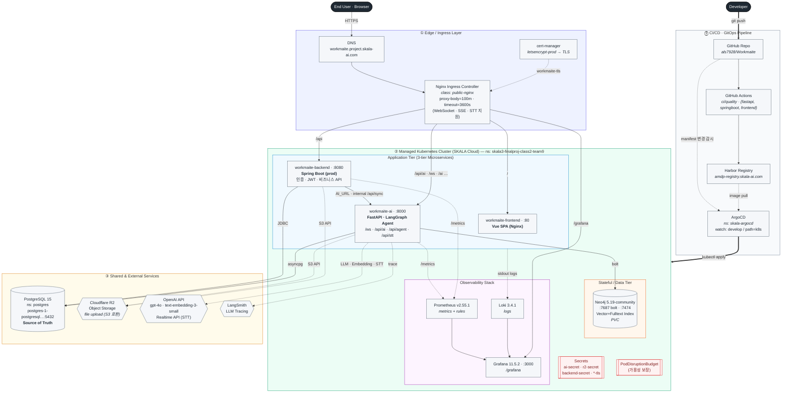

# Cloud Architecture

> Workmaite의 실제 배포 구성(`k8s/`, `argocd/`, `.github/workflows/`)을 근거로 도출한 종합 클라우드 아키텍처.
> 핵심 설계 원칙: **GitOps 기반 지속적 배포(ArgoCD) · Kubernetes 위의 3-tier 마이크로서비스 분리 · 관측성(Observability)과 보안(TLS·Secret·IDOR)을 일급(first-class)으로 통합.**

---

## 1. 종합 클라우드 아키텍처 (Comprehensive Cloud Architecture)

---

## 2. 슬라이드 추천 문구 (Slide Copy)

### 제목 / 부제
- **제목:** Cloud Architecture
- **부제:** *GitOps-Driven Microservices on Kubernetes with Integrated Observability*
- **한 줄 요약:** "선언적 GitOps(ArgoCD)로 배포되는 EKS 기반 3-tier 마이크로서비스 — TLS·Secret·관측성을 플랫폼 차원에서 일급으로 통합한다."

### 핵심 메시지 (Bullet Points)
- **선언적 GitOps 배포 (Declarative GitOps):** GitHub Actions가 서비스별로 빌드·품질검사 후 이미지를 **Harbor 레지스트리**에 푸시하고, **ArgoCD**가 `k8s/` 매니페스트를 단일 진실원천(Single Source of Truth)으로 삼아 EKS에 지속 동기화한다.
- **3-tier 마이크로서비스 분리:** **Vue SPA** · **Spring Boot**(인증·JWT·비즈니스) · **FastAPI**(LangGraph 에이전트·STT) 를 독립 배포 단위로 분리하고, Ingress가 경로 기반(path-based)으로 트래픽을 라우팅한다.
- **단일 진실원천 + 하이브리드 데이터 (Polyglot Persistence):** **PostgreSQL**(Source of Truth)과 **Neo4j**(Vector+Fulltext 프로퍼티 그래프)를 역할 분리하고, 파일은 **Cloudflare R2** 객체 스토리지에 저장한다.
- **엣지 보안 & 장기 연결 지원:** **cert-manager + Let's Encrypt**로 자동 TLS를 발급하고, Nginx Ingress의 타임아웃·바디 크기 튜닝으로 **WebSocket·SSE 스트리밍·STT 업로드**를 안정적으로 지원한다.
- **내장 관측성 (Built-in Observability):** **Prometheus·Loki·Grafana** 스택으로 메트릭·로그·대시보드를 클러스터 내부에서 통합 수집하며, PrometheusRule로 경보를 선언한다.
- **운영 안정성 (Operational Resilience):** Readiness/Liveness 프로브, 리소스 requests/limits, **PodDisruptionBudget**, Secret 분리(ai/r2/backend/tls), 내부 전용 `/api/sync` 비노출로 가용성과 보안을 동시에 확보한다.

### 학술적 정의 (Caption / Speaker Note)
> *We deploy a cloud-native, three-tier microservice system on a managed Kubernetes substrate, governed by a declarative GitOps control loop (ArgoCD) that continuously reconciles cluster state against a version-controlled manifest repository. A path-routing ingress with automated TLS provisioning fronts a polyglot persistence layer—relational source-of-truth (PostgreSQL), a hybrid vector/graph store (Neo4j), and S3-compatible object storage (Cloudflare R2)—while a co-located Prometheus/Loki/Grafana stack provides first-class observability across metrics and logs.*

---

## 3. 표기 범례 (Legend)

| 기호 | 의미 |
|------|------|
| `──▶` (실선) | 동기 요청 흐름 (HTTP/JDBC/bolt request) |
| `══▶` (굵은선) | 배포 파이프라인 (git push → ArgoCD apply) |
| `┄┄▶` (점선) | 보조 호출 (외부 API · 메트릭/로그 · TLS 주입) |
| ⓪ CI/CD | GitHub Actions → Harbor → ArgoCD GitOps |
| ① Edge | DNS · Nginx Ingress · cert-manager TLS |
| ② EKS Cluster | App(3-tier) · Data(Neo4j) · Observability · Secret |
| ③ External | PostgreSQL(공용 ns) · Cloudflare R2 · OpenAI(LLM·Embedding·Realtime STT) · LangSmith |

---

### 부록 — 인프라 구성 매핑 (Infra Provenance)

| 구성요소 | 매니페스트 · 출처 |
|----------|-------------------|
| Ingress · TLS · 경로 라우팅 | `k8s/ingress.yaml` — `public-nginx`, `letsencrypt-prod`, host `workmaite.project.skala-ai.com` |
| GitOps 배포 | `argocd/workmaite-app.yaml` — repo/branch=`develop`, path=`k8s`, ns=`skala3-finalproj-class2-team9` |
| CI/품질 파이프라인 | `.github/workflows/ci-{fastapi,springboot,frontend}.yml`, `quality-*.yml` |
| Frontend (Vue) | `k8s/frontend.yaml` — `workmaite-frontend:80`, image `…/workmaite-frontend` |
| Backend (Spring Boot) | `k8s/springboot.yaml` — `workmaite-backend:8080`, `SPRING_PROFILES_ACTIVE=prod`, `AI_URL`, JWT |
| AI (FastAPI · LangGraph) | `k8s/fastapi.yaml` — `workmaite-ai:8000`, probes `/health`, `ai-secret`·`r2-secret` |
| Neo4j (Graph + Vector) | `k8s/neo4j/{deployment,service,pvc,configmap}.yaml` — `neo4j:5.19-community`, bolt `7687` |
| PostgreSQL (Source of Truth) | `postgres-1-postgresql.postgres.svc.cluster.local:5432` (공용 `postgres` ns) |
| 관측성 스택 | `k8s/workmaite-{prometheus,loki,grafana}.yaml`, `k8s/prometheus-rules.yaml` |
| 가용성 · 보안 | `k8s/pdb.yaml`, `k8s/secrets.yaml`, `harbor-secret`(imagePullSecret) |
| 객체 스토리지 | `r2-secret` (Cloudflare R2 · S3 호환 API) |
| LLM / Embedding / STT | OpenAI `gpt-4o` · `text-embedding-3-small` · Realtime API STT (`ai-secret`) |
| LLM 트레이싱 | LangSmith (`LANGSMITH_*`) |
