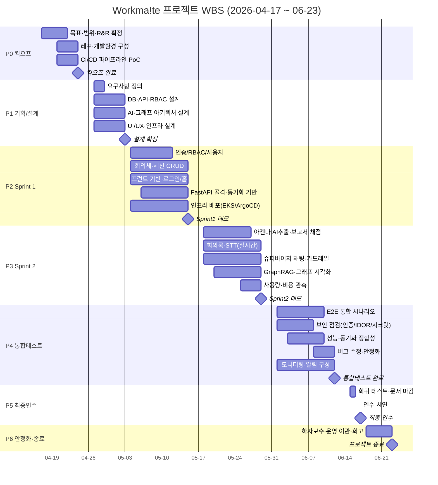

# Workma!te 프로젝트 WBS (Work Breakdown Structure)

**AI 회의체 운영 Agent 서비스 — Team No.9**

| 항목 | 내용 |
|---|---|
| 프로젝트명 | Workma!te (AI Archive Link Platform) |
| 전체 기간 | **2026-04-17 (금) ~ 2026-06-23 (화)**, 약 10주 |
| 문서 버전 | v1.0 (2026-06-17 작성) |
| 산출물 근거 | 현행 코드베이스(`frontend/`, `backend/springboot/`, `backend/fastapi/`, `ddl/`, `k8s/`, `docs/`) |

---

## 1. 개요

본 WBS는 Workma!te 서비스 개발을 6개 Phase로 분해하고, 각 Phase의 작업 패키지(Work Package)·산출물·담당·일정·의존성을 정의한다. 작업 내용은 **실제 구현된 코드베이스**(인증/RBAC, 회의체·세션·아젠다·보고서·회의록 도메인, AI 슈퍼바이저·GraphRAG, PG↔Neo4j 동기화, Vue SPA, EKS/ArgoCD 인프라)를 역으로 분해해 매핑했다.

> 요청 Phase는 **Phase 5 최종인수(~06-17)** 까지이며, 계약 기간(~06-23)을 채우기 위해 **Phase 6 안정화·이관·종료(06-18~06-23)** 를 추가했다.

---

## 2. 담당자 범례 (R&R)

| 코드 | 이름 | 역할 |
|---|---|---|
| **PM** | 안민혁 | PM — 일정·범위·이해관계자 조율·인수 |
| **FE** | 안상연 | Front-end & AI |
| **BE1** | 이한결 | Back-end & AI |
| **BE2** | 윤세준 | Back-end & AI |
| **INF1** | 김세림 | Infra & AI |
| **INF2** | 이다예 | Infra & AI |
| **ALL** | 전원 | 공동 작업 |

> AI 기능(LangGraph 에이전트·GraphRAG·STT)은 전 직군이 **& AI**로 교차 참여한다.

---

## 3. 전체 일정 요약

| Phase | 명칭 | 시작 | 종료(마일스톤) | 영업일 | 핵심 산출물 |
|---|---|---|---|---|---|
| **P0** | 킥오프 | 04-17 (금) | **04-24 (금)** | 6d | 레포·환경·CI/CD PoC |
| **P1** | 기획/설계 | 04-27 (월) | **05-03 (일)** | 5d | 요구사항·DB/API/AI 아키텍처 설계서 |
| **P2** | Sprint 1 (핵심 도메인) | 05-04 (월) | **05-15 (금)** | 9d | 인증·도메인 CRUD·기반 인프라 |
| **P3** | Sprint 2 (AI 기능) | 05-18 (월) | **05-29 (금)** | 10d | AI 에이전트·GraphRAG·그래프 UI |
| **P4** | 통합테스트 | 06-01 (월) | **06-12 (금)** | 10d | E2E·보안·성능·안정화 |
| **P5** | 최종인수 | 06-15 (월) | **06-17 (수)** | 3d | 인수 시연·최종 문서 |
| **P6** | 안정화·이관·종료 | 06-18 (목) | **06-23 (화)** | 4d | 하자보수·운영 이관·회고 |

**공휴일/비가동:** 어린이날 05-05(화), 현충일 06-06(토). 주말 제외.

---

## 4. 전체 일정 간트 차트

---

## 5. Phase별 상세 WBS

> 표기: **WBS** 코드 / 작업 / 산출물(코드 경로) / 담당 / 시작~종료 / 선행.

### Phase 0 — 킥오프 (04-17 ~ 04-24)

목표: 팀·환경·배포 파이프라인 기반을 먼저 세운다(기능 전 인프라 검증).

| WBS | 작업 | 산출물 | 담당 | 일정 | 선행 |
|---|---|---|---|---|---|
| 0.1 | 프로젝트 목표·범위 정의 | 프로젝트 헌장, 범위 기술서 | PM | 04-17~04-20 | — |
| 0.2 | 팀 R&R·협업 규칙 확정 | R&R·브랜치 전략(`dev/*`,`feat/*`,`develop`) | PM | 04-17~04-21 | 0.1 |
| 0.3 | 기술 스택 선정 | 스택 결정서(Vue3·Spring Boot·FastAPI·PG·Neo4j·EKS) | ALL | 04-20~04-22 | 0.1 |
| 0.4 | 모노레포·개발환경 구성 | `README.md`, `.env.example`, `.editorconfig`, 디렉토리 골격 | INF1, BE1 | 04-20~04-24 | 0.3 |
| 0.5 | CI/CD 파이프라인 PoC | `.github/workflows/`, `k8s/`, `argocd/`, health check(`/health`,`/actuator/health`) | INF1, INF2 | 04-20~04-24 | 0.4 |
| 0.6 | 데이터스토어 프로비저닝 | PostgreSQL·Neo4j(`k8s/neo4j/`) 기동·포트포워딩 | INF2 | 04-22~04-24 | 0.4 |
| **M0** | **킥오프 완료** | 환경·CI/CD·DB 준비 완료 | PM | **04-24** | 0.1~0.6 |

### Phase 1 — 기획/설계 (04-27 ~ 05-03)

목표: 도메인·API·AI·인프라 설계를 확정해 Sprint 진입 준비.

| WBS | 작업 | 산출물 | 담당 | 일정 | 선행 |
|---|---|---|---|---|---|
| 1.1 | 요구사항 정의 | 요구사항 명세(회의체 운영·아젠다·보고서·회의록·카드뉴스) | PM, ALL | 04-27~04-29 | M0 |
| 1.2 | 도메인 모델·DB 스키마 설계 | ER·`ddl/schema.sql`·`relation.sql`·`index.sql` 초안, bigint 표준 | BE1, BE2 | 04-27~05-03 | 1.1 |
| 1.3 | REST API 설계 | API 규약(`/api/v1`, `ApiResponse`, ErrorCode, 페이지네이션 `docs/api-pagination.md`) | BE2 | 04-28~05-03 | 1.1 |
| 1.4 | 인증/인가(RBAC) 설계 | JWT(HS256, access/refresh), company_role×meeting_role 가드 설계 | BE1 | 04-28~05-03 | 1.1 |
| 1.5 | AI 에이전트 아키텍처 설계 | supervisor 라우팅·LangGraph·도구·데이터 스코프(`docs/ai-data-scope.md`) | FE, BE1 | 04-27~05-03 | 1.1 |
| 1.6 | 지식그래프 모델 설계 | Neo4j 노드/관계 스키마(`rel_schema.py`), PG→Neo4j 동기화 전략(Outbox) | BE2, INF1 | 04-28~05-03 | 1.2 |
| 1.7 | UI/UX 설계 | 와이어프레임, 페이지 구조(Home·Archive·Session·Company), 그래프 시각화 컨셉 | FE | 04-27~05-03 | 1.1 |
| 1.8 | 인프라 아키텍처 설계 | k8s 토폴로지, Ingress 라우팅, 모니터링(Prometheus/Grafana/Loki) 설계 | INF1, INF2 | 04-27~05-03 | M0 |
| **M1** | **설계 확정** | 설계 리뷰 통과·Sprint 백로그 확정 | PM | **05-03** | 1.1~1.8 |

### Phase 2 — Sprint 1: 핵심 도메인 + 기반 (05-04 ~ 05-15)

목표: 인증·핵심 CRUD·프런트/AI 골격·배포 기반을 동작시킨다. *(05-05 어린이날 비가동)*

| WBS | 작업 | 산출물 | 담당 | 일정 | 선행 |
|---|---|---|---|---|---|
| 2.1 | 인증/토큰 구현 | `auth`(signup/login/refresh/logout), `JwtTokenProvider`, `JwtAuthenticationFilter` | BE1 | 05-04~05-11 | M1 |
| 2.2 | RBAC 인가 가드 | `MeetingAccessGuard`(requireView/MeetingEdit/OwnedEdit), `CustomUserDetailsService` | BE1 | 05-07~05-13 | 2.1 |
| 2.3 | 사용자/회사 도메인 | `user`·`company` 도메인, 사용자 검색·역할 관리 | BE2 | 05-04~05-10 | M1 |
| 2.4 | 회의체·멤버 CRUD | `meetings` 도메인, `meeting_members`, 역할 배정 | BE2 | 05-08~05-15 | 2.3 |
| 2.5 | 세션 CRUD·라이프사이클 | `sessions`(start/pause/resume/end/archive), `session_members` | BE1 | 05-11~05-15 | 2.4 |
| 2.6 | DB 스키마 적용 | `ddl/*` 운영 반영, 인덱스, 전역 예외(`GlobalExceptionHandler`) | BE1, BE2 | 05-04~05-07 | M1 |
| 2.7 | 프런트 기반 골격 | `router.js`(가드), Pinia 스토어, `api.js`(이중 인스턴스·토큰 갱신), `MainLayout` | FE | 05-04~05-11 | M1 |
| 2.8 | 로그인·홈·회의체 화면 | `LandingPage`·`HomePage`·`MeetingsPage`, 공통 컴포넌트(`AppTable`·`AppPagination`) | FE | 05-08~05-15 | 2.7, 2.4 |
| 2.9 | FastAPI 골격 + JWT 검증 | `main.py`, `core/auth`(JWT 공유 검증), `llm_factory`, 라우터 등록 | BE1, FE | 05-06~05-12 | 2.1 |
| 2.10 | PG→Neo4j 동기화 기반 | `neo4j_sync`(Outbox 소비), `routers/sync.py`, 기본 노드/제약·인덱스 | BE2 | 05-08~05-15 | 1.6, 2.4 |
| 2.11 | 인프라 배포 | `k8s/*`(frontend/backend/ai), Ingress, ArgoCD 자동 동기화, 3개 서비스 기동 | INF1, INF2 | 05-04~05-15 | M0 |
| 2.12 | 감사 로그 기반 | `audit`(@AuditLogged AOP), `audit_middleware` | BE1 | 05-12~05-15 | 2.2 |
| **M2** | **Sprint 1 데모** | 로그인→회의체/세션 CRUD→배포 동작 시연 | PM | **05-15** | 2.1~2.12 |

### Phase 3 — Sprint 2: AI 기능 + 고급 (05-18 ~ 05-29)

목표: AI 에이전트·GraphRAG·STT·그래프 시각화 등 차별화 기능 구현.

| WBS | 작업 | 산출물 | 담당 | 일정 | 선행 |
|---|---|---|---|---|---|
| 3.1 | 아젠다 도메인 + AI 추출 | `agendas` CRUD, `task_extractor`(추출·HITL), 담당자 배정 | BE2, FE | 05-18~05-25 | M2 |
| 3.2 | 보고서 + AI 채점 + HITL | `reports`(버전트리), `report_scores`, `report_reviewer`(검토·interrupt) | BE1, FE | 05-18~05-27 | M2 |
| 3.3 | 회의록 생성·요약 | `minutes` 도메인, `minutes_generator`, refine·요약 | BE2 | 05-20~05-27 | M2 |
| 3.4 | STT — 배치 + 실시간 전사 | `routers/stt`, `realtime/transcription`(WebSocket·OpenAI Realtime), 화자 라벨 | FE, BE1 | 05-18~05-29 | M2 |
| 3.5 | 슈퍼바이저 채팅 | `supervisor`(의도분류·라우팅), `graphs/agent_workflow`(triage→QA→환각검증), ReAct | BE1, FE | 05-18~05-29 | 2.9 |
| 3.6 | 에이전트 도구·데이터 스코프 | `tools/meeting_tools`·`action_tools`, `agent_scope`(IDOR 이중 방어) | BE1 | 05-20~05-27 | 3.5 |
| 3.7 | GraphRAG 검색 | `retrieval_registry`(벡터/풀텍스트/하이브리드), `graphrag_text2cypher`, `file_embedder` | BE2 | 05-20~05-29 | 2.10 |
| 3.8 | 그래프 시각화 | `GraphView`(PixiJS+d3-force), `useGraphBuilder`, `relSchema`, 노드/관계 렌더 | FE | 05-20~05-29 | 2.10 |
| 3.9 | 아카이브·세션 페이지 | `ArchivePage`·`SessionPage`, AI 사이드바(`AgentSidebar`·`AgentComposer`), 채팅 스트리밍(SSE) | FE | 05-22~05-29 | 3.5 |
| 3.10 | 사용량·비용 관측 | `agent_logging`(token_usage_logs), `pricing.yaml`, `metrics`(TTFT), `usage` 라우터 | INF1, BE2 | 05-25~05-29 | 3.5 |
| 3.11 | 동기화 고도화 | 증분 sync·삭제 전파·orphan 정리·관계 파생(부서 참여 등) | BE2 | 05-25~05-29 | 2.10 |
| **M3** | **Sprint 2 데모** | AI 채팅·추출·검토·STT·그래프 전체 흐름 시연 | PM | **05-29** | 3.1~3.11 |

### Phase 4 — 통합테스트 (06-01 ~ 06-12)

목표: 전 기능 통합·보안·성능·정합성 검증 및 안정화. *(06-06 현충일 비가동)*

| WBS | 작업 | 산출물 | 담당 | 일정 | 선행 |
|---|---|---|---|---|---|
| 4.1 | E2E 통합 시나리오 테스트 | 회의 준비→진행(STT)→회의록→보고서 검토→아카이브 전 흐름 테스트 케이스·결과 | ALL | 06-01~06-10 | M3 |
| 4.2 | 보안 점검 | 인증/인가·IDOR·시크릿 관리·감사 로그 점검(`security-review`), 취약점 조치 | BE1, INF1 | 06-01~06-08 | M3 |
| 4.3 | 성능·부하 테스트 | 채팅 TTFT, 검색 응답, 동시성(슈퍼바이저 single_flight·일일 예산) | BE2, INF2 | 06-03~06-10 | M3 |
| 4.4 | PG↔Neo4j 정합성 검증 | 전체 재동기화·증분·삭제 전파·orphan 정리 정합성, 관계 스키마 일치 | BE2 | 06-03~06-09 | 3.11 |
| 4.5 | 프런트 통합·회귀 | 페이지 통합, Vitest 회귀, 토큰 갱신·SSE·그래프 렌더 검증 | FE | 06-01~06-10 | M3 |
| 4.6 | 품질 게이트 정비 | 3개 스택 품질 워크플로(ruff/mypy·spotless/checkstyle·eslint/vitest) green화 | ALL | 06-01~06-08 | M3 |
| 4.7 | 모니터링·알림 구성 | Grafana 대시보드, `PrometheusRule`(5xx·TTFT·재시작 알림), Loki 로그 | INF1, INF2 | 06-01~06-12 | 3.10 |
| 4.8 | 버그 수정·안정화 | 결함 트래킹·수정, `Plan.md` P0~ 이슈 처리 | ALL | 06-08~06-12 | 4.1~4.5 |
| **M4** | **통합테스트 완료** | 통과 기준 충족·릴리스 후보(RC) 확정 | PM | **06-12** | 4.1~4.8 |

### Phase 5 — 최종인수 (06-15 ~ 06-17)

목표: 최종 회귀·문서 마감·인수 시연.

| WBS | 작업 | 산출물 | 담당 | 일정 | 선행 |
|---|---|---|---|---|---|
| 5.1 | 인수 체크리스트 작성 | 인수 기준·시나리오 체크리스트 | PM | 06-15~06-15 | M4 |
| 5.2 | 최종 회귀 테스트 | RC 회귀 결과, 잔여 결함 zero화 | ALL | 06-15~06-16 | M4 |
| 5.3 | 문서 마감 | `개발표준정의서.md`, `README.md`, `docs/*`, 운영 가이드 | ALL | 06-15~06-16 | M4 |
| 5.4 | 인수 시연 | 데모 시나리오 시연·Q&A | PM, ALL | 06-17~06-17 | 5.1~5.3 |
| 5.5 | 인수 결함 즉시 조치 | 시연 중 지적사항 핫픽스 | ALL | 06-17~06-17 | 5.4 |
| **M5** | **최종 인수** | 인수 확인서·릴리스 승인 | PM | **06-17** | 5.1~5.5 |

### Phase 6 — 안정화·이관·종료 (06-18 ~ 06-23)

목표: 인수 후 하자보수·운영 이관·프로젝트 종료(계약 기간 마감).

| WBS | 작업 | 산출물 | 담당 | 일정 | 선행 |
|---|---|---|---|---|---|
| 6.1 | 하자보수·안정화 | 인수 후 결함 조치, 운영 모니터링 관찰 | ALL | 06-18~06-22 | M5 |
| 6.2 | 운영 이관(핸드오버) | 운영 런북, 시크릿 회전 절차(`SECURITY_ROTATION.md`), 배포/롤백 가이드 | INF1, INF2 | 06-18~06-22 | M5 |
| 6.3 | 산출물 정리·아카이빙 | 최종 산출물 패키징, 리포 태깅 | PM, ALL | 06-19~06-23 | 6.1 |
| 6.4 | 회고(Retrospective) | 회고 보고서, 교훈(lessons learned) | PM, ALL | 06-23~06-23 | 6.1~6.3 |
| **M6** | **프로젝트 종료** | 종료 보고·계약 마감 | PM | **06-23** | 6.1~6.4 |

---

## 6. 마일스톤 요약

| 마일스톤 | 일자 | 판정 기준(Exit Criteria) |
|---|---|---|
| **M0** 킥오프 완료 | 04-24 | 레포·환경·CI/CD PoC·DB 기동 완료 |
| **M1** 설계 확정 | 05-03 | DB/API/RBAC/AI/인프라 설계 리뷰 통과 |
| **M2** Sprint 1 데모 | 05-15 | 인증·핵심 CRUD·배포 동작 |
| **M3** Sprint 2 데모 | 05-29 | AI 채팅·추출·검토·STT·그래프 동작 |
| **M4** 통합테스트 완료 | 06-12 | E2E·보안·성능·품질 게이트 통과(RC) |
| **M5** 최종 인수 | 06-17 | 인수 시연·인수 확인서 |
| **M6** 프로젝트 종료 | 06-23 | 이관·회고·계약 마감 |

---

## 7. 워크스트림 ↔ 담당 매트릭스

| 워크스트림 | 주담당 | 협업 | 주요 Phase |
|---|---|---|---|
| 인증·RBAC·도메인 CRUD (Spring) | BE1, BE2 | — | P2 |
| AI 에이전트·LangGraph·도구 | BE1, FE | BE2 | P3 |
| GraphRAG·Neo4j·동기화 | BE2 | INF1 | P2~P3 |
| STT(배치·실시간) | FE, BE1 | — | P3 |
| 프런트엔드(SPA·그래프 UI) | FE | — | P2~P3 |
| 인프라·CI/CD·모니터링 | INF1, INF2 | — | P0, P2, P4 |
| 보안·품질·문서 | ALL | PM | P4~P5 |
| 일정·범위·인수 | PM | ALL | 전체 |

---

## 8. 가정·제약·리스크

**가정**
- 영업일은 월~금. 공휴일(05-05 어린이날, 06-06 현충일) 및 주말은 비가동.
- OpenAI·Neo4j·EKS 등 외부 의존성은 Phase 0에서 가용 확보.
- Phase 1 설계 마감(05-03)은 일요일이나 산출물 기준 마일스톤으로 운영.

**제약**
- `develop` 브랜치 push가 배포를 트리거하므로, 통합테스트 전까지 배포 영향 관리 필요.
- 단일 replica 전제(Outbox·WebSocket·idempotency 인메모리) — 확장 시 별도 작업.

**주요 리스크 & 대응**
| 리스크 | 영향 | 대응 |
|---|---|---|
| AI 품질(환각·라우팅 오류) | 기능 신뢰도 | 가드레일(환각검증)·HITL·`eval/` 스모크 평가 |
| PG↔Neo4j 동기화 불일치 | 데이터 정합 | Outbox + 주기 전체 재동기화 + orphan 정리 안전장치 |
| 평문 시크릿·IDOR 등 보안 | 인수 차질 | P4 보안 점검·시크릿 회전(`SECURITY_ROTATION.md`) |
| 일정 압박(2 Sprint) | 범위 초과 | Sprint 백로그 우선순위화·핵심 우선 구현 |
| 머지 회귀(타입/포맷) | 빌드 실패 | 머지 전 컴파일·품질 게이트 확인 |

---

> 본 WBS는 진행에 따라 갱신한다. 실제 작업·일정 변경 시 해당 Phase 표와 간트 차트를 함께 업데이트한다.
