<div align="center">

# Workma!te 개발표준정의서
## Software Development Standards Definition

**AI Archive Link Platform**

| 항목 | 내용 |
|---|---|
| 프로젝트명 | Workma!te (회의체 운영 AI Agent 서비스) |
| 문서명 | 개발표준정의서 (Development Standards Definition) |
| 문서 버전 | v2.0 |
| 작성 기준 브랜치 | `dev/minhyuk` |
| 최종 수정일 | 2026-06-17 |
| 분류 | 대외비 / 개발 내부 표준 |
| 적용 대상 | Frontend(Vue 3) · Backend(Spring Boot · FastAPI) · DB(PostgreSQL · Neo4j) · Infra(Kubernetes · ArgoCD) |

</div>

---

## 개정 이력 (Revision History)

| 버전 | 일자 | 작성자 | 변경 내용 |
|---|---|---|---|
| v0.1 | 2026-06-07 | Team No.9 | 초안 — 실행 방법·환경변수 정리 수준 |
| v1.0 | 2026-06-14 | Team No.9 | 스택/구조/CI 표준 1차 정의 |
| v2.0 | 2026-06-17 | Team No.9 | 전 코드베이스 정밀 조사 기반 전면 확장(아키텍처·API 전수·DB 데이터딕셔너리·AI 에이전트·보안·인프라·관측성 추가, 다이어그램 다수 포함) |

---

## 문서 표기 규약 (Notation)

본 문서는 다음 표기를 따른다.

- **✅ MUST / 필수** — 반드시 지켜야 하는 규칙. CI 게이트 또는 코드리뷰에서 강제된다.
- **⭕ SHOULD / 권장** — 특별한 사유가 없으면 따른다.
- **🚫 MUST NOT / 금지** — 절대 해서는 안 되는 사항.
- **⚠️ 주의** — 과거 사고·함정에서 도출된 경고. 위반 시 장애로 직결된 이력이 있다.
- **💡 근거(Rationale)** — 규칙이 왜 그렇게 정해졌는지의 배경.
- 코드/식별자/경로는 `monospace`로, 외부 계약(DB 컬럼·API 키)은 **굵게** 강조한다.
- 다이어그램은 Mermaid 또는 ASCII로 그리며, GitHub·VS Code·IntelliJ 마크다운 뷰어에서 렌더링된다.

> 본 문서의 모든 규칙은 **실제 코드베이스 관찰**에 근거한다. "표준"과 "현행 코드"가 어긋나는 지점은 각 장 말미의 *현행 격차(Gap)* 절에 명시하고, 개선 방향을 함께 적는다. 따라서 본 문서는 *지향점*과 *현황*을 동시에 기술하는 living document다.

---

## 목차 (Table of Contents)

1. **문서 개요** — 목적·범위·산출물 위치·용어
2. **시스템 아키텍처 총론** — 구성도·데이터 흐름·요청 생명주기·배포 토폴로지
3. **기술 스택 표준** — 전 스택 버전·선정 근거·버전 정책
4. **개발 환경 및 형상관리 표준** — 로컬 셋업·브랜치·커밋·PR·코드리뷰
5. **공통 코딩 규칙** — 인코딩·명명·주석·시간·로깅·시크릿
6. **프런트엔드 개발 표준 (Vue 3)** — 구조·컴포넌트·상태·라우팅·API·컴포저블·스타일·그래프·테스트
7. **백엔드 개발 표준 (Spring Boot)** — 패키지·계층·DTO·엔티티·예외·인증·감사·동기화
8. **백엔드 개발 표준 (FastAPI / AI)** — 패키지·라우터·가드·에이전트·도구·LLM·GraphDB·실시간
9. **API 설계 표준** — URL·상태코드·응답·에러코드·권한·페이지네이션·SSE/WS
10. **데이터베이스 설계 표준** — 스키마 관리·데이터 딕셔너리·ER·인덱스·Neo4j·동기화
11. **AI/LLM 개발 표준** — 모델·프롬프트·구조화 출력·비용 관측·스코프·HITL·가드레일
12. **보안 표준** — 인증/인가·시크릿·IDOR·검증·감사·취약점 대응
13. **인프라 및 배포 표준** — Docker·Kubernetes·Ingress·ArgoCD·시크릿·가용성
14. **CI/CD 및 품질 게이트 표준** — 워크플로·정적분석·이미지 태깅·배포 흐름
15. **관측성(Observability) 표준** — 메트릭·로깅·추적·대시보드·알림
16. **테스트 표준** — 단위/통합·운영DB 금지 원칙·AI eval
17. **문서화 표준** — 코드 문서·API 문서·표준 유지보수
18. **부록** — 환경변수 전수·포트 매핑·에러코드·관계 스키마·체크리스트·용어집

---

# 1. 문서 개요

## 1.1 목적

본 개발표준정의서는 Workma!te 서비스 개발에 참여하는 모든 구성원이 **일관되고 안전하며 유지보수 가능한** 코드를 생산하도록, 프로젝트 전반에 걸친 기술적 표준을 단일 문서로 정의하는 것을 목적으로 한다. 구체적으로 다음을 규정한다.

1. **구조 표준** — 디렉토리·패키지·모듈을 어떻게 나누고 배치하는가.
2. **코딩 표준** — 명명·포맷·주석·언어 사용 규칙.
3. **설계 표준** — API 계약, 데이터베이스 스키마, 그래프 모델, AI 에이전트의 설계 규약.
4. **품질 표준** — 정적분석·테스트·코드리뷰의 통과 기준.
5. **운영 표준** — 형상관리, CI/CD, 배포, 보안, 관측성.

이 문서는 신규 입사자의 온보딩 교재이자, 기능 추가·리팩터링 시 의사결정의 기준선이며, 코드리뷰의 합의된 근거다.

## 1.2 적용 범위

```
Workma!te 모노레포 전체
├── frontend/          ← 6장
├── backend/springboot/ ← 7장
├── backend/fastapi/    ← 8장
├── ddl/                ← 10장
├── k8s/ · argocd/      ← 13장
├── .github/workflows/  ← 14장
└── docs/               ← 17장
```

본 표준은 위 전 영역에 적용된다. 단, 외부 팀이 관리하는 컴포넌트(`workmaite-wlk`, `workmaite-whisper` 등 레포에 매니페스트가 없는 서비스)와 서드파티 라이브러리 내부 코드는 적용 대상이 아니다.

## 1.3 적용 원칙 (Guiding Principles)

본 표준 전체를 관통하는 다섯 가지 상위 원칙이다. 개별 규칙이 모호하거나 충돌할 때는 이 원칙으로 판단한다.

| # | 원칙 | 의미 |
|---|---|---|
| P1 | **기존 패턴 우선** | 새 코드는 주변 코드의 명명·주석 밀도·관용구를 그대로 따른다. "더 나은 방식"이라도 국소적으로 도입하지 않고, 표준 개정을 통해 전역적으로 바꾼다. |
| P2 | **자동화 게이트 신뢰** | 포맷·린트·타입·테스트는 사람이 아니라 CI가 강제한다. 로컬에서 게이트를 통과시킨 뒤 PR을 올린다. |
| P3 | **외부 계약 불변** | DB 컬럼명·REST JSON 키·그래프 관계명 등 *외부 계약*은 함부로 바꾸지 않는다. 내부 식별자만 개명한다. |
| P4 | **신뢰 경계에서 강제** | 권한·스코프·검증은 "착한 호출자"를 가정하지 않고, 서버(신뢰 경계)에서 강제한다. 특히 AI 모델의 출력은 신뢰하지 않는다. |
| P5 | **단일 소스 원칙(SSOT)** | 관계 어휘·인덱스 정의·단가표·ID 명명·context_type 등은 한 곳에서만 정의하고 나머지는 참조·미러링한다. |

💡 **근거:** 이 프로젝트는 3개 언어·2개 DB·다수의 AI 에이전트가 얽힌 복합 시스템이며, 5명이 병렬로 작업한다. 개인의 국소 최적화가 전역 일관성을 해치는 비용이 매우 크기 때문에, "일관성 > 개인 취향"을 최상위 가치로 둔다.

## 1.4 핵심 용어 정의

| 용어 | 영문/코드 | 설명 |
|---|---|---|
| 회의체 | Meeting (`meetings`) | 반복적으로 운영되는 상위 회의 단위(예: 주간 전략회의). 멤버·아젠다·세션·보고서를 포함한다. |
| 세션 | Session (`meeting_sessions`) | 회의체에서 실제로 1회 열린 회의. STT 전사·회의록이 귀속된다. |
| 아젠다 | Agenda (`agenda`) | 회의 안건. AI가 자료에서 추출하거나 수동 생성한다. |
| 회의록 | Minutes (`minutes`) | 세션의 결과 기록. 세션당 1개(UNIQUE). |
| 보고자료 | Report (`reports`) | 회의에 제출되는 문서. 버전 트리(parent_id)와 AI 채점(report_scores)을 가진다. |
| 조직 권한 | companyRole (`users.role`) | 회사 차원 권한: `USER` / `COMPANY_ADMIN` / `SYSTEM_ADMIN`. |
| 회의체 권한 | meetingRole (`meeting_members.role`) | 회의체 차원 권한: `admin`(간사) / `member`(참여자). |
| 슈퍼바이저 | Supervisor | 사용자 채팅 요청을 분류·도구 호출로 처리하는 중앙 AI 에이전트. |
| HITL | Human-in-the-loop | AI 제안을 사람이 승인/거부한 뒤에야 확정 반영하는 흐름. |
| GraphRAG | — | Neo4j 지식 그래프 + 벡터/풀텍스트 검색을 결합한 검색 증강 생성. |
| Outbox | Transactional Outbox | PG 트랜잭션과 동일 원자성으로 동기화 메시지를 적재 후 비동기 전송하는 패턴. |
| SoR | System of Record | 데이터의 권위 있는 단일 원천. 본 시스템에서는 PostgreSQL. |

## 1.5 산출물 및 관련 문서

| 문서 | 경로 | 내용 |
|---|---|---|
| 본 표준 | `개발표준정의서.md` | 개발 전반 표준(본 문서) |
| 프로젝트 README | `README.md` | 빠른 시작·실행 방법 |
| 개선 계획 | `Plan.md` | 단계별(P0~) 개선 로드맵 |
| 시크릿 회전 절차 | `SECURITY_ROTATION.md` | 노출 시크릿 교체 런북 |
| AI 데이터 스코프 | `docs/ai-data-scope.md` | AI 데이터 접근 범위 규칙 |
| 페이지네이션 규약 | `docs/api-pagination.md` | keyset/offset 페이지네이션 |
| CI/CD 파이프라인 | `docs/infra/cicd-pipeline.md` | 초기 배포 파이프라인 설계 |

---

# 2. 시스템 아키텍처 총론

본 장은 표준을 이해하기 위한 전제로서 시스템 전체 구조를 조망한다. 세부 컴포넌트 표준은 6~8장, 데이터는 10장, 인프라는 13장에서 다룬다.

## 2.1 아키텍처 개요

Workma!te는 **단일 프런트엔드 + 이중 백엔드 + 이중 데이터스토어** 구조의 SPA 기반 웹 서비스다. 인증·CRUD를 담당하는 Spring Boot와, AI 에이전트·실시간·그래프를 담당하는 FastAPI를 **역할로 분리**하되, 동일한 PostgreSQL을 공유한다.

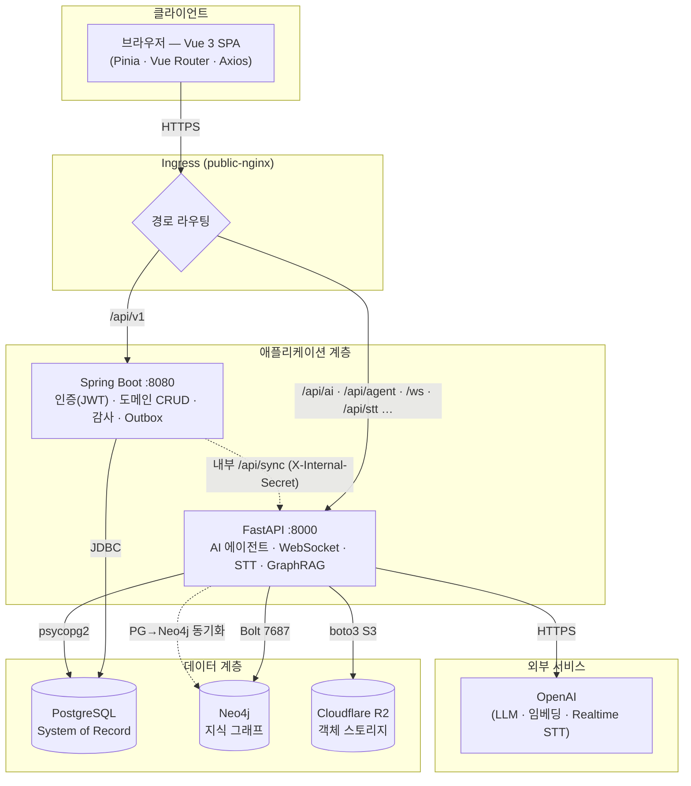

### 책임 분리(Separation of Concerns)

| 책임 | 담당 | 근거 |
|---|---|---|
| 회원가입·로그인·토큰 발급/회전 | **Spring Boot 단독** | 인증은 단일 주체가 보유해야 토큰 일관성이 유지된다. |
| 도메인 CRUD(회의체·세션·아젠다·보고서·회의록) | **Spring Boot** | 트랜잭션·JPA·감사·Outbox를 일관 적용. |
| AI 채팅·추출·검토·회의록 생성 | **FastAPI** | LangChain/LangGraph 생태계, async 스트리밍. |
| 실시간 전사(STT)·WebSocket·SSE | **FastAPI** | OpenAI Realtime 프록시, ASGI 스트리밍. |
| 지식 그래프·벡터 검색·Text2Cypher | **FastAPI** | Neo4j·임베딩 파이프라인. |
| 토큰 검증(JWT) | **양쪽 공통** | `JWT_SECRET`을 공유해 어느 서버든 같은 토큰을 검증. |

💡 **근거(이중 백엔드):** Java 생태계는 트랜잭션·보안·엔터프라이즈 CRUD에 강하고, Python 생태계는 LLM 오케스트레이션에 압도적이다. 한 언어로 통일하는 대신 각 영역의 최적 도구를 쓰되, **PostgreSQL을 공유 SoR로 두어 데이터 분열을 막는다.**

## 2.2 데이터 흐름과 SoR 원칙

✅ **MUST: PostgreSQL이 유일한 SoR이다.** Neo4j는 PG로부터 **단방향 동기화**되는 파생 저장소이며, 절대 권위 원천이 아니다.

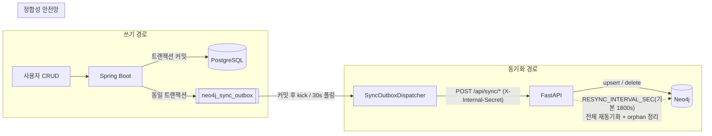

동기화는 **Transactional Outbox 패턴**으로 구현된다. 비즈니스 트랜잭션 안에서 `neo4j_sync_outbox` 행을 적재하므로, 비즈니스 변경이 롤백되면 동기화도 함께 취소되어 *원자성*이 보장된다. 커밋 직후 디스패처가 비동기로 FastAPI를 호출하고, 누락분은 30초 폴러와 주기적 전체 재동기화가 보완한다. 자세한 표준은 7.8·10.7절에서 다룬다.

⚠️ **주의:** Neo4j를 직접 수정하는 코드를 작성하지 말 것. 모든 그래프 변경은 PG 변경 → Outbox → 동기화 경로를 거쳐야 한다. (예외: 사용자가 명시적으로 만드는 *수동 자유 관계*는 `graph_relations` 테이블을 SoR로 두고 동기화한다.)

## 2.3 요청 생명주기 (Request Lifecycle)

대표적인 인증된 CRUD 요청과 AI 채팅 요청의 생명주기를 시퀀스로 정리한다.

### 2.3.1 인증된 CRUD 요청 (Spring Boot)

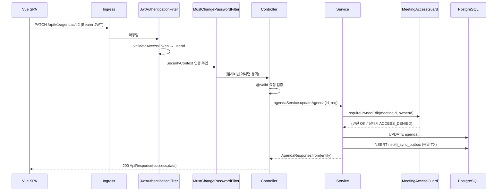

### 2.3.2 AI 슈퍼바이저 채팅 요청 (FastAPI, SSE 스트리밍)

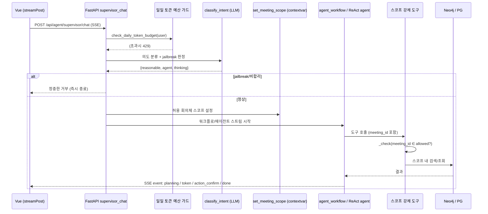

이 두 흐름에서 드러나는 표준 원칙은 다음과 같다.

- **인가는 신뢰 경계에서**(P4): Spring은 `MeetingAccessGuard`, FastAPI는 `access_guard` + 도구 내부 스코프 검사로 *이중 방어*한다.
- **AI 출력은 비신뢰**(P4): 모델이 임의의 `meeting_id`를 넘겨도 도구가 허용 범위와 대조해 거부한다.
- **스트리밍 우선**: AI 응답은 SSE로 토큰 단위 스트리밍하여 TTFT(첫 토큰 도달 시간)를 관측·최적화한다(15장).

## 2.4 배포 토폴로지

운영 환경은 Amazon EKS(Kubernetes) 위에 GitOps(ArgoCD)로 배포된다. 네임스페이스는 `skala3-finalproj-class2-team9`이다.

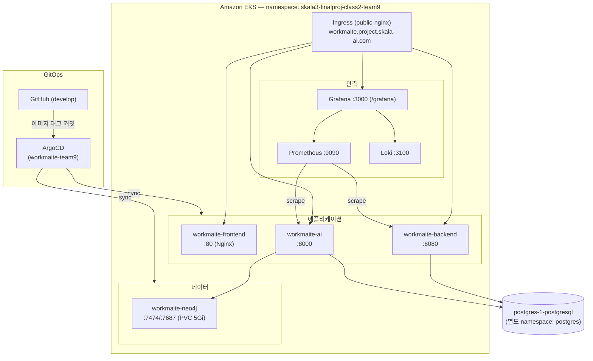

| 워크로드 | replicas | 이미지 | 포트 | 헬스체크 |
|---|---|---|---|---|
| workmaite-frontend | 1 | `workmaite-frontend:<sha>` | 80 | `/` |
| workmaite-backend | 1 | `workmaite-backend:<sha>` | 8080 | `/actuator/health` |
| workmaite-ai | 1 | `workmaite-ai:<sha>` | 8000 | `/health` |
| workmaite-neo4j | 1 | `neo4j:5.19-community` | 7474/7687 | HTTP `/` |

⚠️ **주의:** 운영 PostgreSQL은 `postgres-1-postgresql.postgres.svc.cluster.local`(별도 `postgres` 네임스페이스의 Bitnami Helm 배포)을 사용한다. 레포의 `k8s/postgres/` 매니페스트(`postgres:15`)는 **현재 배선과 불일치하는 예비/미사용 자원**이다(13장 Gap 참조).

## 2.5 포트 및 네트워크 경로 표준

```
[브라우저]
   │  HTTPS (workmaite.project.skala-ai.com)
   ▼
[Ingress public-nginx]
   ├── /api/v1                          → workmaite-backend:8080  (Spring CRUD/Auth)
   ├── /api/ai, /api/agent, /api/neo4j,
   │   /api/chats, /api/stt, /api/upload,
   │   /api/usage, /ws, /ai             → workmaite-ai:8000       (FastAPI)
   ├── /api  (그 외)                    → workmaite-backend:8080
   ├── /grafana                         → workmaite-grafana:3000
   └── /  (fallback)                    → workmaite-frontend:80
```

✅ **MUST:** 신규 FastAPI 라우터의 경로 prefix는 위 Ingress 화이트리스트(`/api/ai`, `/api/agent`, `/api/neo4j`, `/api/chats`, `/api/stt`, `/api/upload`, `/api/usage`, `/ws`)에 포함되어야 외부 노출된다. 새 prefix가 필요하면 `k8s/ingress.yaml`을 함께 수정한다.

⚠️ **주의:** `/api/sync`(Spring→FastAPI 내부 동기화)는 **의도적으로 Ingress에 노출하지 않는다.** 내부 호출 전용이며 `X-Internal-Secret`으로 보호된다(12장).

## 2.6 로컬 개발 시 네트워크 경로

로컬에서는 Vite dev 서버의 프록시가 운영 Ingress와 동일한 라우팅을 흉내 낸다.

| 경로 | 프록시 대상 | 비고 |
|---|---|---|
| `/api/v1` | `http://localhost:8080` | Spring Boot |
| `/api` (그 외) | `http://localhost:8000` | FastAPI |
| `/ws` | `http://localhost:8000` | WebSocket(`ws:true`) |

💡 **근거:** dev 프록시 경로를 운영 Ingress와 일치시켜, "로컬에선 되는데 운영에선 안 되는" 라우팅 불일치를 원천 차단한다.

---

# 3. 기술 스택 표준

## 3.1 스택 선정 원칙

✅ **MUST:** 신규 의존성 추가는 PR 리뷰에서 합의한다. 아래 표의 메이저 버전 라인을 임의로 올리거나 내리지 않는다.

⭕ **SHOULD:** 동일 목적의 라이브러리를 중복 도입하지 않는다(예: 날짜 라이브러리, HTTP 클라이언트). 이미 채택된 도구를 우선 사용한다.

🚫 **MUST NOT:** 보안 패치를 제외한 메이저 업그레이드를 기능 PR에 끼워 넣지 않는다. 의존성 업그레이드는 별도 PR로 분리한다.

## 3.2 프런트엔드 스택

| 구분 | 기술 | 버전 | 비고 |
|---|---|---|---|
| 프레임워크 | Vue | 3.5.x | Composition API + `<script setup>` 전용 |
| 빌드 | Vite | 8.x | dev 프록시·코드분할 |
| 상태관리 | Pinia | 3.x | setup store 형식 |
| 라우팅 | Vue Router | 5.x | history 모드, path 기반 |
| HTTP | Axios | 1.x | 이중 인스턴스(`api`/`apiAI`) |
| UI 프레임워크 | Bootstrap | 5.3.x | + bootstrap-icons |
| 리치 에디터 | TipTap | 3.x | 회의록/보고서 편집(table·underline 확장) |
| 그래프 시각화 | PixiJS 8 + d3-force 3 + d3-zoom 3 | — | WebGL 렌더 + 물리 시뮬레이션 |
| 마크다운 | marked 18 + DOMPurify 3 | — | AI 응답 렌더 + XSS 정화 |
| 런타임(CI/빌드) | Node | 22(CI) / 20(Docker) | — |
| 품질 | ESLint 10 · Prettier 3 · Vitest 4 · @vue/test-utils 2 · jsdom | — | — |

## 3.3 백엔드 스택 — Spring Boot

| 구분 | 기술 | 버전 | 비고 |
|---|---|---|---|
| 언어/런타임 | Java | 21 (toolchain) | LTS |
| 프레임워크 | Spring Boot | 4.1.x | — |
| 빌드 | Gradle (Kotlin DSL) | — | `bootJar -x test` |
| 영속성 | Spring Data JPA / Hibernate | — | `ddl-auto: none` |
| 보안 | Spring Security + jjwt | 0.13 | HS256 JWT |
| API 문서 | springdoc-openapi | 3.0.x | Swagger UI |
| 모니터링 | Actuator + Micrometer (Prometheus) | — | `/actuator/prometheus` |
| 보일러플레이트 | Lombok | — | `@Getter`·`@Builder`·`@RequiredArgsConstructor` |
| HTTP 클라이언트 | RestClient / RestTemplate | — | FastAPI 동기화 호출(연결 3s/읽기 5s) |
| 품질 | Spotless(googleJavaFormat) · Checkstyle 10.12.7 · PMD 6.55 · SpotBugs | — | 빌드 실패 강제(`ignoreFailures=false`) |

## 3.4 백엔드 스택 — FastAPI (AI)

| 구분 | 기술 | 버전 | 비고 |
|---|---|---|---|
| 언어 | Python | 3.11+ | `requires-python >=3.11` |
| 패키지 매니저 | uv | — | `uv.lock` 고정, `uv sync --frozen` |
| 웹 프레임워크 | FastAPI | 0.136.x | — |
| ASGI 서버 | uvicorn[standard] | 0.49.x | — |
| ORM | SQLAlchemy | 2.0.x | `Mapped[]` / `mapped_column()` 스타일 |
| 검증/스키마 | Pydantic | 2.x | `from_attributes=True` |
| LLM 오케스트레이션 | LangChain 1.2 · langchain-openai · LangGraph 1.1 | — | ReAct·StateGraph·체크포인터 |
| LLM 관측 | LangSmith | — | `LANGSMITH_TRACING` 켤 때만 |
| 그래프 | neo4j 6.x · neo4j-graphrag 1.17 | — | async Bolt + Text2Cypher |
| 임베딩/STT | openai 2.41 · google-cloud-speech · tiktoken | — | — |
| 토큰화/형태소 | kiwipiepy | — | STT 문장 재조립 |
| 문서 파싱 | pypdf · pdfplumber · python-docx · openpyxl | — | 첨부 텍스트 추출 |
| PDF 렌더 | weasyprint | — | 회의록/보고서 PDF |
| 체크포인터 | langgraph-checkpoint-postgres | 3.1 | HITL 영속화(AsyncPostgresSaver) |
| 객체 스토리지 | boto3 | — | Cloudflare R2(S3 호환) |
| 모니터링 | prometheus-fastapi-instrumentator · prometheus-client | — | `/metrics` |
| 품질 | ruff(lint+format) · mypy · deptry · pip-audit | — | — |

## 3.5 데이터·인프라 스택

| 구분 | 기술 | 버전 |
|---|---|---|
| 관계형 DB | PostgreSQL | 운영 15 / CI 16 / 로컬 16 |
| 그래프 DB | Neo4j | 5.19-community |
| 컨테이너 | Docker (멀티스테이지) | — |
| 레지스트리 | Harbor (`amdp-registry.skala-ai.com`) | — |
| 오케스트레이션 | Kubernetes (Amazon EKS) | — |
| 배포 | ArgoCD (GitOps) | — |
| CI | GitHub Actions | — |
| 모니터링 | Prometheus 2.55 · Grafana 11.5 · Loki 3.4 | — |
| 객체 스토리지 | Cloudflare R2 | — |

## 3.6 버전 고정 정책

| 스택 | 고정 방식 | 파일 |
|---|---|---|
| 프런트 | `package-lock.json` (멀티플랫폼 옵션 생성) | `frontend/package-lock.json` |
| FastAPI | `uv.lock` (`uv sync --frozen`) | `backend/fastapi/uv.lock` |
| Spring | Gradle 버전 카탈로그/명시 | `build.gradle.kts` |
| 컨테이너 베이스 | 태그 고정(`:21-jdk`, `:3.11-slim`, `:20-alpine`) | 각 `Dockerfile` |

⚠️ **주의(프런트 lock):** CI·Docker는 `npm ci`가 아니라 **`npm install`** 을 쓴다. npm의 크로스플랫폼 optional-dependency lock 버그(Windows에서 만든 lock이 linux의 `@emnapi`/`@rolldown-wasm` 해석과 어긋남) 때문이다. 이는 5.4절·14.3절에서 재강조한다.

---

# 4. 개발 환경 및 형상관리 표준

## 4.1 로컬 개발 환경 구성

### 사전 요구사항

| 도구 | 버전 | 용도 |
|---|---|---|
| JDK | 21 (temurin 권장) | Spring Boot |
| Python | 3.11+ + `uv` | FastAPI |
| Node.js | 20+ | 프런트 |
| kubectl | — | DB 포트포워딩 |
| Docker | — | 로컬 DB(선택) |

### 실행 절차

```bash
# 0) 데이터스토어 포트포워딩 (k8s 사용 시)
kubectl port-forward svc/postgres-1-postgresql 5432:5432 -n postgres
kubectl port-forward svc/workmaite-neo4j 7474:7474 7687:7687

# 1) Spring Boot — 루트 .env를 bootRun이 자동 주입
cd backend/springboot && ./gradlew bootRun      # Windows: gradlew.bat bootRun

# 2) FastAPI
cd backend/fastapi && uv run uvicorn main:app --reload --port 8000

# 3) Frontend
cd frontend && npm install && npm run dev        # http://localhost:5173
```

✅ **MUST:** 환경변수는 **리포 루트 `.env`** 하나로 관리한다. Spring `bootRun`은 루트 `../../.env`를 자동 주입하고, FastAPI `main.py`는 `load_dotenv("../../.env", override=True)`로 로드한다. `.env`는 절대 커밋하지 않는다(`.gitignore`로 차단, `.env.example`만 추적).

💡 **근거:** 두 백엔드가 `JWT_SECRET`·DB 접속 정보를 공유해야 토큰·데이터가 호환된다. 단일 `.env`가 "두 서버 설정 불일치"를 막는다.

## 4.2 모노레포 디렉토리 표준

```
Workmaite/
├── frontend/              Vue 3 SPA            (6장)
├── backend/
│   ├── springboot/        인증·CRUD            (7장)
│   ├── fastapi/           AI Agent             (8장)
│   └── Dockerfile         ⚠️ 레거시 Maven(미사용)
├── ddl/                   DB 스키마 단일 소스   (10장)
│   ├── schema.sql · relation.sql · index.sql · graph_relations.sql
├── neo4j/                 Neo4j 로컬 compose·conf
├── postgres/              PostgreSQL 로컬 compose
├── k8s/                   Kubernetes Manifest  (13장)
├── argocd/                ArgoCD Application
├── docs/                  설계 문서            (17장)
├── .github/workflows/     CI/CD                (14장)
├── README.md · Plan.md · SECURITY_ROTATION.md
└── 개발표준정의서.md       (본 문서)
```

✅ **MUST:** 신규 코드는 위 구조의 해당 위치에 둔다. 루트에 임시 스크립트·실험 파일을 방치하지 않는다.

## 4.3 브랜치 전략

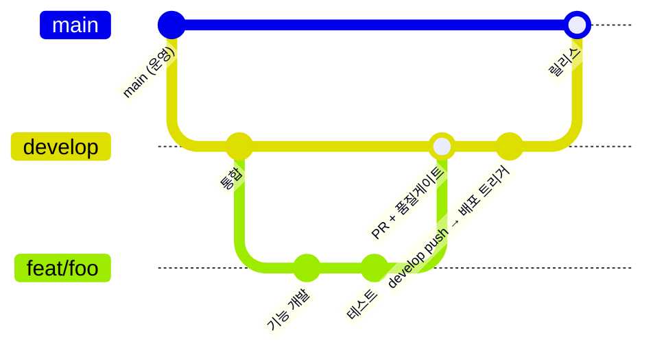

| 브랜치 | 용도 | 보호 | 비고 |
|---|---|---|---|
| `main` | 운영(릴리스) | ✅ | 직접 push 금지 |
| `develop` | 통합 | ✅ | **push 시 배포 CI(`ci-*.yml`) 트리거** |
| `dev/<name>` | 개발자별 작업 통합 | — | 예: `dev/minhyuk` |
| `feat/<topic>` | 기능 | — | — |
| `fix/<topic>` | 버그 | — | — |
| `chore/<topic>` | 빌드·설정·도구 | — | — |

⚠️ **주의(머지 회귀 사고):** 과거 *bigint 이전 코드 기반*의 오래된 브랜치(`feat/prettier-lint-rename`)를 머지하면서, bigint로 표준화한 약 87개 Java 파일의 타입이 `Long → Integer`로 통째로 회귀해 **전체 컴파일이 깨진 사고**가 있었다(2026-06-13). 

✅ **MUST: 오래된 베이스의 브랜치를 머지하기 전에는 반드시 ① 머지 베이스를 확인하고 ② 로컬 컴파일을 통과시킨다.** `develop` 머지는 곧 배포이므로 더욱 엄격히 적용한다.

## 4.4 커밋 메시지 규약

`type: 한글 요약` 형식(Conventional Commits 기반)을 표준으로 한다.

```
<type>: <50자 내외 요약>

<본문(선택)> — 무엇을 바꿨는지가 아니라 "왜" 바꿨는지를 적는다.
<관련 이슈/계획 항목 — 예: Plan.md P1-4>
```

| type | 의미 | 예시 |
|---|---|---|
| `feat` | 기능 추가 | `feat: 실시간 STT 화자 라벨 편집 추가` |
| `fix` | 버그 수정 | `fix: refresh 토큰 재사용 시 전체 폐기 처리` |
| `refactor` | 동작 변화 없는 구조 개선 | `refactor: access_guard 가드 함수 통합` |
| `docs` | 문서 | `docs: 개발표준정의서 v2.0` |
| `test` | 테스트 | `test: usePagination 경계 케이스` |
| `chore` | 빌드/설정/도구 | `chore: ruff format 규칙 조정` |
| `ci` | CI/CD | `ci: update frontend image tag` |

✅ **MUST:** 한 커밋은 하나의 논리적 변경만 담는다. 포맷 변경과 로직 변경을 한 커밋에 섞지 않는다.

## 4.5 Pull Request 및 코드리뷰 표준

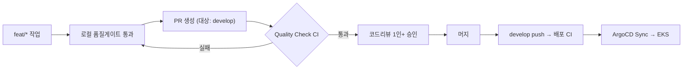

✅ **MUST(PR 본문):** 변경 목적·범위·테스트 결과(스크린샷/로그)·영향 범위를 기재한다.

✅ **MUST(통과 기준):** 해당 스택의 Quality Check가 **전부 green**이어야 머지 가능하다(14장).

⭕ **SHOULD(리뷰 관점):** 리뷰어는 ① 본 표준 위반 여부 ② 권한/스코프 누락(P4) ③ 외부 계약 변경(P3) ④ 단일 소스 위반(P5)을 우선 점검한다.

⭕ **SHOULD:** 리뷰어 1인 이상 승인 후 머지. 머지 방식은 Squash 또는 Merge commit을 사용한다(팀 합의).

---

# 5. 공통 코딩 규칙

본 장은 언어·스택과 무관하게 모든 코드에 적용되는 횡단(cross-cutting) 규칙이다.

## 5.1 파일 인코딩·포맷

| 항목 | 표준 |
|---|---|
| 인코딩 | UTF-8 (BOM 없음) |
| 줄바꿈 | **LF** (`endOfLine: lf`, `.editorconfig` `end_of_line = lf`) |
| 파일 끝 | 개행 1개(`insert_final_newline`) |
| 들여쓰기 | 2 스페이스(프런트/Java), 4 스페이스(Python 관례) |
| 후행 공백 | 제거(마크다운 제외) |

✅ **MUST:** 인코딩·줄바꿈은 `.editorconfig`로 IDE에 강제하고, 포맷은 각 스택의 포매터(Prettier / googleJavaFormat / ruff format)가 전담한다. 포맷을 손으로 맞추지 않는다(P2).

## 5.2 명명 규칙 일반

| 대상 | 규칙 | 예 |
|---|---|---|
| Java 클래스 | PascalCase | `AgendaController` |
| Java 메서드/필드 | camelCase | `extractAgendas` |
| Java 상수 | UPPER_SNAKE | `INTERNAL_SERVER_ERROR` |
| Python 함수/변수 | snake_case | `get_current_user` |
| Python 클래스 | PascalCase | `ConnectionManager` |
| Python 모듈 비공개 | `_` 접두 | `_check`, `_logger` |
| Vue 컴포넌트/파일 | PascalCase | `AppPagination.vue` |
| JS 함수/변수 | camelCase | `ensureFreshToken` |
| 컴포저블 | `useXxx` | `useAgentChat` |
| DB 테이블/컬럼 | snake_case | `meeting_members` |
| 환경변수 | UPPER_SNAKE | `JWT_SECRET` |

## 5.3 주석·문서화

✅ **MUST:** 코드 주석·docstring은 **한국어**를 기본으로 하며, "무엇을(what)"이 아니라 "왜(why)"를 설명한다. "무엇을"은 코드 자체로 드러나야 한다.

```python
# 나쁜 예: 무엇을 하는지만 반복
# meeting_id가 allowed에 있는지 검사한다
if meeting_id in allowed: ...

# 좋은 예: 왜 이렇게 하는지(설계 의도)
# 모델이 임의 meeting_id를 넘겨도 거부해야 하므로, 프롬프트가 아닌
# 도구 내부에서 허용 범위와 대조한다 (P4 — AI 출력 비신뢰)
if meeting_id in allowed: ...
```

⭕ **SHOULD:** 공개 함수·엔드포인트·핵심 클래스에는 의도·권한·주의사항을 docstring/Javadoc으로 남긴다. 특히 권한 가드가 어디서 강제되는지 명시한다.

⭕ **SHOULD(TODO):** `# TODO(담당/이슈): 내용` 형식으로 추적 가능하게 남긴다. 기약 없는 TODO는 만들지 않는다.

## 5.4 시간·타임존 표준

✅ **MUST:** 서버 저장 시각은 **UTC**로 통일한다. PostgreSQL 컬럼은 `timestamp without time zone`이며 값은 UTC 기준이다.

⚠️ **주의(KST 사고):** 과거 `meeting_sessions.created_at`이 KST로 잘못 저장된 적이 있어, `main.py`의 기동 마이그레이션이 `(now() AT TIME ZONE 'UTC')` 기본값으로 교정하고 9시간 차 데이터를 보정한다. 신규 컬럼은 처음부터 UTC 기본값을 쓴다.

⭕ **SHOULD:** 표시용 시각 변환(KST 등)은 **클라이언트 책임**이다. 프런트는 `utils/date.js`의 포맷 함수를 단일 사용하며, `YYYY-MM-DD` 문자열을 Date로 만들 때는 KST 밀림 방지를 위해 `T09:00:00`을 부착한다(이미 구현됨).

## 5.5 로깅 표준

| 스택 | 방식 | 레벨 제어 |
|---|---|---|
| FastAPI | `logging.getLogger(__name__)`, 포맷 `%(asctime)s %(levelname)s [%(name)s] %(message)s` | `LOG_LEVEL` env(기본 INFO) |
| Spring | SLF4J(`@Slf4j`) | application.yaml |

✅ **MUST:** 예외는 삼키지 않는다. 의도적 폴백 catch는 그 의도를 주석으로 남긴다(ESLint `no-empty: allowEmptyCatch`는 *의도적* 폴백에 한함).

🚫 **MUST NOT:** 시크릿(토큰·비밀번호·API 키)·개인정보를 로그에 남기지 않는다. 예외 메시지는 로그에만 풀로 남기고, 클라이언트 응답에는 일반화된 메시지만 반환한다(7.5절 `GlobalExceptionHandler`).

## 5.6 시크릿·설정 관리

✅ **MUST:** 모든 시크릿은 코드 밖에서 주입한다 — 로컬은 `.env`, 운영은 k8s Secret.

🚫 **MUST NOT:** API 키·비밀번호·`JWT_SECRET`·`INTERNAL_SECRET`을 소스/매니페스트에 하드코딩하지 않는다.

⚠️ **주의(현행 격차):** 현재 `k8s/secrets.yaml`·`k8s/neo4j/secret.yaml`·로컬 compose 파일들에 **평문 시크릿이 커밋**되어 있다. 이는 알려진 치명 이슈이며, 12.2절·13.7절에서 회전·외부화 로드맵을 정의한다. 신규 시크릿은 절대 평문 커밋하지 않는다.

## 5.7 에러 처리 철학

| 원칙 | 설명 |
|---|---|
| 신뢰 경계에서 검증 | 입력은 서버에서 검증(Spring `@Valid`, FastAPI Pydantic). |
| 구조화된 에러 | Spring은 `BusinessException + ErrorCode`, FastAPI는 `HTTPException`. |
| 사용자 복구 가능 메시지 | AI 거부 응답은 모델/사용자가 다음 행동을 정정할 수 있는 문장으로 반환. |
| 가짜 기본값 금지 | 구조화 출력 실패 시 가짜 기본값으로 진행하지 않고 명시적으로 실패시킨다(`StructuredOutputError`, 8장). |

---

# 6. 프런트엔드 개발 표준 (Vue 3)

프런트엔드는 Vite 기반 Vue 3 SPA다. 인증/CRUD는 Spring Boot(`/api/v1`), AI/실시간은 FastAPI(`/api/*`, `/ws`)와 통신하며, 두 백엔드를 분리된 Axios 인스턴스로 다룬다.

## 6.1 디렉토리 구조 표준

```
frontend/src/
├── main.js            앱 부트스트랩(Pinia·Router 마운트, 전역 CSS, 툴팁 초기화)
├── App.vue            루트 — <RouterView/> + 전역 피드백 레이어
├── router.js          라우트 정의 + 인증 가드
├── api.js             Axios 인스턴스·인터셉터·토큰 갱신·SSE 헬퍼
├── style.css          전역 스타일·CSS 변수 팔레트(유일한 :root)
├── pages/             라우트 단위 페이지 (HomePage·ArchivePage·SessionPage …)
├── layouts/           MainLayout (인증 영역 공통 레이아웃)
├── components/        재사용 컴포넌트 (App* 공통 + 도메인 컴포넌트, ~39개)
├── composables/       useXxx 로직 훅 (~11개)
├── stores/            Pinia 스토어 + 경량 전역 ref (~6개)
├── graph/             관계 스키마·노드 아이콘 (백엔드 SSOT 미러)
├── icons/             UI 아이콘 path 레지스트리
├── utils/             순수 유틸 (date·avatar)
├── styles/archive/    아카이브 전역 CSS 모듈
└── assets/            로고·AI 아바타
```

✅ **MUST:** 파일은 역할에 맞는 폴더에 둔다.
- 페이지(라우트 진입점) → `pages/`
- 둘 이상에서 재사용되는 UI → `components/`
- 상태·부수효과 로직 → `composables/`(UI 없음) 또는 `stores/`(전역 상태)
- 순수 함수(부수효과 없음) → `utils/`

## 6.2 컴포넌트 작성 표준

### 6.2.1 SFC 기본 규칙

✅ **MUST: 모든 컴포넌트는 `<script setup>` 형식**으로 작성한다. Options API는 신규 작성 금지(기존 코드도 점진 전환).

✅ **MUST: SFC 블록 순서**는 `<template>` → `<script setup>` → `<style>`.

✅ **MUST: 컴포넌트 파일명은 PascalCase.** 범용/공통 컴포넌트는 `App` 접두(`AppTable`, `AppPagination`, `AppToast`, `AppConfirmModal`, `AppIcon`, `AppHeader`).

⭕ **SHOULD:** `vue/multi-word-component-names`는 페이지 명명 관례를 위해 off 처리되어 있다. 그러나 `components/`의 재사용 컴포넌트는 다단어 이름을 권장한다.

### 6.2.2 Props / Emits 규약

✅ **MUST:** `defineProps`는 항상 **객체형**으로 `type`·`default`를 명시한다. 배열/객체 기본값은 팩토리 함수로 준다.

```js
const props = defineProps({
  columns: { type: Array, default: () => [] },        // 배열 기본값 = 팩토리
  dark: { type: Boolean, default: false },
  sortDir: { type: String, default: null },           // 'asc' | 'desc' | null  ← 허용값 인라인 주석
})
const emit = defineEmits(['sort', 'update:modelValue'])
```

✅ **MUST(v-model):** 표준 `v-model`은 `modelValue` prop + `update:modelValue` emit. 명명 v-model은 `page` + `update:page`처럼 짝을 맞춘다.

⭕ **SHOULD:** prop 옆에 허용값을 인라인 주석으로 표기한다(`// 'asc'|'desc'|null`).

⚠️ **주의(no-mutating-props):** 일부 편집 모달이 prop 객체를 직접 변형하는 패턴이 남아 있어 ESLint `warn`으로 두었다. **신규 코드에서는 prop을 변형하지 말고 emit으로 상위에 위임**한다.

### 6.2.3 상태 전달 3원칙

조사 결과 본 코드베이스는 컴포넌트 간 상태 전달을 **세 가지 패턴**으로 일관되게 구분한다. 신규 코드도 이 분류를 따른다.

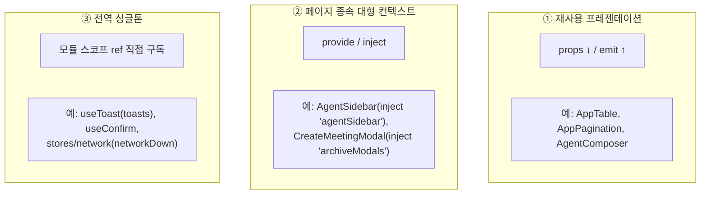

| 패턴 | 언제 | 예시 |
|---|---|---|
| props/emit | 재사용 가능한 프레젠테이션 컴포넌트 | `AppTable`, `AppPagination`, `AgentComposer` |
| provide/inject | 특정 페이지에 종속된 대형 컨텍스트(키 수십 개) | `AgentSidebar`, `CreateMeetingModal` |
| 모듈 ref 직접 구독 | 앱 전역 싱글톤 피드백 | `useToast`, `useConfirm`, `network` |

✅ **MUST(모달/오버레이):** `<Teleport to="body">` + `<Transition>` 조합으로 작성한다(`AppConfirmModal`·`AppToast`·`CreateMeetingModal` 참조). 배경 클릭 닫기는 `@click.self`.

## 6.3 상태관리(Pinia) 표준

✅ **MUST: setup store 형식**만 사용한다.

```js
export const useAuthStore = defineStore('auth', () => {
  const user = ref(safeParseUser())
  const token = ref(sessionStorage.getItem('token') || '')
  const isStrategicTeam = computed(() => user.value?.role === 'SYSTEM_ADMIN')
  async function login(employee_id, password) { /* ... */ }
  return { user, token, isStrategicTeam, login }
})
```

### 6.3.1 스토어 인벤토리

| 스토어 | 형태 | 책임 | 영속 |
|---|---|---|---|
| `auth` | Pinia | 로그인/로그아웃·프로필·토큰 | sessionStorage(token/refreshToken/user) |
| `meetings` | Pinia | 회의체·멤버·역할 캐시 | 메모리 |
| `sessions` | Pinia | 회의체별 세션 목록 캐시 | 메모리 |
| `theme` | Pinia | 야간/주간 모드 | **localStorage** |
| `network` | 모듈 ref | 네트워크 다운 배너 | 없음 |
| `llmModel` | 모듈 ref | 선택 LLM 모델 | sessionStorage(llm_model) |

### 6.3.2 영속 저장소 선택 규칙

✅ **MUST:**
- **인증 토큰·모델 선택 → `sessionStorage`** (탭 단위, 탭 닫으면 만료).
- **테마 → `localStorage`** (브라우저 영속).

💡 **근거:** 인증 정보를 `localStorage`에 두면 탈취 시 영속 위험이 크다. 테마는 보안과 무관한 사용자 선호이므로 영속 저장한다.

⭕ **SHOULD(캐시 무효화):** 목록 캐시 스토어(`meetings`/`sessions`)는 `fetchXxxOnce(force)` + `invalidate()` 패턴으로 캐시를 명시적으로 관리한다. 변경(생성/삭제) 후 관련 캐시를 무효화한다.

⭕ **SHOULD(에러 흡수):** 권한 없음(403)·빈 응답은 사용자에게 빈 목록으로 흡수한다(`fetchMeetings`가 403을 빈 배열로 처리하듯). 치명적이지 않은 조회 실패가 화면을 깨뜨리지 않게 한다.

## 6.4 API 레이어 표준 (`src/api.js`)

### 6.4.1 이중 인스턴스

```js
export const BASE_URL = import.meta.env.VITE_API_URL ?? ''     // Spring (8080)
export const AI_BASE_URL = import.meta.env.VITE_AI_URL ?? ''   // FastAPI (8000)

const api   = axios.create({ baseURL: BASE_URL,   timeout: 10000 })  // default export
const apiAI = axios.create({ baseURL: AI_BASE_URL, timeout: 30000 })
```

✅ **MUST:** 모든 HTTP는 `api`(Spring) 또는 `apiAI`(FastAPI)를 통해 호출한다. **컴포넌트에서 `axios`를 직접 import하지 않는다.**

✅ **MUST:** `import.meta.env`는 `api.js`의 위 두 줄에서만 사용한다(환경변수 단일 진입점). 미설정 시 `''`(상대경로 → Ingress 라우팅).

### 6.4.2 인터셉터 규약

| 인스턴스 | 요청 인터셉터 | 응답 인터셉터 |
|---|---|---|
| `api` | `Authorization: Bearer` 부착 | `markNetworkUp()` + **Spring `ApiResponse` 자동 언랩**(`res.data = res.data.data`) |
| `apiAI` | `Authorization` + `X-LLM-Model`(선택 모델) | `markNetworkUp()` (언랩 없음) |

💡 **근거(자동 언랩):** Spring은 모든 응답을 `{success,message,data}`로 감싼다(9.3절). `api` 인터셉터가 `data`를 자동 추출하므로, 컴포넌트는 언랩을 신경 쓰지 않고 실제 페이로드를 받는다. FastAPI는 래핑이 없으므로 언랩하지 않는다.

### 6.4.3 토큰 자동 갱신

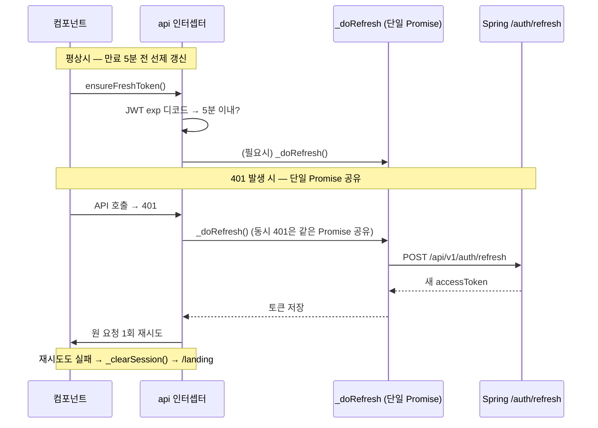

✅ **MUST:** 토큰 갱신 로직은 `api.js`에 일원화되어 있다. **개별 호출에서 401 재시도·refresh를 중복 구현하지 않는다.**

- `_refreshPromise` 모듈 변수로 동시 401의 중복 refresh를 방지(단일 Promise 공유).
- `ensureFreshToken()`은 만료 5분 이내일 때 선제 갱신하며, `streamPost`/`streamPostForm` 진입과 `useActivityRefresh`(사용자 인터랙션, 60초 쓰로틀)에서 호출된다.
- 재시도까지 실패하면 `_clearSession()`이 세션을 비우고 `/landing`으로 보낸다.

### 6.4.4 SSE 스트리밍 헬퍼

AI 응답은 `fetch` 기반 SSE 헬퍼로 수신한다(Axios 아님 — 스트리밍 때문).

| 헬퍼 | 용도 |
|---|---|
| `streamPost(path, body, onChunk, onDone, onPlanning, onHighlight, onResult, options)` | JSON 본문 SSE. `options.signal`로 중단, `options.onAction`으로 쓰기 제안 카드 수신 |
| `streamPostForm(path, formData, onEvent)` | multipart SSE(파일 분석) |
| `_readSseStream(...)` | v2(`event:` 기반) 우선 파싱 + v1(`data:` 프리픽스) 폴백 |
| `toWsUrl(path)` | WebSocket URL 생성(http→ws, token 쿼리 자동 부착) |

✅ **MUST(SSE 이벤트 어휘):** 백엔드와 합의된 이벤트 타입만 사용한다 — `run`·`planning`·`token`·`tool_call`·`result`·`highlight`·`action_confirm`·`usage`·`error`·`done`(9.7절). LLM 출력에 `data:`/`[DONE]`이 섞여도 안전하도록 v2 파서를 우선 사용한다.

## 6.5 컴포저블 표준

✅ **MUST:** 재사용 로직은 `composables/use<Name>.js`에 `export function use<Name>()`로 작성한다.

| 컴포저블 | 책임 |
|---|---|
| `useAgentChat` | 슈퍼바이저 채팅 오케스트레이션(스트리밍·히스토리 페이지네이션·쓰기 제안 확인) |
| `useAgentMention` | `@` 멘션(회의체·아젠다·구성원·문서 통합 검색, 참조 칩) |
| `useRealtimeSTT` | 실시간 전사(WebAudio PCM16 → WS → OpenAI Realtime, VAD 포함) |
| `useSTT` | HTTP 청크 STT(MediaRecorder → POST `/api/stt/transcribe`) |
| `usePagination` | 클라이언트 페이지네이션(현재 페이지 clamp) |
| `useTableSort` | 테이블 정렬(`AppTable @sort` 연동) |
| `useToast` / `useConfirm` | 전역 토스트 / Promise 기반 확인·입력 다이얼로그 |
| `useMarkdown` | `renderMd`(marked + DOMPurify) |
| `useActivityRefresh` | 사용자 활동 감지 → 토큰 선제 갱신 |
| `useGraphBuilder` | 백엔드 데이터 → 그래프 `{nodes, edges}` 변환 |

✅ **MUST(전역 싱글톤형):** `useToast`/`useConfirm`처럼 앱 전역에서 단일 상태를 공유해야 하는 것은 **모듈 스코프 ref + 분리된 함수 export**로 작성한다(호출마다 새 상태를 만들지 않는다).

⭕ **SHOULD(인스턴스형):** `useAgentChat`/`useRealtimeSTT`처럼 사용처마다 독립 상태가 필요한 것은 호출 시 새 클로저를 만든다.

## 6.6 스타일·테마 표준

### 6.6.1 CSS 변수 단일 소스

✅ **MUST: 모든 디자인 토큰(색·간격·반경·그림자)은 `src/style.css`의 단일 `:root`에만 정의**한다. 다른 곳에 `:root`를 만들지 않는다(P5 — SSOT).

```
브랜드:  --primary:#1e3a5f  --accent:#3b82f6
배경/텍스트: --bg  --bg-card  --border  --text  --text-muted  --surface
상태:    --success:#10b981  --warning:#f59e0b  --danger:#ef4444
레이아웃: --sidebar-w:240px  --header-h:47px  --radius:8px  --radius-lg:12px
다크:    --dark-bg:#0f172a  --dark-card:#1e293b  --dark-text:#e2e8f0 …
오버레이: --white-03 ~ --white-18 (다크 표면 hover/border)
```

✅ **MUST:** 컴포넌트 스타일에서 색상을 하드코딩하지 말고 `var(--xxx)`를 사용한다.

### 6.6.2 다크모드 패턴

✅ **MUST:** 다크모드는 **CSS 변수 재정의 방식**으로 구현한다. `theme.js`가 `<html>`에 `night-mode`/`day-mode-global` 클래스를 토글하면, `html.night-mode { --bg: var(--dark-bg); ... }`로 변수만 다크 값으로 바뀐다.

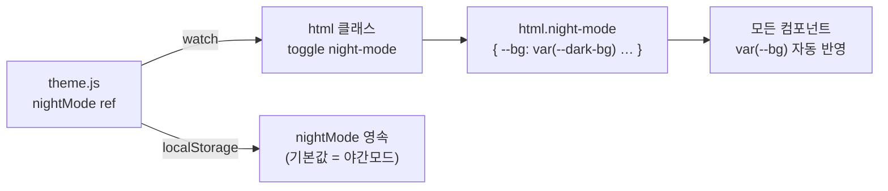

⭕ **SHOULD:** 변수만으로 해결 안 되는 하드코딩 흰배경 요소는 `html.night-mode .xxx { background: var(--bg-card) !important }`로 명시 override한다(기존 패턴 유지).

## 6.7 그래프 시각화 표준

지식 그래프는 **PixiJS(WebGL 렌더) + d3-force(물리 시뮬레이션)** 이중 루프로 그린다. 백엔드 `rel_schema.py`의 관계 어휘를 프런트가 미러링한다.

### 6.7.1 SSOT 미러 — `graph/relSchema.js`

✅ **MUST:** 관계명·색상·노드 타입쌍 매핑은 백엔드 `graphdb/rel_schema.py`가 **권위 원천(SSOT)** 이다. 프런트 `relSchema.js`는 그 미러이며, 앱 시작 시 `fetchRelSchema()`로 `GET /api/neo4j/rel-schema`를 호출해 번들 기본값과 병합한다.

🚫 **MUST NOT:** 프런트에서 관계명·색상을 독자적으로 추가하지 않는다. 새 관계는 백엔드 `rel_schema.py`에 먼저 정의하고, 프런트는 따라 미러링한다.

### 6.7.2 렌더링 아키텍처 — `GraphView.vue`

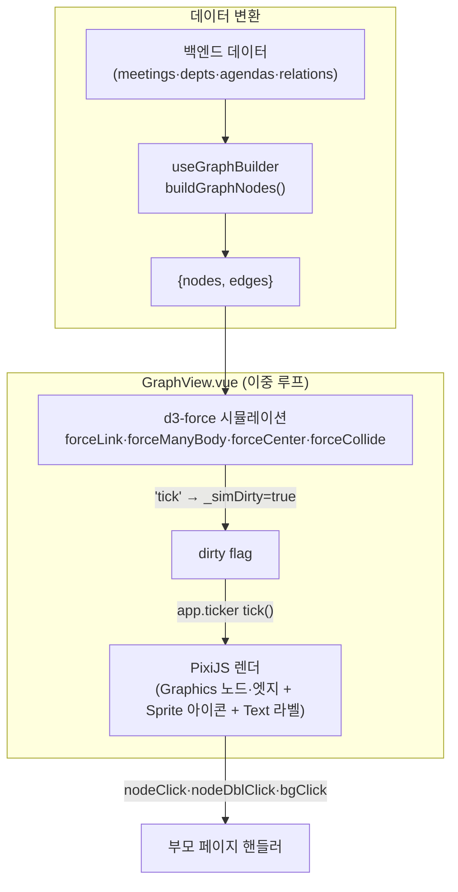

✅ **MUST(이중 루프 분리):** d3-force의 `tick`은 `_simDirty=true` 플래그만 세우고, 실제 위치 반영은 `app.ticker`의 `tick()`에서 한다. 물리 계산과 렌더 프레임을 분리해 성능을 확보한다(기존 구현 유지).

⭕ **SHOULD:** PixiJS v8의 SVG arc 버그를 피하기 위해 아이콘은 `nodeIconSvg`로 만든 SVG를 `parseAsGraphicsContext:false`로 래스터화해 `Sprite`로 부착한다(기존 우회 패턴 유지).

### 6.7.3 그래프 모델 규칙(useGraphBuilder)

✅ **MUST:** 그래프 노드/엣지 생성 규칙(예: 사람→부서→회사 체인, `session→Meetings(소속)`은 DB 보존하되 시각화 제외)은 `useGraphBuilder.js`에 집중하고, 단위 테스트(`tests/useGraphBuilder.test.js`)로 회귀를 방지한다.

## 6.8 빌드·환경변수 표준

| 항목 | 표준 |
|---|---|
| 빌드 | `vite build` → `dist/` |
| 별칭 | `@` → `./src` |
| dev 프록시 | `/api/v1`→8080, `/api`→8000, `/ws`→8000(ws) |
| 환경변수 | `VITE_API_URL`(Spring), `VITE_AI_URL`(FastAPI)만 |
| 정적 서빙 | Nginx(`try_files ... /index.html`, SPA 폴백) |

✅ **MUST:** 환경변수는 `VITE_` 접두만 사용(Vite 노출 규칙). 빌드 타임 주입(`ARG`/`ENV`)으로 Docker 이미지에 굳는다.

## 6.9 프런트엔드 품질 게이트

✅ **MUST(통과 기준):** `npm run prettier:check` → `npm run lint` → `npm run test` → `npm run build` 전부 통과.

| 도구 | 설정 | 핵심 규칙 |
|---|---|---|
| Prettier | `.prettierrc.json` | `semi:false`, `singleQuote:true`, `printWidth:100`, `tabWidth:2`, `trailingComma:all`, `arrowParens:avoid`, `endOfLine:lf` |
| ESLint | `eslint.config.js`(flat) | `js.recommended` + `vue/flat/essential` + `eslint-config-prettier`(마지막). 점진 적용 위해 대부분 `warn` |
| Vitest | `vite.config.js`(jsdom) | 컴포넌트 emit/DOM·컴포저블 입출력·스토어 부수효과 |

💡 **근거(warn 위주):** 기존 코드베이스에 린트를 점진 도입하기 위해, 차단(error) 규칙을 최소화하고 `warn` 위주로 시작한다(`frontend/PLAN.md` Phase 0). 강화는 단계적으로 진행한다.

## 6.10 현행 격차(Gap) 및 개선 방향

| 항목 | 현황 | 방향 |
|---|---|---|
| prop 직접 변형 | 일부 편집 모달이 prop 객체 변형(`no-mutating-props: warn`) | 모달 재설계 시 emit 기반으로 전환 |
| ESLint 강도 | 대부분 warn | Phase별로 error 승격 |
| `defineModel` | 미사용(명시적 props/emit) | 신규 컴포넌트부터 선택 도입 검토 |

---

# 7. 백엔드 개발 표준 — Spring Boot

Spring Boot 서버(`com.workmaite`)는 인증·도메인 CRUD·감사·PG→Neo4j 동기화를 담당한다. 진입점은 `WorkmaiteServerApplication`이며 `@SpringBootApplication @EnableJpaAuditing @EnableScheduling`이 선언되어 있다.

## 7.1 패키지 구조 표준

**도메인 주도(domain-driven) + 전역 공통(global)** 으로 분리한다.

```
com.workmaite
├── WorkmaiteServerApplication.java
├── domain/<aggregate>/         도메인별 (agendas, meetings, sessions, reports,
│   │                            minutes, scripts, chat, auth, user, company,
│   │                            home, logs, audit)
│   ├── controller/             REST 엔드포인트
│   ├── service/                비즈니스 로직(트랜잭션 경계)
│   ├── repository/             Spring Data JPA
│   ├── entity/                 JPA 엔티티 + Enum + Converter
│   └── dto/                    요청/응답 DTO
└── global/
    ├── auth/      JwtTokenProvider · JwtAuthenticationFilter · CustomUserDetailsService
    │              · CurrentUser · MeetingAccessGuard · MustChangePasswordFilter · LegacyPbkdf2Verifier
    ├── config/    SecurityConfig · AppConfig
    ├── common/    ApiResponse
    ├── exception/ ErrorCode · BusinessException · GlobalExceptionHandler
    ├── audit/     AuditLogged · AuditLogAspect · AuditLogService
    └── sync/      NeoSyncService · SyncOutbox · SyncOutboxDispatcher · SyncOutboxRepository
```

✅ **MUST:** 새 도메인은 `domain/<복수형>/` 아래 5개 하위 패키지 규약(controller·service·repository·entity·dto)을 따른다.

✅ **MUST:** 횡단 관심사(인증·예외·공통응답·감사·동기화)는 `global/` 아래 둔다. 도메인 패키지에 인증/예외 로직을 흩뿌리지 않는다.

## 7.2 계층 책임 표준

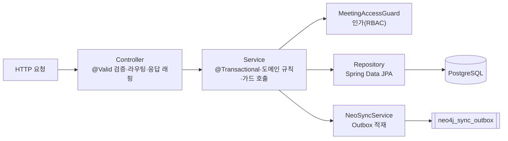

| 계층 | 책임 | 금지 |
|---|---|---|
| Controller | 요청 검증(`@Valid`), 경로 매핑, `ApiResponse` 래핑, 상태코드 | 비즈니스 로직, 직접 DB 접근 |
| Service | 트랜잭션 경계, 도메인 규칙, 인가 가드 호출, 동기화 적재 | HTTP 관심사(상태코드 등) |
| Repository | 쿼리(파생 메서드·`@Query`) | 비즈니스 로직 |

⚠️ **주의(현행 격차 — 인가 위치):** 현재 인가(`MeetingAccessGuard`)와 감사(`@AuditLogged`)는 **컨트롤러가 아니라 서비스 계층**에 위치한다(`ChatMessageController`만 예외적으로 컨트롤러에서 guard 직접 호출). 컨트롤러에는 `@PreAuthorize`가 전혀 없다.

✅ **MUST:** 따라서 **신규 서비스 메서드는 데이터에 접근하기 전에 반드시 가드를 호출**해야 한다. 컨트롤러만 보고 "인증되어 있으니 안전"이라고 가정하지 않는다. 일부 컨트롤러 메서드(`getMeeting`/`deleteMeeting`/`getMembers`)는 `Authentication` 인자조차 없고 인가를 전적으로 서비스에 의존한다 — 서비스에서 가드를 빠뜨리면 곧 IDOR다.

## 7.3 명명 규칙 (Spring)

| 대상 | 규칙 | 예 |
|---|---|---|
| Controller | `<도메인>Controller` | `AgendaController` |
| Service | `<도메인>Service` | `AgendaService` |
| Repository | `<엔티티>Repository` | `AgendaRepository` |
| 요청 DTO | `<도메인><행위>Request` | `AgendaCreateRequest` |
| 응답 DTO | `<도메인>Response` | `AgendaResponse` |
| Enum 값 | UPPER_SNAKE(코드) | `ADMIN`, `SUBMITTED` |
| Enum Converter | `<Enum>Converter` | `MeetingStatusConverter` |

## 7.4 의존성 주입 · DTO 표준

### 7.4.1 생성자 주입

✅ **MUST:** 의존성은 **생성자 주입**(`@RequiredArgsConstructor` + `private final`). 필드 주입(`@Autowired`) 금지.

```java
@RestController
@RequestMapping("/api/v1")
@RequiredArgsConstructor
public class AgendaController {
  private final AgendaService agendaService;   // 생성자 주입
}
```

### 7.4.2 응답 DTO 정적 팩토리

✅ **MUST:** 응답 DTO는 `@Getter @Builder` + 정적 팩토리 `from(Entity)`로 변환한다.

```java
@Getter @Builder
public class AgendaResponse {
  private Long id;
  private AgendaStatus status;
  // ...
  public static AgendaResponse from(Agenda agenda) {
    return AgendaResponse.builder()
        .id(agenda.getId())
        .status(agenda.getStatus())
        // ...
        .build();
  }
}
```

🚫 **MUST NOT:** JPA 엔티티를 컨트롤러 응답으로 직접 노출하지 않는다. 반드시 DTO를 경유한다(지연로딩·순환참조·과다노출 방지).

### 7.4.3 요청 DTO 검증

✅ **MUST:** 요청 DTO에 Bean Validation을 적용하고 컨트롤러에서 `@Valid`로 트리거한다.

| 애너테이션 | 용도 | 예 |
|---|---|---|
| `@NotBlank` | 필수 문자열 | email, name, title |
| `@Email` | 이메일 형식 | email |
| `@Pattern` | 비밀번호 규칙(8자+영문+숫자) | `^(?=.*[A-Za-z])(?=.*\d).{8,}$` |
| `@NotNull` | 필수 식별자 | assigneeId |
| `@NotEmpty` | 비어있지 않은 리스트 | 스크립트 세그먼트 |

⚠️ **주의:** `SessionUpdateRequest`·`AgendaUpdateRequest`는 현재 `@Valid`가 없다(부분 수정 허용). 신규 수정 DTO는 검증 필요 필드에 한해 검증을 적용하되, 부분 수정 의도를 주석으로 남긴다.

⭕ **SHOULD(외부 계약 호환):** snake_case 입력 호환은 `@JsonAlias`, snake_case 출력은 `@JsonProperty`로 처리한다(필드는 camelCase 유지).

## 7.5 예외 처리 표준

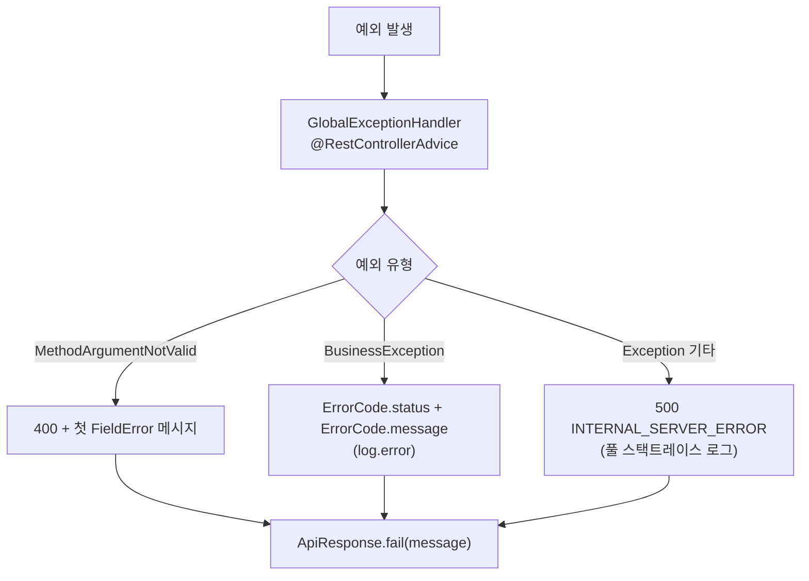

✅ **MUST:** 비즈니스 오류는 `throw new BusinessException(ErrorCode.XXX)`로 던지고, 전역 핸들러가 일괄 변환한다. 컨트롤러에서 try/catch로 상태코드를 직접 만들지 않는다.

✅ **MUST:** 신규 오류 상황은 `ErrorCode` enum에 `(HttpStatus, 한국어 메시지)`로 추가한다. 에러코드 전수는 부록 18.3에 정리한다.

🚫 **MUST NOT:** 스택트레이스·내부 메시지를 클라이언트 응답에 노출하지 않는다(500은 일반 메시지만).

## 7.6 엔티티 · JPA 표준

### 7.6.1 공통 엔티티 규약

✅ **MUST:**
- `@Entity @Table(name="...")` + `@Getter` + `@NoArgsConstructor(access = PROTECTED)`.
- ID는 `@Id @GeneratedValue(strategy = IDENTITY)` **`Long`** (bigint 표준, 18.x 참조).
- 생성/수정 시각은 `@EntityListeners(AuditingEntityListener.class)` + `@CreatedDate/@LastModifiedDate`(전역 `@EnableJpaAuditing`) 또는 `@PrePersist/@PreUpdate`.
- 상태 변경은 setter가 아니라 **도메인 메서드**(`update(...)`, `updatePassword(...)`, `changeCompanyRole(...)`)로 표현한다.

### 7.6.2 타입 표준 — bigint/Long

✅ **MUST: 모든 PK/FK는 `bigint`(Java `Long`).** 카운터·버전·토큰 수(`loop_count`, `version`, `*_tokens`)는 의미상 `integer`/`Integer`를 유지한다.

⚠️ **주의(회귀 금지):** id/FK를 `Integer`로 되돌리지 않는다. pre-bigint 브랜치 머지로 87개 파일이 회귀해 컴파일이 깨진 이력이 있다(4.3절). 타입 변경 PR은 양 백엔드(`models.py`의 `BigInteger`)와 함께 검토한다.

### 7.6.3 Enum ↔ DB 매핑

DB에는 소문자 문자열로 저장하되 코드 enum은 UPPER로 둔다. 매핑 방식은 두 가지가 공존한다.

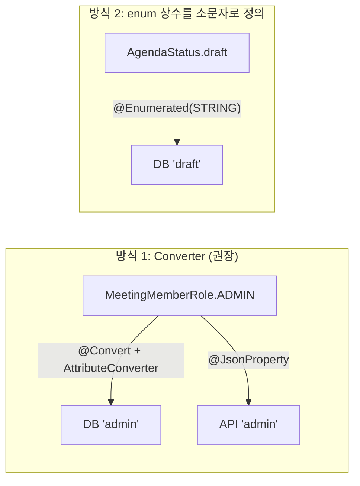

| 방식 | 적용 | 비고 |
|---|---|---|
| `@Convert` + `AttributeConverter` + `@JsonProperty` | `MeetingMemberRole`, `MeetingStatus`, `MeetingType`, `SessionStatus` | 역매핑/fallback 가능(예: `presenter`→MEMBER, unknown→SCHEDULED) |
| enum 상수 자체를 소문자로 | `AgendaStatus{draft,ongoing,done}` | 단순하나 fallback 없음 |

⚠️ **현행 격차:** `MinutesStatus{DRAFT, completed}`처럼 혼합된 사례가 있다. 신규 enum은 **방식 1(Converter)** 을 표준으로 한다(역매핑·fallback이 안전).

### 7.6.4 JSONB 매핑

✅ **MUST:** JSONB 컬럼은 `@JdbcTypeCode(SqlTypes.JSON) @Column(columnDefinition="jsonb") String`로 매핑한다(`Agenda.department`, `AuditLog.detail`, `SyncOutbox.payload`).

### 7.6.5 role 컬럼 명명 경계 (중요)

✅ **MUST:** DB 컬럼 **`role`** 은 그대로 유지하고, 자바 식별자만 의미별로 분리한다.
- 조직 권한: `@Column(name="role") UserRole companyRole`
- 회의체 권한: `@Convert(...) @Column(name="role") MeetingMemberRole meetingRole`

🚫 **MUST NOT:** 새 코드에서 bare `role` 변수를 재도입하지 않는다. API JSON 키도 `role`/`my_role`을 유지한다(`@JsonProperty("role")`).

💡 **근거:** `role`은 세 가지 의미(조직·회의체·그래프 관계)로 쓰이고, 프런트·Neo4j가 같은 키로 읽는다. DB/API 키를 바꾸면 무중단 파손 위험이 크므로 *내부 식별자만* 개명한다(P3).

## 7.7 인증·인가 표준

### 7.7.1 Security 필터 체인

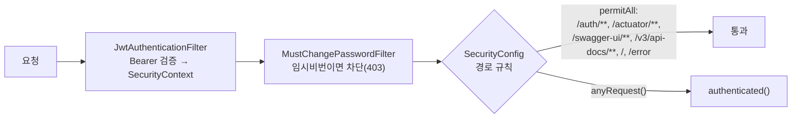

✅ **MUST(permitAll 최소화):** 공개 경로는 인증·문서·헬스에 한정한다. 그 외 **모든 경로는 `authenticated()`** 이다. 새 공개 엔드포인트가 필요하면 `SecurityConfig`에 명시적으로 추가하고 그 사유를 적는다.

| 설정 | 값 |
|---|---|
| 세션 | STATELESS |
| CSRF | disable(토큰 기반) |
| CORS | 화이트리스트(`workmaite.project.skala-ai.com`, `localhost:5173/4173`), `allowCredentials=true` |
| PasswordEncoder | BCrypt |

### 7.7.2 JWT 표준

✅ **MUST:** JWT는 HS256, `jwt.secret`(env `JWT_SECRET`)으로 서명한다. **이 시크릿은 FastAPI와 동일해야** 양 서버가 같은 토큰을 검증한다.

✅ **MUST(access/refresh 구분):** 토큰에 `type` 클레임(access/refresh)을 넣고, access 검증 시 `type=refresh`면 거부한다(SEC-7 — refresh를 access로 악용 방지). `sub`는 `str(userId)`.

| 토큰 | 만료 |
|---|---|
| access | 900,000ms (15분) |
| refresh | 1,209,600,000ms (14일) |

⭕ **SHOULD(refresh 회전):** refresh 토큰은 SHA-256 해시로 DB 저장하고, 서명은 유효하나 DB에 없으면 *재사용(탈취) 신호*로 보고 해당 사용자 토큰을 전부 폐기한다(`AuthService.refresh`).

### 7.7.3 RBAC — MeetingAccessGuard

조직 권한(companyRole)과 회의체 권한(meetingRole)을 결합한 RBAC다.

```mermaid
flowchart TB
    REQ["서비스가 가드 호출"] --> SA{"SYSTEM_ADMIN?"}
    SA -->|yes| OK["허용"]
    SA -->|no| CA{"COMPANY_ADMIN<br/>& 자사 회의체?"}
    CA -->|yes view/edit| OK
    CA -->|no| MR{"회의체 멤버?"}
    MR -->|requireView: 멤버| OK
    MR -->|requireMeetingEdit: 간사(admin)| OK
    MR -->|requireOwnedEdit: 소유자 본인| OK
    MR -->|아니면| DENY["ACCESS_DENIED / MEETING_ACCESS_DENIED"]
```

| 가드 | 허용 대상 | 실패 코드 |
|---|---|---|
| `requireView(meetingId)` | SYSTEM_ADMIN \| 자사참여 COMPANY_ADMIN \| 멤버 | `ACCESS_DENIED` |
| `requireMeetingEdit(meetingId)` | SYSTEM_ADMIN \| 자사소유 COMPANY_ADMIN \| 간사 | `MEETING_ACCESS_DENIED` |
| `requireOwnedEdit(meetingId, ownerId)` | 위 편집권자 \| 소유자 본인 | `ACCESS_DENIED` |

진입 헬퍼(`requireViewBySession`, `requireViewByReport`, `meetingIdOfSession/Report`)로 세션·보고서·아젠다에서 회의체 회사 귀속을 상속해 검증한다. 회사 귀속은 `meetings.created_by`의 회사로 판정한다.

✅ **MUST:** 새 보호 리소스를 추가하면 위 가드 중 적절한 것을 서비스에서 호출한다. 단건 조회 진입점(`findXxxById`)이 가드를 포함하도록 설계하고, 가드 없는 원본 조회(`fetchXxx`)는 호출부가 명시 검증하도록 분리한다(IDOR 차단 설계).

### 7.7.4 비밀번호 마이그레이션

⭕ **SHOULD:** 구 FastAPI `pbkdf2:` 해시는 `LegacyPbkdf2Verifier`(PBKDF2-HMAC-SHA256, 100k iters, `MessageDigest.isEqual`로 타이밍 안전)로 검증하고, 로그인 성공 시 BCrypt로 재해시한다(점진 마이그레이션).

## 7.8 감사(Audit) 표준

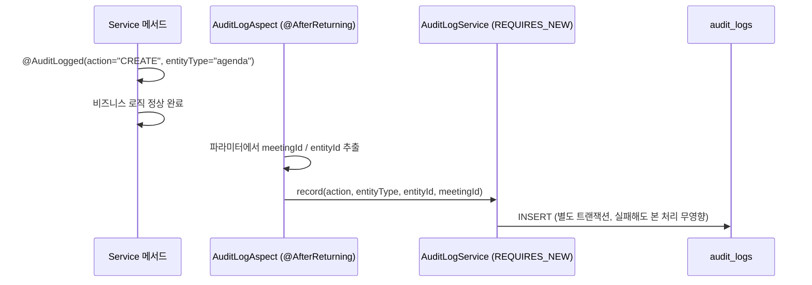

✅ **MUST:** 변경 동작(CREATE/UPDATE/DELETE/ASSIGN/APPROVE/LOGIN 등)은 서비스 메서드에 `@AuditLogged(action, entityType)`를 붙인다. AOP가 **정상 완료 후** `audit_logs`에 기록한다.

⭕ **SHOULD:** 감사 기록은 `REQUIRES_NEW` 별도 트랜잭션으로 분리하고, 기록 실패는 본 처리에 영향을 주지 않는다(warn 로그만). 인증 컨텍스트가 없는 로그인은 `recordAs(actorId, ...)`, 같은 트랜잭션에서 actor가 생성되는 signup은 `recordAfterCommit(...)`을 사용한다(FK 충족).

## 7.9 PG → Neo4j 동기화 표준 (Outbox)

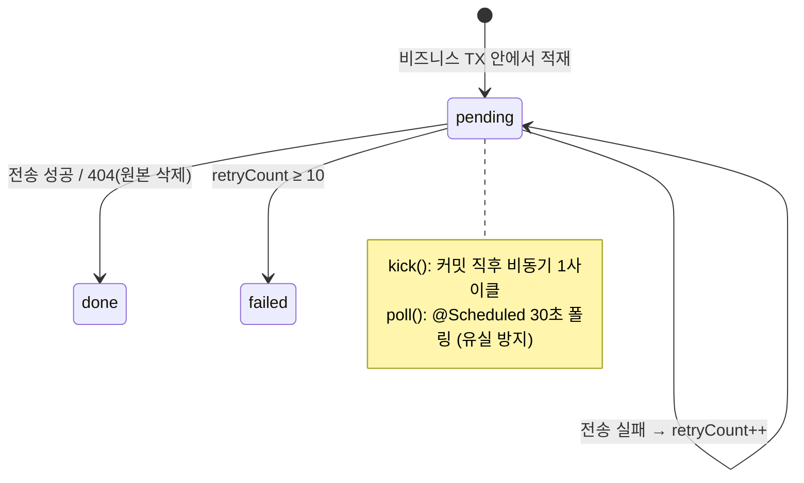

✅ **MUST:** 그래프 동기화가 필요한 CUD는 비즈니스 트랜잭션 안에서 `NeoSyncService.syncXxx()`/`deleteXxx()`를 호출해 **`neo4j_sync_outbox`에 적재**한다(직접 FastAPI 호출 금지 — 원자성·재시도를 위해).

- `SyncOutboxDispatcher`가 커밋 직후 `kick()`으로 비동기 전송하고, 30초 `@Scheduled` 폴러가 잔여분을 재처리한다.
- 전송은 entityType별 `/api/sync/*` URL로, 헤더 `X-Internal-Secret`을 붙여 호출한다.
- 404(원본 이미 삭제)는 `done` 처리(재시도 무의미), 그 외 실패는 `retryCount++` 후 10회 초과 시 `failed`.

⚠️ **주의:** 현재 단일 replica 전제다(인메모리 `AtomicBoolean running`으로 동시 실행 방지). 멀티 replica로 확장 시 `SELECT ... FOR UPDATE SKIP LOCKED`로 전환해야 한다(13장 Gap).

## 7.10 설정(application.yaml) 표준

| 항목 | 값 | 비고 |
|---|---|---|
| `spring.profiles.active` | `local`(기본) / `prod`(k8s) | — |
| `spring.jpa.hibernate.ddl-auto` | **`none`** | 스키마는 `ddl/` 수동 관리 |
| `spring.jpa.open-in-view` | `false` | 지연로딩 누수 방지 |
| `jwt.secret` | `${JWT_SECRET}` | FastAPI와 공유 |
| `jwt.access/refresh-token-expiration` | 900000 / 1209600000 | — |
| `ai.url` | `http://localhost:8000` / `http://workmaite-ai:8000` | 동기화 대상 |
| `management.endpoints` | `prometheus,health,info` | Actuator 노출 |
| `server.port` | 8080(기본) | — |

✅ **MUST:** DB·시크릿·AI URL은 환경변수로 주입한다(`${DB_PASSWORD}`, `${JWT_SECRET}`). yaml에 운영 비밀을 적지 않는다.

## 7.11 Spring 품질 게이트

✅ **MUST(통과 기준):** `./gradlew spotlessCheck checkstyleMain checkstyleTest pmdMain spotbugsMain` 전부 통과(`ignoreFailures=false` → 위반 시 빌드 실패).

| 도구 | 역할 |
|---|---|
| Spotless (googleJavaFormat) | 포맷·import 정렬·미사용 import 제거·EOF 개행 |
| Checkstyle 10.12.7 | 코딩 컨벤션(`config/checkstyle/`) |
| PMD 6.55 | 안티패턴(`config/pmd/ruleset.xml`) |
| SpotBugs | 버그 패턴(`config/spotbugs/exclude.xml`) |

⭕ **SHOULD:** `@SpringBootTest` 통합 테스트는 CI의 throwaway PostgreSQL(`postgres:16-alpine`)로 컨텍스트를 검증한다(16장 — 운영 DB 금지).

## 7.12 현행 격차(Gap)

| 항목 | 현황 | 방향 |
|---|---|---|
| 인가 위치 | 컨트롤러에 `@PreAuthorize` 없음, 서비스 의존 | 서비스 가드 호출 누락 점검을 리뷰 필수 항목화 |
| enum 매핑 일관성 | Converter / 소문자상수 / 혼합 공존 | 신규는 Converter 방식 통일 |
| `extractAgendas` | 빈 스텁(`return List.of()`) | AI 추출 연동 또는 제거 |
| `TokenUsageLog` | 엔티티만 있고 repository 없음 | 사용량 조회는 FastAPI가 담당(분리 유지) |
| Outbox 동시성 | 단일 replica 전제 | 멀티 replica 시 SKIP LOCKED |

---

# 8. 백엔드 개발 표준 — FastAPI (AI)

FastAPI 서버는 AI 에이전트·실시간 전사·지식 그래프·검색을 담당한다. import 루트는 `backend/fastapi`이며, 약 21,000 LOC / 77개 모듈로 구성된다. 인증은 Spring이 발급한 JWT를 검증만 한다.

## 8.1 패키지 구조 표준

```
backend/fastapi/
├── main.py            엔트리포인트(.env 로드 → 로깅 → lifespan → 라우터 등록)
├── core/              교차 관심사: 인증·인가·미들웨어·요청 컨텍스트
│   auth · access_guard · service_guards · audit_middleware · model_override
│   · context_types · agent_scope · meeting_context · ai_config · stt_prompt
├── db/                database · models(SQLAlchemy 2.0) · schemas(Pydantic v2)
├── llm/               llm_factory · pricing(+pricing.yaml) · metrics · agent_logging · graph_runtime
├── graphdb/           neo4j_client · neo4j_sync · neo4j_ids · rel_schema
│   · retrieval_registry · file_embedder · graphrag_text2cypher
├── storage/           r2_storage
├── realtime/          sse · websocket_manager · transcription
├── routers/           HTTP 라우터(14개) + prompts/ 서브패키지
├── agents/            knowledge_manager · minutes_generator · report_reviewer · task_extractor
├── graphs/            supervisor_graph(ReAct) · agent_workflow(StateGraph 가드레일)
├── tools/             meeting_tools(조회) · action_tools(쓰기 제안)
├── services/          supervisor_helpers(비-HTTP 공유 헬퍼)
├── eval/              run_eval · retrieval_eval(스모크 평가)
└── scripts/           일회성 스크립트(python -m scripts.<name>)
```

✅ **MUST:** 모듈은 위 패키지 책임에 맞게 배치한다. 라우터에 LLM 오케스트레이션 로직을 직접 쓰지 말고 `agents/`·`graphs/`·`services/`로 분리한다.

## 8.2 코드 규약

✅ **MUST: 절대 import** 를 사용한다 — `from db.database import ...`, `from core.auth import ...`. 상대 import(`from ..core`) 금지.

💡 **근거:** uvicorn `main:app`을 `backend/fastapi`에서 실행하고 Docker `WORKDIR /app` + `COPY . .` 구조이므로, 절대 import가 로컬·컨테이너에서 동일하게 해석된다.

✅ **MUST(타입 힌트):** 함수 인자·반환에 타입 힌트를 단다(mypy `check_untyped_defs=true`, `implicit_optional`).

✅ **MUST(docstring):** 공개 함수·엔드포인트는 한국어 docstring으로 의도·권한·주의사항을 적는다. 특히 어떤 가드로 보호되는지 명시한다.

⭕ **SHOULD:** 모듈 비공개 헬퍼·로거는 `_` 접두(`_check`, `_logger`, `_scope`).

## 8.3 라우터 표준

✅ **MUST:** 라우터는 `APIRouter(prefix=..., tags=[...])`로 그룹화하고 `main.py`에서 등록한다.

✅ **MUST:** 인증·DB는 의존성 주입으로 받는다 — `current_user = Depends(get_current_user)`, `db = Depends(get_db)`.

✅ **MUST:** 요청/응답 모델은 `db/schemas.py`의 Pydantic 모델을 사용한다(불가피한 경우만 `dict`).

### 라우터 prefix 인벤토리

| 라우터 | prefix | 책임 |
|---|---|---|
| `supervisor` | `/api/agent` | 중앙 채팅 오케스트레이션(핵심) |
| `archive` | `/api/agent` | 아카이브 추출·파일 분석·아젠다 커밋 |
| `graph_analysis` | `/api/agent` | 관계 분석·필드 채움(SSE) |
| `hitl_reviews` | `/api/agent` | HITL 검토(시작/확인) |
| `knowledge` | `/api/agent` | 지식 저장·관계 제안/확정·지식 챗 |
| `chat_history` | `/api/chats` | 채팅 이력(self-scope) |
| `neo4j_graph` | `/api/neo4j` | 그래프 조회·관계 CRUD |
| `sessions` | `/api/ai` | 회의록 CRUD·refine |
| `meetings.ai_router` | `/api/ai` | 회사/부서 rename·사용자 관리(AI측) |
| `stt` | `/api/stt` | 배치 STT |
| `upload` | `/api/upload` | 보고서/회의록 업로드·채점 |
| `usage` | `/api/usage` | 토큰/STT 사용량(self-scope) |
| `sync` | `/api/sync` | **내부 전용**(X-Internal-Secret) |
| `transcription_ws` | `/ws/...` | 실시간 STT WebSocket |

⚠️ **주의(prefix 공유):** 다수 라우터가 `/api/agent`를 공유한다. 새 엔드포인트 경로가 기존과 충돌하지 않도록 한다.

## 8.4 인증·인가·가드 표준

### 8.4.1 JWT 검증 — `core/auth.py`

✅ **MUST:** `get_current_user`는 `SECRET_KEY = os.environ["JWT_SECRET"]`(Spring 공유), `ALGORITHMS = ["HS256","HS384","HS512"]`(HS만 허용 — `alg=none`/RS 혼동 차단)로 검증한다.

- `sub` 없으면 401, `type=="refresh"`면 401(SEC-7), 만료는 명시 처리.
- 조회한 User가 `is_active`가 아니면 401(MT-6 — 탈퇴 계정은 잔여 토큰으로도 거부).

### 8.4.2 RBAC — `core/access_guard.py`

Spring `MeetingAccessGuard`와 **동일 규칙**(company_role × meeting_role)을 Python으로 구현한다.

| 가드 | 의미 |
|---|---|
| `require_view(meeting_id)` | 조회 권한 |
| `require_meeting_edit(meeting_id)` | 편집 권한(간사/관리자) |
| `require_owned_edit(meeting_id, owner_id)` | 편집권자 또는 소유자 |
| `require_view_by_session/report` | 세션/보고서 경유 조회 |
| `viewable_meeting_ids` / `visible_user_ids` | 가시성 집합(None=SYSTEM_ADMIN 전체) |

✅ **MUST:** 보호 엔드포인트는 위 가드 중 적절한 것을 호출한다.

### 8.4.3 서비스 가드 — `core/service_guards.py`

| 가드 | 역할 | 초과 시 |
|---|---|---|
| `check_daily_token_budget(db, user_id)` | 오늘 0시 이후 토큰 합산(`DAILY_TOKEN_BUDGET` 기본 300,000) | 429 |
| `idempotency_guard(key)` | 인메모리 TTL 600초 멱등성 | 409 |
| `single_flight(user_id)` | 사용자당 동시 1개 | 429 |

✅ **MUST:** 비용이 큰 AI 호출(슈퍼바이저 채팅)은 `check_daily_token_budget`를, 확정 반영 엔드포인트(HITL confirm·commit)는 `idempotency_guard`를 적용한다.

### 8.4.4 미들웨어

| 미들웨어 | 역할 |
|---|---|
| `AuditLogMiddleware` | 변경성(POST/PATCH/PUT/DELETE) & status<400 요청을 `audit_logs`에 기록(`/metrics`·`/api/sync`·문서 경로 제외) |
| `ModelOverrideMiddleware` | `X-LLM-Model` 헤더가 `pricing.yaml` 등록 모델일 때만 `model_override_var` 설정(순수 ASGI — 스트리밍 자식 태스크까지 contextvar 상속) |

💡 **근거(순수 ASGI):** `BaseHTTPMiddleware`는 contextvar를 스트리밍 자식 태스크로 전파하지 못한다. 모델 오버라이드는 최외곽 순수 ASGI로 구현해야 스트리밍 중에도 유지된다.

### 8.4.5 내부 호출 인증 — `core/`·`sync.py`

✅ **MUST:** Spring→FastAPI 내부 동기화는 `X-Internal-Secret` 헤더(`INTERNAL_SECRET`)로 검증한다.

⚠️ **주의(현행 격차):** 현재 비교가 평문 `!=`(non-constant-time)이고, `sync.py` 일부 엔드포인트(minutes/report sync)가 내부 시크릿이 아닌 사용자 인증을 쓰는 불일치가 있다. 개선 방향은 12장에 정의한다.

## 8.5 AI 에이전트 아키텍처 표준

### 8.5.1 전체 구성

⚠️ **중요:** 본 시스템의 "supervisor"는 *진정한 LangGraph supervisor 그래프가 아니라*, **LLM 의도 분류 + if/elif 디스패치** 다. 두 라우팅 메커니즘이 공존한다.

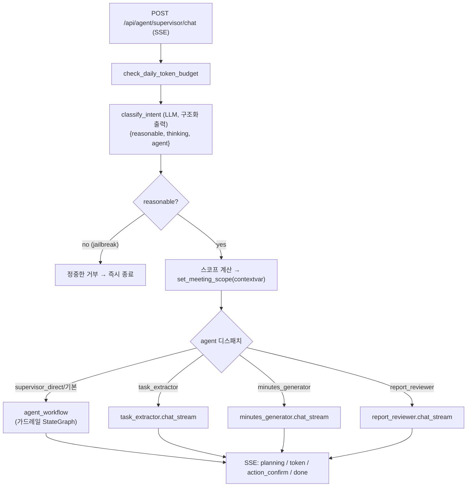

✅ **MUST:** 라우팅 결정은 단일 LLM 콜(`classify_intent`)로 jailbreak 판정과 의도 분류를 함께 수행한다. **jailbreak/비합리 요청은 스코프 조회·디스패치 전에 최전선에서 차단**한다.

### 8.5.2 가드레일 워크플로 — `graphs/agent_workflow.py`

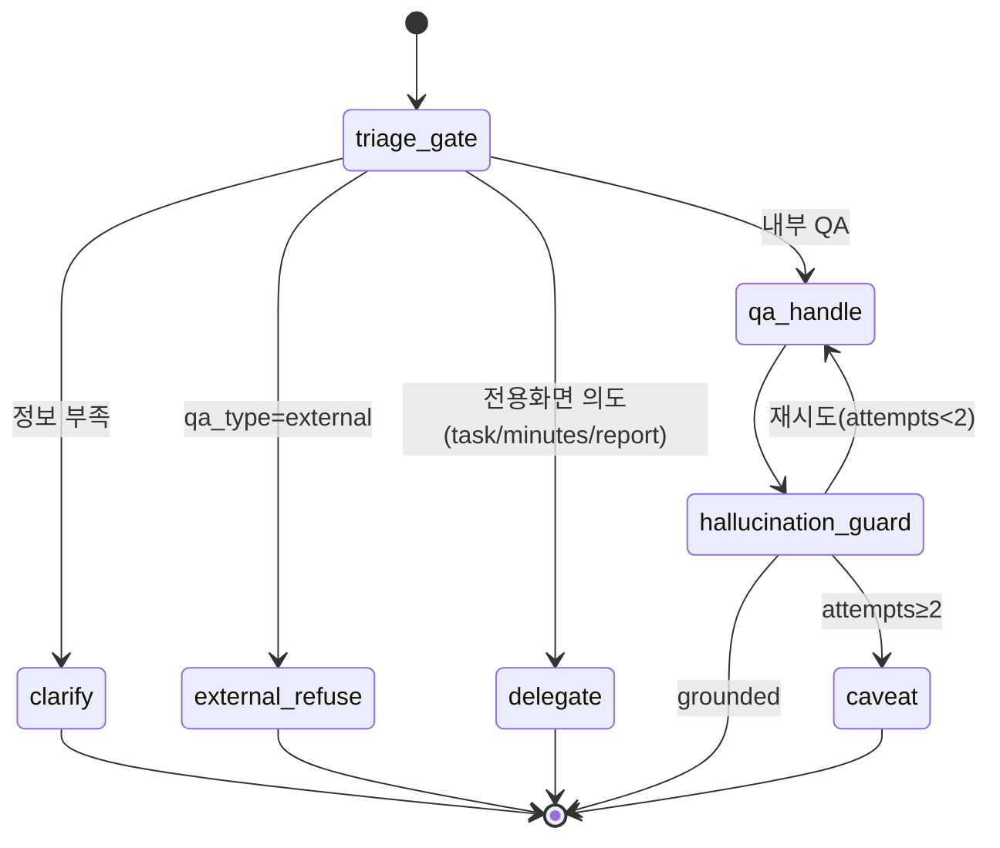

✅ **MUST:** QA 응답은 `hallucination_guard`(다중라벨 벡터검색 + LLM grounding 판정)를 거친다. 근거 부족 시 최대 2회 재시도 후 caveat(주의 문구)를 붙여 반환한다.

⚠️ **주의:** 스트리밍 경로(`run_agent_workflow_stream`)는 컴파일된 그래프를 쓰지 않고 노드 함수를 수동 순차 호출한다(스트림 되감기 불가). 그래프 토폴로지를 바꿀 때 스트리밍 경로도 함께 갱신해야 한다.

### 8.5.3 ReAct 에이전트 — `graphs/supervisor_graph.py`

✅ **MUST:** 도구 사용 에이전트는 `create_react_agent(model, tools=SUPERVISOR_TOOLS + ACTION_TOOLS, prompt=...)`로 만든다. 모델은 `model_override_var → OPENAI_MODEL_CHAT → OPENAI_MODEL → "gpt-4o"` 순으로 해석한다.

✅ **MUST:** 스코프는 **RunnableConfig.configurable**(`user_id`, `allowed_meeting_ids`, `is_admin`, `meeting_id`, `thread_id`)로 전달한다.

### 8.5.4 HITL(Human-in-the-loop) 표준

검토가 필요한 쓰기(보고서 검토·아젠다 추출)는 `StateGraph` + 체크포인터 + `interrupt()`로 구현한다.

```mermaid
sequenceDiagram
    participant FE as 프런트
    participant EP as start/confirm 엔드포인트
    participant G as StateGraph(interrupt)
    participant CP as AsyncPostgresSaver
    participant ST as store_report/store_task

    FE->>EP: POST /reports/review/start
    EP->>G: 실행 → interrupt(proposed)
    G->>CP: 상태 체크포인트 저장
    EP-->>FE: thread_id + 제안(pending)
    FE->>EP: POST /reports/review/confirm {approved}
    EP->>G: Command(resume={approved})
    G->>CP: 체크포인트 복원
    alt approved
        G->>ST: 확정 저장(그래프 반영)
    end
    EP-->>FE: 결과
```

✅ **MUST:** HITL 그래프는 `get_checkpointer()`(AsyncPostgresSaver)를 사용한다. `interrupt()`는 체크포인터가 있어야 동작한다. 확정 반영은 사용자 승인 후에만 실행한다.

## 8.6 에이전트 도구 · 데이터 스코프 표준 (보안 핵심)

### 8.6.1 도구 분류

| 도구 묶음 | 모듈 | 성격 |
|---|---|---|
| `SUPERVISOR_TOOLS` (조회 9종) | `tools/meeting_tools.py` | 회의/아젠다/보고서/회의록/그래프 조회·검색 |
| `ACTION_TOOLS` (쓰기 제안 1종) | `tools/action_tools.py` | `propose_data_change` — 실행하지 않고 spec만 반환 |
| `KNOWLEDGE_TOOLS` 등 | `agents/*.py` | 에이전트별 검색 도구(최종적으로 `search_knowledge` 호출) |

### 8.6.2 이중 IDOR 방어 (P4)

```mermaid
flowchart TB
    subgraph D1["방어 1: RunnableConfig"]
        T1["meeting_tools 도구"] --> CHK1["_check(meeting_id ∈ allowed?)"]
        CHK1 -->|no| DENY1["_denied(meeting_id) 한국어 거부"]
        CHK1 -->|yes / is_admin| OK1["스코프 내 조회"]
    end
    subgraph D2["방어 2: contextvar"]
        SUB["sub-agent 도구 search_knowledge"] --> CV["current_scope_meeting_ids()"]
        CV --> OK2["검색 제한 id (admin/미설정=None=무제한)"]
    end
```

✅ **MUST:** 모든 회의 관련 조회 도구는 `_check(meeting_id, allowed, is_admin)`로 스코프를 강제하고, 범위 밖이면 데이터를 반환하지 않고 복구 가능한 거부 문장을 돌려준다.

✅ **MUST:** RunnableConfig를 못 받는 sub-agent 도구(`search_knowledge`)는 `core/agent_scope.py`의 contextvar(`meeting_scope_var`)로 스코프를 강제한다. 라우터가 `set_meeting_scope(allowed, is_admin)`를 설정하고 finally에서 reset한다.

🚫 **MUST NOT:** 스코프를 프롬프트 지시("이 회의만 보세요")로만 강제하지 않는다. **모델 출력은 비신뢰**이므로 도구 내부에서 강제한다. (상세: `docs/ai-data-scope.md`)

### 8.6.3 쓰기 제안(propose_data_change) 표준

✅ **MUST:** AI는 데이터를 직접 변경하지 않는다. `propose_data_change`는 화이트리스트(`agenda`/`minutes`/`report`/`meeting`, 허용 op·필드)만 통과시켜 *spec*만 반환하고, 프런트가 사용자 확인 후 **기존 CRUD 엔드포인트**를 호출한다(권한 재검증·감사·동기화 재사용).

🚫 **MUST NOT:** AI 도구가 원시 SQL/Cypher·DDL을 실행하지 못하게 한다. Text2Cypher도 읽기 전용(EXPLAIN으로 쓰기 거부).

## 8.7 LLM 계층 표준

### 8.7.1 모델 팩토리 — `llm/llm_factory.py`

✅ **MUST:** LLM 인스턴스는 `llm_factory(profile)`로 생성한다. 프로파일별 온도/스트리밍이 정의되어 있다.

| profile | temp | streaming | 용도 |
|---|---|---|---|
| `routing` | 0.0 | no | 의도 분류·Text2Cypher |
| `extract` | 0.0 | no | 추출 |
| `chat` | 0.2 | yes | 슈퍼바이저 |
| `knowledge` | 0.2 | yes | 지식 챗 |
| `review` | 0.1 | yes | 보고서 검토 |
| `minutes` | 0.3 | yes | 회의록 |

✅ **MUST(구조화 출력):** 구조화 출력은 `ainvoke_structured(llm, schema, messages)`(function_calling)로 받고, 실패 시 가짜 기본값을 만들지 말고 `StructuredOutputError`를 던진다(H-2 — 환각 방지).

### 8.7.2 비용·토큰 관측 — `llm/agent_logging.py`, `pricing.py`

✅ **MUST:** AI 작업 함수는 `@log_agent_run(context_type, ...)`로 감싼다. LangChain 전역 콜백(`TokenUsageCollector`)이 토큰을 자동 수집하고, `AgentLog`(status running→success/failed) + `TokenUsageLog`(모델별 prompt/completion + `estimate_cost`) + LangSmith `trace_id`를 기록한다.

✅ **MUST(단가 SSOT):** 모델/임베딩/STT 단가는 `llm/pricing.yaml`이 단일 소스다. 신규 모델은 여기에 단가를 추가한다(`_match_key`가 최장 prefix 매칭).

### 8.7.3 모델 오버라이드 표준

✅ **MUST:** 프런트는 `X-LLM-Model` 헤더로 모델을 선택할 수 있으나, **`pricing.yaml`에 등록된 모델만** 허용된다(미들웨어가 검증). 임의 모델명을 받지 않는다(비용 통제).

## 8.8 GraphDB / Neo4j 표준 (FastAPI 측)

### 8.8.1 단일 소스 모듈

| 모듈 | SSOT 책임 |
|---|---|
| `graphdb/rel_schema.py` | 관계 어휘(`REL_MATRIX`)·색상(`REL_COLORS`)·허용 관계(`ALLOWED_REL_TYPES`) |
| `graphdb/neo4j_ids.py` | PG id ↔ Neo4j string id 변환(`mg-{pg}`, `agenda-{pg}` …) |
| `graphdb/retrieval_registry.py` | 노드타입별 인덱스명·차원·스코프 규칙·검색 함수 |
| `llm/...` `file_embedder.EMBED_DIM` | 임베딩 차원(모델에서 도출) |

✅ **MUST:** 관계명·인덱스명·ID 명명을 코드 곳곳에 하드코딩하지 말고 위 모듈을 참조한다(P5).

### 8.8.2 동기화 표준 — `graphdb/neo4j_sync.py`

✅ **MUST:** 모든 Neo4j sync는 `try/except`로 메인 흐름을 비차단한다(PG가 SoR이므로 동기화 실패가 사용자 요청을 깨지 않게).

✅ **MUST(orphan 정리 안전장치):** 전체 재동기화의 orphan 정리는 **빈 id 리스트면 즉시 반환**한다(전체 삭제 사고 방지). `pg_id`가 있는 노드만 대상으로 `NOT pg_id IN $ids` DETACH DELETE.

✅ **MUST(임베딩 절약):** 노드 콘텐츠는 `content_hash`(sha256)로 비교해 변경 없으면 임베딩 재계산을 생략한다.

⚠️ **주의:** 벡터 인덱스 차원은 모델에서 도출(`EMBED_DIM`)한다. 정적 차원을 박으면 모델 변경 시 `IF NOT EXISTS`가 잘못된 차원을 선점하는 사고가 난다.

### 8.8.3 검색 스코프 표준 — `retrieval_registry.py`

✅ **MUST:** 노드타입별 스코프 모드로 IDOR을 강제한다.

| 모드 | 적용 | Cypher 패턴 |
|---|---|---|
| `prop` | Report | `WHERE node.meeting_id IN $mids` |
| `rel` | Session/Agenda | `MATCH (node)--(mg:Meetings) WHERE mg.pg_id IN $mids` |
| `custom` | Minutes/Chunk | prop OR 2-hop, 공유지식은 `meeting_id IS NULL` 허용 |

⚠️ **주의(Text2Cypher 격차):** non-admin 스코프가 LLM 프롬프트 권고 수준이라 하드 필터가 아니다. 보장이 필요하면 `graph_query`(Text2Cypher) 도구를 admin 전용으로 제한한다(12장).

## 8.9 실시간(Realtime) 표준

| 모듈 | 표준 |
|---|---|
| `realtime/sse.py` | SSE v2 와이어포맷(`event: <type>\ndata: <json>\n\n`). 이벤트 어휘는 9.7절 |
| `realtime/websocket_manager.py` | `ConnectionManager` 싱글톤(`manager`) — meeting/session/user 소켓 추적 |
| `realtime/transcription.py` | 브라우저 PCM16(24kHz) → OpenAI Realtime 프록시, kiwipiepy 문장 재조립, 용어교정 |

✅ **MUST(WS 인증):** WebSocket은 쿼리파라미터 `token`(JWT)으로 인증하고, refresh 토큰은 거부한다(SEC-7). 실패 시 close code 4401/4403.

⚠️ **주의:** `ConnectionManager`는 인메모리·단일 replica 전제다. 멀티 replica 확장 시 외부 pub/sub(예: Redis)로 브로드캐스트를 옮겨야 한다.

## 8.10 데이터 모델 표준 (FastAPI 측)

✅ **MUST(SQLAlchemy):** 모델은 `db/models.py`에 `Mapped[]`/`mapped_column()` 스타일로 정의한다. PK는 `BigInteger`. **`create_all` 금지**(스키마는 `ddl/` 단일 관리).

✅ **MUST(role 매핑):** Python 속성은 의미별로 분리하되 DB 컬럼은 `role` 유지 — `company_role: mapped_column("role", String(30))`, `meeting_role: mapped_column("role", String(20))`.

✅ **MUST(Pydantic):** 스키마는 `db/schemas.py`에 `ConfigDict(from_attributes=True)`로 정의한다. 외부 계약 키는 alias로 처리(`MeetingMemberOut`의 `meeting_role` → `serialization_alias="role"`).

## 8.11 기동 시퀀스 표준 — `main.py`

```mermaid
flowchart TB
    A[".env 로드 (override=True)"] --> B["로깅 / LangSmith 트레이싱 조건부"]
    B --> C["lifespan 시작"]
    C --> D["init_checkpointer (AsyncPostgresSaver)"]
    D --> E["_run_pg_migrations (멱등 DDL)"]
    E --> F["ensure_constraints (UNIQUE)"]
    F --> G["init_vector_index + ensure_fulltext_indexes"]
    G --> H["_startup_sync_task (stale 정리 + 선택적 전체 resync)"]
    H --> I["_periodic_resync_task (RESYNC_INTERVAL_SEC 주기)"]
    I --> J["라우터/미들웨어/CORS/Prometheus 등록"]
    J --> K["/health, WebSocket 등록"]
```

✅ **MUST(멱등 마이그레이션):** 불가피한 런타임 스키마 보정은 `_run_pg_migrations`의 `IF NOT EXISTS`/`IF EXISTS` 멱등 DDL로만 한다. 정식 스키마 변경은 `ddl/`에 반영한다(10장).

✅ **MUST(트레이싱 조건부):** LangSmith는 `LANGSMITH_API_KEY`가 있고 `LANGSMITH_TRACING=true`일 때만 켠다(키 없이 켜면 403 스팸).

## 8.12 FastAPI 품질 게이트

✅ **MUST(통과 기준):** `uv run ruff check . && uv run ruff format --check . && uv run mypy . && uv run deptry .` 전부 통과. `pip-audit`는 경고(transitive 취약점).

| 도구 | 역할 |
|---|---|
| ruff | lint(E4/E7/E9/F/W) + format(`py311`) |
| mypy | 타입 검사(`implicit_optional`, `check_untyped_defs`) |
| deptry | 미사용/누락 의존성(런타임 전용은 `per_rule_ignores`) |
| pip-audit | 의존성 취약점(경고) |

⚠️ **주의:** CI(ci-fastapi)는 추가로 `compileall` + `ruff check --select F821,F811,...`(미정의/재정의 이름)로 import 오류를 빌드 단계에서 차단한다.

## 8.13 현행 격차(Gap)

| 항목 | 현황 | 방향 |
|---|---|---|
| `neo4j_graph` 쓰기 | per-resource 가드 부재 | 가드 추가 |
| `INTERNAL_SECRET` 비교 | 평문 `!=` | constant-time 비교 |
| `sync.py` 인증 불일치 | minutes/report sync가 사용자 인증 | 내부 시크릿으로 통일 |
| `retry_failed_syncs` | 스텁 | 실제 재시도 구현 |
| Text2Cypher 스코프 | LLM 권고 수준 | admin 전용 또는 하드 필터 |
| ConnectionManager | 단일 replica 인메모리 | 외부 pub/sub |

---

# 9. API 설계 표준

본 장은 Spring Boot·FastAPI 양 백엔드의 REST/SSE/WebSocket API 설계 규약을 정의한다. 전체 엔드포인트 인벤토리는 부록에서 참조한다.

## 9.1 URL 설계 규약

| 서버 | prefix | 규칙 |
|---|---|---|
| Spring Boot | `/api/v1` | 버전 프리픽스. 리소스 복수형 명사, 행위는 하위 경로 |
| FastAPI | `/api/ai`·`/api/agent`·`/api/neo4j`·`/api/stt`·`/api/upload`·`/api/usage`·`/api/chats`·`/ws` | Ingress 화이트리스트와 일치 |

✅ **MUST(리소스 명명):**
- 컬렉션: `/meetings`, `/agendas`(복수형 명사).
- 단건: `/agendas/{agendaId}`.
- 종속 컬렉션: `/meetings/{meetingId}/agendas`.
- 행위(비-CRUD): `/agendas/{agendaId}/assignment`, `/agendas/extract`, `/sessions/{id}/start`.

✅ **MUST:** Spring 경로 변수는 camelCase(`{meetingId}`), FastAPI는 snake_case(`{meeting_id}`)로 각 언어 관례를 따른다. 단, 외부에서 보이는 경로 세그먼트 형태는 일관 유지한다.

⭕ **SHOULD:** 신규 버전 호환 파괴 변경은 `/api/v2`로 분리한다(현재는 v1만 존재).

## 9.2 HTTP 메서드·상태코드 표준

| 메서드 | 용도 | 성공 코드 |
|---|---|---|
| GET | 조회(부수효과 없음) | 200 |
| POST | 생성·행위 | 201(생성) / 200(행위) |
| PATCH | 부분 수정 | 200 |
| PUT | 전체 교체(드묾) | 200 |
| DELETE | 삭제 | 200 |

| 오류 코드 | 의미 |
|---|---|
| 400 | 입력 검증 실패 |
| 401 | 미인증·토큰 만료/무효 |
| 403 | 인가 실패(권한 없음·스코프 밖) |
| 404 | 리소스 없음 |
| 409 | 충돌(중복·멱등 위반) |
| 429 | 한도 초과(토큰 예산·동시 실행) |
| 500 | 서버 오류 |

✅ **MUST:** 생성은 201을 반환한다(예: `POST .../agendas` → 201). 행위형 POST(`/start`, `/review`)는 200.

## 9.3 응답 포맷 표준

### 9.3.1 Spring Boot — ApiResponse 래핑

✅ **MUST: 모든 Spring 응답은 `ApiResponse<T>`로 감싼다.**

```json
{ "success": true, "message": "success", "data": { /* 페이로드 */ } }
```

```java
return ResponseEntity.ok(ApiResponse.ok(data));                         // 200
return ResponseEntity.status(HttpStatus.CREATED).body(ApiResponse.ok(data)); // 201
// 실패는 GlobalExceptionHandler가 ApiResponse.fail(message)로 변환
```

✅ **MUST:** 프런트는 `api` 인터셉터가 `data`를 자동 언랩하므로(6.4.2), 컨트롤러는 항상 `ApiResponse.ok(...)`로 일관 래핑한다.

### 9.3.2 FastAPI — 직접 반환

✅ **MUST:** FastAPI는 Pydantic 모델 또는 SSE 스트림을 직접 반환한다(`ApiResponse` 래핑 없음). 오류는 `HTTPException(status_code, detail)`.

💡 **근거(불일치 허용):** 두 서버의 응답 포맷이 다른 것은 의도된 설계다. 프런트가 `api`(언랩)와 `apiAI`(비언랩)를 분리해 다루므로(6.4.2) 혼선이 없다.

## 9.4 에러 코드 표준

✅ **MUST(Spring):** 비즈니스 오류는 `ErrorCode` enum에 `(HttpStatus, 한국어 메시지)`로 정의하고 `BusinessException`으로 던진다. 코드 명명은 `<도메인>_<상황>`(예: `MEETING_NOT_FOUND`, `REPORT_ALREADY_APPROVED`). 전체 목록은 부록 18.3.

✅ **MUST(FastAPI):** `HTTPException`의 `detail`은 한국어 사용자 메시지로 작성한다. AI 거부는 *복구 가능한* 문장으로(`[접근 거부] … list_my_meetings로 확인하세요`).

## 9.5 인증 표준

```mermaid
flowchart LR
    L["POST /api/v1/auth/login"] --> T["access(15분) + refresh(14일) 발급"]
    T --> U["이후 요청: Authorization: Bearer <access>"]
    U --> EXP{"만료 5분 전?"}
    EXP -->|yes| R["POST /auth/refresh → 새 access"]
    EXP -->|no| OK["정상 처리"]
    R --> U
```

✅ **MUST:**
- 인증은 JWT Bearer 토큰. `JWT_SECRET`을 양 서버가 공유(HS256).
- access/refresh를 `type` 클레임으로 구분, refresh를 access로 쓰면 거부.
- WebSocket은 쿼리파라미터 `token`으로 인증(헤더를 못 쓰므로), refresh 거부.

## 9.6 권한(RBAC) 표준

```mermaid
flowchart TB
    REQ["보호 리소스 요청"] --> AUTH{"인증됨?"}
    AUTH -->|no| E401["401"]
    AUTH -->|yes| SYS{"SYSTEM_ADMIN?"}
    SYS -->|yes| ALLOW["전체 허용"]
    SYS -->|no| CO{"COMPANY_ADMIN<br/>& 자사 회의체?"}
    CO -->|yes| SCOPE["회사 범위 허용"]
    CO -->|no| MEM{"회의체 멤버?"}
    MEM -->|view: 멤버| ALLOW2["조회 허용"]
    MEM -->|edit: 간사/소유자| ALLOW3["편집 허용"]
    MEM -->|아니면| E403["403"]
```

✅ **MUST:** 권한은 양 서버에서 **이중 방어**한다 — HTTP 레이어 가드(`MeetingAccessGuard`/`access_guard`) + (AI는) 도구 내부 스코프(8.6.2).

✅ **MUST:** AI 데이터 접근 범위는 다음을 따른다(`docs/ai-data-scope.md`).

| 데이터 | 일반 사용자 | SYSTEM_ADMIN |
|---|---|---|
| 회의체 목록/현황/아젠다/보고서 | 소속 회의체만 | 전체 |
| 회의록 의미 검색(Neo4j) | 소속 회의체 회의록만(`mg.pg_id IN allowed`) | 전체 |
| 사용자 디렉터리 | 본인+내 회사+공유 회의체 | 전체 |

## 9.7 SSE / WebSocket 표준

### 9.7.1 SSE 이벤트 어휘

✅ **MUST:** SSE는 v2 와이어포맷(`event: <type>\ndata: <json>\n\n`)을 사용하고, 아래 이벤트 타입만 쓴다.

| 이벤트 | 의미 |
|---|---|
| `run` | 스트림 시작 메타 |
| `planning` | 진행 계획·사고 과정 |
| `token` | 응답 토큰(본문 스트리밍) |
| `tool_call` | 도구 호출 알림 |
| `result` | 구조화 결과 |
| `highlight` | 그래프/UI 하이라이트 지시 |
| `action_confirm` | 쓰기 제안 카드(사용자 확인 필요) |
| `usage` | 토큰 사용량 |
| `error` | 오류(500자 절단) |
| `done` | 종료 |

✅ **MUST(TTFT 의존):** 첫 `token` 프레임까지의 시간으로 TTFT를 측정한다(`instrument_stream`). 따라서 본문 토큰은 반드시 `token` 이벤트로 보낸다(15장).

### 9.7.2 SSE 엔드포인트 인벤토리

| 라우터 | SSE 엔드포인트 수 |
|---|---|
| supervisor | 4 (supervisor/chat, session/chat, minutes/sessions-chat, generate-minutes) |
| archive | 2 |
| graph_analysis | 2 |
| hitl_reviews | 1 |
| knowledge | 1 |

### 9.7.3 WebSocket

| WS 엔드포인트 | 용도 |
|---|---|
| `/ws/sessions/{session_id}/transcribe` | 실시간 STT |
| `/ws/meetings/{meeting_id}/agenda` | 회의체 아젠다 실시간 |
| `/ws/sessions/{session_id}/minutes` | 세션 회의록 실시간 |

✅ **MUST:** WS는 쿼리 token 인증 + 가드(`require_meeting_member_by_session`), 실패 시 4401/4403 close.

## 9.8 페이지네이션 표준

✅ **MUST:** 데이터 성격에 따라 두 방식을 구분한다(`docs/api-pagination.md`).

| 데이터 | 방식 | 파라미터 | 이유 |
|---|---|---|---|
| 시간순 무한 누적(채팅·STT) | **keyset 커서** | `beforeId` / `afterSec` | offset은 실시간 삽입 시 페이지 밀림·느림 |
| 관리/검색 목록(회의체·사용자) | offset | `page`, `size` | 일반 페이지네이션 |

✅ **MUST:** size 상한은 서버가 강제한다(채팅 100, STT 500).

```
채팅:  GET /api/v1/chat/messages?threadId=&limit=100&beforeId=<가장 오래된 id>
        → 항상 시간 오름차순 배열, 다음 커서 = 응답 첫 요소 id, 빈 배열 = 과거 없음
STT:   GET /api/v1/sessions/{id}/scripts?afterSec=<마지막 start_sec>&limit=500
        → start_sec 오름차순, 실시간 WS append와 충돌 안 함
```

✅ **MUST(인덱스 전제):** keyset은 커버링 인덱스를 전제한다 — `idx_chat_messages_thread (thread_id, created_at)`, `idx_stt_segments_session (session_id, start_sec)`.

## 9.9 명명 경계 규칙 (외부 계약)

✅ **MUST:** DB 컬럼·REST JSON 키·그래프 관계명은 **외부 계약이므로 변경하지 않는다**(P3). 예: `role`/`my_role` 키는 그대로 유지하고 내부 식별자만 `companyRole`/`meetingRole`로 구분한다.

- Spring: `@JsonProperty("role")`, `@JsonAlias`(입력 호환).
- FastAPI: Pydantic `Field(serialization_alias="role")`, `AliasChoices`.

## 9.10 내부 API 표준

✅ **MUST:** Spring→FastAPI 내부 동기화 API(`/api/sync/*`)는 **Ingress에 노출하지 않고** `X-Internal-Secret`으로 인증한다. 외부 사용자 토큰으로 호출되어선 안 된다.

⚠️ **현행 격차:** 일부 내부 sync 엔드포인트(minutes/report)가 사용자 인증을 쓰는 불일치가 있다(8.13). 신규 내부 API는 반드시 `verify_internal`(X-Internal-Secret)만 사용한다.

---

# 10. 데이터베이스 설계 표준

PostgreSQL(운영 데이터의 SoR)과 Neo4j(파생 지식 그래프)를 다룬다.

## 10.1 스키마 관리 표준

✅ **MUST: PostgreSQL 스키마 단일 소스는 리포 루트 `ddl/` 이다.** Flyway 등 런타임 자동 마이그레이션은 사용하지 않는다(전면 제거됨). 앱은 `ddl-auto: none` / `create_all 금지`로 기존 운영 스키마에 접속한다.

| 파일 | 내용 |
|---|---|
| `ddl/schema.sql` | 24개 테이블 컬럼·PK·UNIQUE·일부 인라인 FK/CHECK |
| `ddl/relation.sql` | 외래키(FK) 정의 |
| `ddl/index.sql` | 보조 인덱스 |
| `ddl/graph_relations.sql` | 수동 자유 관계 테이블(멱등 `IF NOT EXISTS`) |

✅ **MUST(.gitignore 예외):** `.gitignore`는 `*.sql`을 무시하되 `!ddl/*.sql`로 ddl만 추적한다. 스키마 변경은 `ddl/`에 PR로 반영한다.

⚠️ **주의(스키마 정의 분산):** 22개 테이블은 schema.sql(컬럼)+relation.sql(FK)로 분리돼 있으나, `session_agendas`·`meeting_relations`는 schema.sql에 FK까지 인라인 정의되고(`session_agendas`는 relation.sql과 중복), `graph_relations`는 별도 파일이다. 신규 테이블은 **컬럼=schema.sql, FK=relation.sql, 인덱스=index.sql** 규칙을 따른다.

⚠️ **주의(로컬 init 누락):** `postgres/docker-compose.yml`의 init 마운트는 `01-schema`,`02-relation`,`03-index`만 포함하고 **`graph_relations.sql`은 빠져 있다.** 로컬에서 그래프 자유관계를 쓰려면 수동 적용한다(또는 FastAPI 기동 마이그레이션이 멱등 생성).

## 10.2 컬럼·타입 명명 표준

| 항목 | 표준 |
|---|---|
| PK | `id bigserial` (= bigint + 시퀀스, 앱 타입 `Long`/`BigInteger`) |
| FK | `<참조>_id bigint` — PK와 타입 일치 |
| 컬럼명 | `snake_case` |
| 문자열 enum | 소문자 문자열 값(`'draft'`, `'admin'`), `varchar(20~30)` |
| 유연 데이터 | `jsonb` |
| 시간 | `timestamp without time zone`, **UTC** 저장 |
| 카운터/버전 | `integer`/`smallint`(`loop_count`, `version`, `*_tokens`) |
| IP | `varchar(45)`(IPv6 길이) |

⚠️ **주의(테이블명 단복수 혼재):** `agenda`(단수) vs `meetings`/`reports`/`companies`(복수)가 혼재한다. 이는 기존 계약이므로 변경하지 않되, **신규 테이블은 복수형**을 권장한다.

⚠️ **주의(created_at 기본값 불일치):** 대부분 `now()`이나 `meeting_sessions`만 `(now() AT TIME ZONE 'UTC')`다. 신규 컬럼은 UTC 기본값(`(now() AT TIME ZONE 'UTC')`)을 표준으로 한다(5.4절).

## 10.3 ER 다이어그램 (핵심 도메인)

```mermaid
erDiagram
    companies ||--o{ users : "고용"
    users ||--o{ meetings : "created_by"
    meetings ||--o{ meeting_members : ""
    users ||--o{ meeting_members : ""
    meetings ||--o{ meeting_sessions : ""
    meetings ||--o{ agenda : ""
    meeting_sessions ||--o{ agenda : "session_id"
    meeting_sessions ||--o{ session_members : ""
    meeting_sessions ||--o{ stt_segments : ""
    meeting_sessions ||--o| minutes : "1:1 UNIQUE"
    meeting_sessions ||--o{ session_summary_blocks : ""
    meeting_sessions }o--o{ agenda : "session_agendas"
    meetings ||--o{ reports : ""
    reports ||--o{ report_scores : ""
    reports }o--o{ agenda : "report_agendas"
    reports ||--o{ reports : "parent_id(버전트리)"
    users ||--o{ refresh_tokens : ""
    users ||--o{ chat_messages : ""
    chat_messages ||--o{ chat_feedback : ""
    agent_logs ||--o{ token_usage_logs : ""
    agent_logs ||--o{ hitl_reviews : ""
    meetings ||--o{ meeting_relations : "from/to"

    companies { bigint id PK }
    users { bigint id PK }
    meetings { bigint id PK }
    meeting_members { bigint id PK }
    meeting_sessions { bigint id PK }
    agenda { bigint id PK }
    reports { bigint id PK }
    minutes { bigint id PK }
```

## 10.4 데이터 딕셔너리 (전수)

> 공통: 모든 PK는 `id bigserial`. 시각은 `timestamp`(UTC). 아래는 도메인별 핵심 컬럼이다.

### 10.4.1 인증/사용자

**companies** — `name varchar(100) UNIQUE NOT NULL`, `created_at`.

**users**
| 컬럼 | 타입 | NULL | 기본값 | 비고 |
|---|---|---|---|---|
| name | varchar(100) | NOT NULL | | |
| email | varchar(255) | NOT NULL | | UNIQUE |
| password_hash | varchar(255) | NOT NULL | | BCrypt(레거시 pbkdf2 호환) |
| department | varchar(100) | NULL | | |
| position | varchar(100) | NULL | | |
| **role** | varchar(30) | NOT NULL | `'USER'` | **companyRole**(USER/COMPANY_ADMIN/SYSTEM_ADMIN) |
| company_id | bigint | NULL | | FK→companies |
| must_change_password | boolean | NOT NULL | false | 임시비번 |
| is_active | boolean | NOT NULL | true | 소프트 삭제 |
| created_at / updated_at | timestamp | NULL | now() | |

**refresh_tokens** — `user_id`(FK, CASCADE), `token_hash varchar(64) UNIQUE`(SHA-256), `expires_at`, `created_at`.

### 10.4.2 회의체

**meetings** — `title varchar(255) NOT NULL`, `description text`, `guidelines text`, `type varchar(20)`, `start_date`/`end_date`, `status varchar(20) DEFAULT 'active'`, `created_by`(FK→users), `context text`, `created_at`/`updated_at`.

**meeting_members** — `meeting_id`(FK), `user_id`(FK), **`role` varchar(20) NOT NULL**(meetingRole admin/member), `priority varchar(20) DEFAULT 'medium'`, UNIQUE(meeting_id,user_id).

**meeting_relations** — `from_meeting_id`/`to_meeting_id`(FK, CASCADE), `rel_type varchar(20) DEFAULT '협의'`, `created_by`, UNIQUE(from,to,rel_type), CHECK(from<>to).

### 10.4.3 세션

**meeting_sessions** — `meeting_id`(FK), `title`/`description`/`location`, `type varchar(50) NOT NULL`, `scheduled_at`/`started_at`/`ended_at`, `status varchar(20) DEFAULT 'scheduled'`, `context text`, `recording_seconds bigint DEFAULT 0`, `last_resumed_at`, `created_at DEFAULT (now() AT TIME ZONE 'UTC')`.

**session_members** — `session_id`(FK,CASCADE), `user_id`(FK,CASCADE), `role varchar(20) DEFAULT 'member'`, UNIQUE(session_id,user_id).

**session_agendas** — 복합 PK(session_id,agenda_id), 둘 다 FK CASCADE(M:N).

**session_summary_blocks** — `session_id`(FK), `block_index integer NOT NULL`, `title varchar(500)`, `bullets jsonb`, `recording_start_sec`/`recording_end_sec double precision`.

**stt_segments** — `session_id`(FK), `speaker_label varchar(50) NOT NULL`, `speaker_user_id`(FK→users), `content text NOT NULL`, `start_sec`/`end_sec double precision NOT NULL`, `confidence double precision`, `provider varchar(30)`(분당 과금 모델명).

### 10.4.4 안건

**agenda** (단수 테이블명) — `meeting_id`(FK), `session_id`(FK), `title varchar(255) NOT NULL`, `status varchar(20) DEFAULT 'draft'`, `assignee_id`(FK→users), `department jsonb`, `due_date`, `priority varchar(20) DEFAULT 'medium'`, `ai_evidence text`.

### 10.4.5 보고서

**reports** — `meeting_id`(FK), `parent_id`(FK→reports, 버전트리), `upload_id`(FK→users, 업로더), `version integer DEFAULT 1`, `submitter_department varchar(255) NOT NULL`, `file_name`/`file_path`, `human_status varchar(20) DEFAULT 'pending'` CHECK∈{pending,approved,rejected}, `related_agenda_ids jsonb DEFAULT '[]'`.

**report_agendas** — 복합 PK(report_id,agenda_id), 둘 다 FK CASCADE(M:N).

**report_scores** — `report_id`(FK), `ai_status varchar(20) DEFAULT 'pending'`, `total_score double precision`, `detail_scores jsonb`, `feedback text`.

### 10.4.6 회의록

**minutes** — `session_id`(FK) **UNIQUE**(세션당 1개), `file_name`/`file_path`, `recorder_id`(FK→users), `content_original text`, `content_summary text`, `short_summary text`, `status varchar(20) DEFAULT 'draft'`, `generated_at`.

### 10.4.7 채팅

**chat_messages** — `thread_id varchar(100) NOT NULL`, `user_id`(FK, nullable), `role varchar(10) NOT NULL`(LLM 메시지 역할), `content text`, `file_path`/`file_name`, `context_type varchar(20)`, `meeting_id`/`session_id`(FK).

**chat_feedback** — `user_id`(FK), `thread_id`, `message_id`(FK→chat_messages), `agent_log_id`(FK→agent_logs), `rating smallint NOT NULL`(1/-1), `reason text`, `content_snippet text`.

### 10.4.8 AI 로그·사용량·HITL

**agent_logs** — `task_id varchar(100) UNIQUE NOT NULL`, `context_type varchar(30) NOT NULL`, `meeting_id`/`session_id`/`user_id`(FK), `status varchar(20)`, `input_data`/`output_data`/`reasoning_steps jsonb`, `loop_count integer DEFAULT 0`, `error_message text`, `ended_at`, `trace_id varchar(64)`(LangSmith).

**token_usage_logs** — `agent_log_id`(FK), `model_name varchar(50) NOT NULL`, `prompt_tokens`/`completion_tokens integer NOT NULL`, `estimated_cost_usd double precision`.

**hitl_reviews** — `agent_log_id`(FK), `target_type varchar(30) NOT NULL`, `ai_rationale text`, `status varchar(20)`, `reviewer_id`(FK→users), `agenda_id`(FK, SET NULL), `report_id`(FK, SET NULL), `comment text`, `reviewed_at`.

### 10.4.9 감사·동기화

**audit_logs** — `actor_id`(FK→users, nullable), `action varchar(40) NOT NULL`, `entity_type varchar(40) NOT NULL`, `entity_id bigint`, `meeting_id bigint`, `detail jsonb`, `ip_addr varchar(45)`, `created_at NOT NULL`.

**neo4j_sync_outbox** — `entity_type varchar(30) NOT NULL`, `entity_id bigint NOT NULL`, `op varchar(10) NOT NULL`, `payload jsonb`, `status varchar(15) DEFAULT 'pending'`, `retry_count integer DEFAULT 0`, `last_error text`, `processed_at`.

**graph_relations** — `from_node_id text NOT NULL`, `rel_type text NOT NULL`, `to_node_id text NOT NULL`, `created_by`(FK→users), UNIQUE(from,rel_type,to). (Neo4j string id를 담으므로 `text`.)

## 10.5 외래키·삭제 정책 표준

```mermaid
flowchart TB
    subgraph CASCADE["ON DELETE CASCADE (부모 삭제 시 자식 자동 삭제)"]
        C1["refresh_tokens → users"]
        C2["report_agendas / session_agendas / session_members"]
        C3["meeting_relations → meetings"]
    end
    subgraph SETNULL["ON DELETE SET NULL"]
        S1["hitl_reviews.agenda_id / report_id"]
    end
    subgraph NOACTION["기본 NO ACTION (자식 존재 시 부모 삭제 차단)"]
        N1["대부분의 FK (meeting_id, user_id 등)"]
    end
```

✅ **MUST:** FK 삭제 정책을 명시적으로 선택한다.
- 강한 소유(토큰·조인 테이블·관계) → **CASCADE**.
- 약한 참조(검토 대상) → **SET NULL**.
- 그 외 → 기본(NO ACTION, 자식 보호).

⚠️ **주의(orphan 이슈):** 대부분 FK가 NO ACTION이라, 회의체 삭제 시 자식(세션·아젠다·보고서)이 남아 orphan이 될 수 있다. 애플리케이션 레벨에서 `deleteByMeetingId`·`detachSession` 등으로 정리하고, Neo4j 측은 전체 재동기화 orphan 정리가 보완한다(7.9·8.8.2).

## 10.6 인덱스 표준

✅ **MUST:** 빈번한 조회 경로에 보조 인덱스를 둔다(모두 btree). 핵심:

| 인덱스 | 컬럼 | 목적 |
|---|---|---|
| idx_chat_messages_thread | (thread_id, created_at) | 채팅 keyset 페이지네이션 |
| idx_stt_segments_session | (session_id, start_sec) | STT keyset |
| idx_agenda_meeting_status | (meeting_id, status) | 회의별 안건 필터 |
| idx_meeting_sessions_meeting | (meeting_id, status) | 세션 목록 |
| idx_reports_parent | (parent_id) | 보고서 버전트리 |
| idx_sync_outbox_pending | (status, created_at) **WHERE status<>'done'** | **부분 인덱스** — pending 큐 스캔 |
| idx_audit_logs_entity | (entity_type, entity_id) | 감사 조회 |

✅ **MUST(keyset 전제):** 9.8절의 keyset 페이지네이션은 위 커버링 인덱스를 전제한다. keyset 엔드포인트를 추가하면 대응 인덱스를 `index.sql`에 함께 추가한다.

⭕ **SHOULD:** 큐/상태 스캔처럼 일부 값만 조회하는 경우 **부분 인덱스**(`WHERE`)로 크기·속도를 최적화한다(`idx_sync_outbox_pending` 참조).

## 10.7 Neo4j 그래프 모델 표준

### 10.7.1 노드 라벨·제약

✅ **MUST:** 노드 라벨과 UNIQUE 제약은 `graphdb/neo4j_sync.py`(`ensure_constraints`)와 `k8s/neo4j/configmap.yaml`(`init.cypher`)이 1:1 일치한다.

| 노드 라벨 | UNIQUE 키 |
|---|---|
| User | `pg_id` |
| Meetings | `id` |
| Session | `id` |
| Agenda | `id` |
| Minutes | `id` |
| Report | `id` |
| Department | `name` |
| Company | `name` |
| ReportChunk / MinutesChunk | (청크, 임베딩 보유) |

### 10.7.2 관계 스키마 (SSOT = rel_schema.py)

```mermaid
---
config:
  layout: elk
  theme: default
  look: neo
  fontFamily: '''Open Sans Variable'', sans-serif'
  themeVariables:
    fontFamily: '''Open Sans Variable'', sans-serif'
---
graph LR
    Company((Company))
    Dept((Department))
    Person((User))
    Mtg((Meetings))
    Ag((Agenda))
    Sess((Session))
    Min((Minutes))
    Rep((Report))

    Mtg -->|포함| Company
    Dept -->|소속| Company
    Person -->|소속| Dept
    Person -->|참여/운영| Mtg
    Dept -->|포함| Mtg
    Mtg -->|추출| Ag
    Ag -->|담당부서| Dept
    Ag -->|관련| Ag
    Ag -->|논의| Sess
    Sess -->|소속| Mtg
    Sess -->|기록| Min
    Min -->|도출| Ag
    Rep -->|첨부| Mtg
    Rep -->|취급| Ag
    Dept -->|작성| Rep
    Mtg -->|협의| Mtg
```

✅ **MUST:** 관계명은 한국어 canonical 어휘(`포함`,`소속`,`참여`,`추출`,`담당부서`,`관련`,`논의`,`기록`,`도출`,`첨부`,`취급`,`작성`,`협의` 등)를 `rel_schema.py`에서만 정의한다.

⚠️ **주의(폐지된 관계명):** `관할`(→`추출`), `발제`(→`첨부`/`취급`), `진행`/`다룸`(→`논의`), `생성` 등은 폐지됐다. 옛 감사 메모의 관계명을 그대로 쓰지 않는다. `session→Meetings(소속)`은 DB에 보존하되 **시각화에서는 제외**한다(`useGraphBuilder`).

🚫 **MUST NOT:** 허용 목록(`ALLOWED_REL_TYPES`) 밖의 관계명을 만들지 않는다. 관계 CRUD 엔드포인트는 이 목록으로 검증한다.

### 10.7.3 벡터·풀텍스트 인덱스

| 인덱스 종류 | 정의처 | 차원/필드 |
|---|---|---|
| 벡터(embedding) | 앱 기동(`init_vector_index`) | `EMBED_DIM`(모델 도출, 3-large=3072), cosine |
| 풀텍스트 | `ensure_fulltext_indexes` | agendaFulltext, minutesFulltext, reportFulltext, reportChunkFulltext |

✅ **MUST:** 벡터 인덱스 차원은 모델에서 도출한다(정적 박기 금지 — 8.8.2 주의).

## 10.8 PG → Neo4j 동기화 표준 (요약)

(상세 흐름은 7.9·8.8.2)

```mermaid
flowchart LR
    PG[("PG (SoR)")] -->|Outbox 적재| OB[["neo4j_sync_outbox"]]
    OB -->|"Spring Dispatcher → POST /api/sync/*"| FA["FastAPI sync 라우터"]
    FA -->|"upsert/delete (try/except 비차단)"| NEO[("Neo4j")]
    FA -.->|"주기 전체 재동기화 + orphan 정리 (빈 리스트 가드)"| NEO
```

✅ **MUST:** 동기화는 PG→Neo4j 단방향. 증분(Outbox) + 주기적 전체 재동기화(`RESYNC_INTERVAL_SEC`) 이중 보장. orphan 정리는 빈 id 리스트면 즉시 반환(전체삭제 방지).

## 10.9 현행 격차(Gap)

| 항목 | 현황 | 방향 |
|---|---|---|
| 스키마 정의 분산 | schema/relation 분리 + 일부 인라인 + 별도파일 | 규칙 통일(컬럼/FK/인덱스 파일 분리) |
| 테이블명 단복수 | `agenda` 단수 혼재 | 외부계약 유지, 신규는 복수형 |
| created_at 기본값 | now() vs UTC 혼재 | 신규는 UTC 기본값 |
| 로컬 init | graph_relations.sql 누락 | init 마운트에 추가 |
| FK 삭제 | 대부분 NO ACTION → orphan | 앱 레벨 정리 + 정책 재검토 |

---

# 11. AI / LLM 개발 표준

본 장은 8장(FastAPI 구현)을 보완해, AI 기능을 *어떤 원칙*으로 설계·운영하는지를 횡단적으로 정의한다.

## 11.1 모델 선정·기본값 표준

✅ **MUST:** 기본 모델은 환경변수로 주입한다(`OPENAI_MODEL=gpt-4o`, `STT_MODEL=gpt-realtime-whisper`, `EMBED_MODEL=text-embedding-3-large`). 코드에 모델명을 하드코딩하지 않는다(최종 fallback `"gpt-4o"` 제외).

✅ **MUST:** 새 AI 애플리케이션·기능은 최신·최상위 Claude/OpenAI 모델을 우선 검토한다. 다만 **본 프로젝트의 현행 LLM은 OpenAI(gpt-4o 계열)** 이며, 모델 교체는 비용·품질·레이턴시 영향 평가 후 진행한다.

✅ **MUST(모델 오버라이드):** 사용자/프런트가 `X-LLM-Model`로 모델을 바꿀 수 있으나, **`pricing.yaml`에 등록된 모델만** 허용한다(비용 통제·미들웨어 검증).

## 11.2 프롬프트 관리 표준

✅ **MUST:** 프롬프트는 `routers/prompts/` 서브패키지에 모듈로 분리해 관리한다(코드에 인라인 산재 금지).

| 모듈 | 내용 |
|---|---|
| `common.py` | `CONTENT_GUARD`(프롬프트 인젝션 가드), `make_llm()` |
| `supervisor.py` | 슈퍼바이저 시스템/휴먼 프롬프트 |
| `extraction.py` | 아젠다 추출 프롬프트 |
| `analyze_file.py` | 파일 분석(6항목/100점 루브릭) |
| `report_review.py` | 보고서 검토 프롬프트 |
| `minutes.py` · `knowledge.py` · `status.py` | 회의록·지식·상태 스트림 |

✅ **MUST(인젝션 방어):** 사용자/문서 콘텐츠를 프롬프트에 넣을 때 `CONTENT_GUARD`를 적용한다. jailbreak는 라우팅 단계의 `classify_intent`(`reasonable` 판정)에서 최전선 차단한다(8.5.1).

⭕ **SHOULD:** 프롬프트 변경은 `eval/`(16장) 스모크 평가로 라우팅 정확도·추출 품질 회귀를 확인한다.

## 11.3 구조화 출력 표준

✅ **MUST:** 구조화 응답이 필요한 곳은 `ainvoke_structured(llm, schema, messages)`(function_calling)로 받는다.

🚫 **MUST NOT(가짜 기본값 금지):** 구조화 출력 파싱 실패 시 그럴듯한 기본값으로 진행하지 않는다. `StructuredOutputError`를 던져 명시적으로 실패시킨다(H-2). 

💡 **근거:** AI가 빈/기본값을 "정상 결과"인 척 반환하면, 잘못된 데이터가 조용히 확정 반영된다. 실패는 실패로 드러나야 사용자가 재시도하거나 HITL이 거부할 수 있다.

## 11.4 비용·토큰 관측 표준

```mermaid
flowchart LR
    F["@log_agent_run(context_type)"] --> AL["AgentLog (running)"]
    F --> CB["TokenUsageCollector<br/>(LangChain 전역 콜백)"]
    CB -->|"모델별 prompt/completion"| TU["TokenUsageLog"]
    TU -->|"estimate_cost (pricing.yaml)"| COST["estimated_cost_usd"]
    F --> FIN["_finalize: success/failed + LangSmith trace_id"]
    AL --> FIN
```

✅ **MUST:** 모든 AI 작업 함수는 `@log_agent_run(context_type, meeting_id=, session_id=, user_id=)`로 감싼다. 스트리밍·async generator도 finalize가 보장된다(클라이언트 끊김에도).

✅ **MUST(context_type SSOT):** `context_type` 상수·분류·라벨은 `core/context_types.py`에서만 정의한다(대시보드 분류와 일치).

✅ **MUST(예산):** 사용자별 일일 토큰 예산(`DAILY_TOKEN_BUDGET`, 기본 300,000)을 슈퍼바이저 채팅에서 강제한다(초과 429). 예산은 PG `token_usage_logs` 집계라 재시작에 리셋되지 않는다.

## 11.5 데이터 스코프·IDOR 표준 (재강조)

✅ **MUST(P4):** AI가 사용자 대신 데이터를 조회할 때 **스코프는 도구 내부에서 강제**한다. 모델이 임의 `meeting_id`를 넘겨도 허용 범위와 대조해 거부한다. 신뢰 소스는 *서버가 라우트 핸들러에서 주입한 값*(JWT 기반 `user_id`, `allowed_meeting_ids`, `is_admin`)뿐이다.

✅ **MUST(이중 방어):** RunnableConfig(meeting_tools) + contextvar(`agent_scope`, search_knowledge)로 이중 강제한다(8.6.2).

🚫 **MUST NOT:** 프롬프트 지시만으로 스코프를 보장하지 않는다. (상세: `docs/ai-data-scope.md`)

## 11.6 HITL·쓰기 안전 표준

✅ **MUST:** AI의 쓰기는 항상 **사람 승인을 거친다.**
- 검토형(보고서 검토·아젠다 추출): `interrupt()` 기반 HITL(start→사용자 확인→confirm).
- 즉시형(채팅 중 수정 제안): `propose_data_change`가 spec만 반환 → 사용자 확인 → 기존 CRUD 호출.

✅ **MUST:** confirm/commit 엔드포인트는 `idempotency_guard`로 중복 확정을 막는다.

## 11.7 가드레일·환각 검증 표준

```mermaid
flowchart TB
    Q["QA 응답 생성"] --> HG["hallucination_guard<br/>다중라벨 벡터검색 + LLM grounding"]
    HG --> G{"grounded?"}
    G -->|yes| OUT["응답 반환"]
    G -->|"no & attempts<2"| Q
    G -->|"no & attempts≥2"| CAV["caveat(주의 문구) 부착 → 반환"]
```

✅ **MUST:** 내부 지식 QA 응답은 근거(grounding) 검증을 거친다. 근거 부족 시 최대 2회 재시도 후 주의 문구를 붙여 반환한다(거짓 확신 방지).

✅ **MUST(외부 질의 거부):** 회사 데이터와 무관한 외부 질의(`qa_type=external`)는 정중히 거부한다(`external_refuse`).

## 11.8 검색(GraphRAG) 품질 표준

✅ **MUST:** 검색은 노드타입별 스코프(`retrieval_registry`)를 강제하고, 벡터+풀텍스트 하이브리드(RRF `1/(60+rank)`)를 사용한다.

⭕ **SHOULD(관측):** 검색 0건은 Prometheus 카운터(`workmaite_retrieval_zero_results_total`)로 집계하고, 급증 시 알림한다(15장 — `WorkmaiteRetrievalZeroResultsSpike`).

## 11.9 STT(실시간 전사) 표준

✅ **MUST:** 실시간 전사는 브라우저 PCM16(24kHz mono) → FastAPI WS → OpenAI Realtime 프록시 경로를 쓴다. 문장 재조립은 kiwipiepy(또는 정규식 폴백), IT 용어 영문 복원은 `gpt-4o-mini`(temp 0, timeout 3s, 실패 시 원문 유지).

✅ **MUST(과금):** STT 사용량은 세그먼트 길이(분당 과금, `provider` 컬럼) 기준으로 산출하고 `TokenUsageLog`에 기록한다.

## 11.10 AI 표준 체크리스트

신규 AI 기능 PR 시 다음을 확인한다.

- [ ] 모델은 env/오버라이드로 주입했는가(하드코딩 금지)?
- [ ] `@log_agent_run`으로 토큰/비용을 기록하는가?
- [ ] 데이터 조회 도구가 스코프를 *내부에서* 강제하는가(P4)?
- [ ] 쓰기는 HITL/제안-확인을 거치는가?
- [ ] 구조화 출력 실패 시 가짜 기본값 대신 명시적 실패인가?
- [ ] 프롬프트는 `routers/prompts/`에 분리하고 인젝션 가드를 적용했는가?
- [ ] context_type을 `context_types.py`에서 쓰는가?

---

# 12. 보안 표준

## 12.1 보안 계층 개요

```mermaid
flowchart TB
    subgraph L1["전송"]
        T1["HTTPS / TLS (cert-manager letsencrypt)"]
    end
    subgraph L2["인증"]
        A1["JWT(HS256) — Spring 발급, 양 서버 검증"]
        A2["access/refresh 분리, refresh 회전·재사용 탐지"]
    end
    subgraph L3["인가"]
        Z1["RBAC: company_role × meeting_role"]
        Z2["이중 방어: HTTP 가드 + AI 도구 스코프"]
    end
    subgraph L4["입력/출력"]
        I1["입력: @Valid / Pydantic"]
        I2["출력: DOMPurify (XSS), 일반화된 에러"]
    end
    subgraph L5["감사/관측"]
        U1["audit_logs (변경 동작)"]
        U2["Prometheus 알림 (5xx·재시작)"]
    end
    L1 --> L2 --> L3 --> L4 --> L5
```

## 12.2 인증·인가 보안 표준

✅ **MUST:**
- 모든 보호 엔드포인트는 JWT 인증 + RBAC 가드 통과(7.7·8.4·9.6).
- `JWT_SECRET`은 양 서버 동일, 32자 이상.
- access/refresh를 `type`으로 구분, refresh를 access로 악용 시 거부(SEC-7).
- 비활성(`is_active=false`) 계정은 잔여 토큰으로도 거부(MT-6).
- refresh 재사용(서명 유효+DB 부재) 시 사용자 토큰 전체 폐기.

🚫 **MUST NOT:** 무인증 라우터를 신규 생성하지 않는다. 공개가 불가피하면 `SecurityConfig` permitAll에 명시하고 사유를 적는다.

## 12.3 시크릿 관리 표준

✅ **MUST:** 시크릿은 `.env`(로컬)·k8s Secret(운영)로 주입한다.

⚠️ **현행 격차(치명):** 다음에 **평문 시크릿이 커밋**되어 있다 — `k8s/secrets.yaml`, `k8s/neo4j/secret.yaml`, `neo4j/docker-compose.yml`, `postgres/docker-compose.yml`. `.gitignore`는 `k8s/k8s-secrets.yaml`만 제외해 `secrets.yaml`은 노출 상태다.

✅ **개선 표준(로드맵):**
1. 노출된 시크릿은 `SECURITY_ROTATION.md` 절차로 **즉시 회전**한다.
2. 모든 `k8s/*secret*.yaml`을 `.gitignore`에 추가하고, 예시는 `*.example.yaml`만 추적한다.
3. 외부 시크릿 관리(SealedSecrets/External Secrets/SOPS) 도입을 검토한다.

🚫 **MUST NOT:** 신규 시크릿을 평문으로 커밋하지 않는다(리뷰 차단 항목).

## 12.4 IDOR(권한 우회) 방지 표준

✅ **MUST:** 리소스 접근은 경로 id를 신뢰하지 않고 서버에서 소유/소속을 검증한다(7.7.3·8.4.2).

⚠️ **현행 격차:** `neo4j_graph.py`의 쓰기 엔드포인트가 per-resource 가드 없이 인증만 요구한다. 

✅ **개선 표준:** 그래프 쓰기 엔드포인트에 `require_meeting_edit`류 가드를 추가한다. AI 도구는 8.6.2의 스코프 강제를 따른다.

## 12.5 입력 검증·출력 정화 표준

✅ **MUST(입력):** Spring `@Valid` + DTO 제약, FastAPI Pydantic으로 신뢰 경계에서 검증한다. 파일 업로드는 크기 상한(예: 100MB)을 서버에서 강제한다.

✅ **MUST(출력):** 프런트에서 사용자/AI 생성 HTML·마크다운은 `DOMPurify`로 정화 후 렌더한다(`useMarkdown`). 원시 HTML을 `v-html`로 그대로 넣지 않는다.

## 12.6 내부 통신 보안

✅ **MUST:** Spring→FastAPI 내부 API(`/api/sync/*`)는 Ingress 미노출 + `X-Internal-Secret`.

⚠️ **현행 격차:** ① 비교가 평문 `!=`(타이밍 공격 여지) ② 일부 sync 엔드포인트가 사용자 인증 사용.

✅ **개선 표준:** ① `hmac.compare_digest` 등 constant-time 비교 ② 내부 sync는 모두 `verify_internal`로 통일.

## 12.7 감사(Audit) 보안

✅ **MUST:** 변경 동작은 감사 로그로 남긴다 — Spring `@AuditLogged` AOP, FastAPI `AuditLogMiddleware`. actor·action·entity·IP를 기록하되, 시크릿·민감정보는 detail에 넣지 않는다.

## 12.8 의존성·취약점 관리

✅ **MUST:** FastAPI는 `pip-audit`(CI 경고), 프런트/Spring은 의존성 정기 점검. 즉시 수정 불가한 transitive 취약점은 경고로 추적하되 기한을 정해 해소한다.

🚫 **MUST NOT:** 보안 패치를 무기한 미루지 않는다. 알려진 critical은 우선 처리한다.

## 12.9 보안 알려진 이슈 & 로드맵 (요약)

| # | 이슈 | 심각도 | 표준 대응 |
|---|---|---|---|
| SEC-A | 평문 시크릿 커밋 | 치명 | 회전 + .gitignore + 외부 시크릿 관리 |
| SEC-B | neo4j_graph 쓰기 가드 부재 | 높음 | per-resource 가드 추가 |
| SEC-C | INTERNAL_SECRET 평문 비교 | 중간 | constant-time 비교 |
| SEC-D | sync 엔드포인트 인증 불일치 | 중간 | verify_internal 통일 |
| SEC-E | Text2Cypher non-admin 스코프 약함 | 중간 | admin 전용 또는 하드 필터 |

> 본 표는 `Plan.md`의 단계별 개선 계획과 연동된다. 신규 코드는 위 이슈를 재발시키지 않도록 작성한다.

---

# 13. 인프라 및 배포 표준

## 13.1 컨테이너(Docker) 표준

✅ **MUST:** 애플리케이션 이미지는 **멀티스테이지 빌드**로 작성한다(런타임 이미지에 빌드툴 미포함).

| 서비스 | 베이스(빌드 → 런타임) | 빌드 | 포트 |
|---|---|---|---|
| Spring Boot | `eclipse-temurin:21-jdk` → `21-jre` | `./gradlew bootJar -x test` | 8080 |
| FastAPI | `python:3.11-slim` (+ uv) *단일 스테이지* | `uv sync --frozen --no-dev` | 8000 |
| Frontend | `node:20-alpine` → `nginx:1.27-alpine` | `npm install` → `npm run build` | 80 |

⚠️ **주의:** FastAPI만 단일 스테이지다(시스템 라이브러리 다수 필요 — ffmpeg·pango·cairo·fonts-noto-cjk 등). 가능하면 향후 멀티스테이지로 슬림화한다.

⚠️ **주의(레거시):** `backend/Dockerfile`(Maven/JDK17)은 미사용 레거시다. 운영은 `backend/springboot/Dockerfile`(Gradle/JDK21)만 쓴다. 신규 작업 시 혼동하지 않는다.

✅ **MUST(프런트 install):** 프런트 Docker는 `npm ci`가 아니라 `npm install`(5.4·14.3절 — 크로스플랫폼 lock 버그).

## 13.2 Kubernetes 매니페스트 표준

✅ **MUST:** 모든 워크로드는 네임스페이스 `skala3-finalproj-class2-team9`에 배포된다. 매니페스트는 `k8s/`에 두고 ArgoCD가 동기화한다.

```mermaid
graph TB
    subgraph k8s["k8s/ 매니페스트"]
        ING["ingress.yaml (public-nginx, TLS)"]
        FE["frontend.yaml (Deploy+Svc :80)"]
        BE["springboot.yaml (Deploy+Svc :8080)"]
        AI["fastapi.yaml (Deploy+Svc :8000)"]
        NEO["neo4j/ (Deploy+Svc+PVC+ConfigMap+Secret)"]
        PDB["pdb.yaml (minAvailable 1 ×2)"]
        OBS["prometheus / grafana / loki / prometheus-rules"]
        SEC["secrets.yaml ⚠️ 평문"]
    end
    ING --> FE & BE & AI & OBS
```

| 워크로드 | replicas | resources(req→lim) | 헬스체크 |
|---|---|---|---|
| frontend | 1 | (미설정) | `/`:80 |
| backend | 1 | 250m/512Mi → 1/1Gi | `/actuator/health`:8080 |
| ai | 1 | 250m/512Mi → 1/2Gi | `/health`:8000 |
| neo4j | 1 | 500m/1Gi → 1/2Gi (PVC 5Gi) | HTTP `/`:7474 |

✅ **MUST(probe):** 모든 애플리케이션은 readiness/liveness probe를 헬스 엔드포인트로 설정한다. 신규 워크로드는 resources requests/limits를 명시한다(현재 frontend는 미설정 — 보완 대상).

✅ **MUST(가용성):** 중요 워크로드(backend·ai)는 PodDisruptionBudget(`minAvailable: 1`)을 둔다.

⚠️ **현행 격차:** 모든 워크로드 replicas=1, HPA(autoscaling) 없음. 무중단·확장이 필요하면 replicas 증설 + HPA 도입 + (7.9·8.9의) 단일 replica 전제(Outbox·WebSocket·idempotency 인메모리) 해소가 선행되어야 한다.

## 13.3 데이터 계층 표준

✅ **MUST:** 운영 PostgreSQL은 `postgres-1-postgresql.postgres.svc.cluster.local:5432/sk-team-9`(별도 `postgres` 네임스페이스)를 사용한다. 접속 정보는 Secret으로 주입한다.

⚠️ **현행 격차:** `k8s/postgres/`(postgres:15) 매니페스트는 실제 배선과 불일치하는 예비/미사용 자원이다. 혼동 방지를 위해 정리하거나 README에 명시한다.

✅ **MUST(Neo4j):** Neo4j는 단일 인스턴스(PVC 5Gi)이며 init.cypher(ConfigMap)로 제약·풀텍스트 인덱스를 멱등 생성한다. `enableServiceLinks: false`로 K8s 주입 환경변수(NEO4J_PORT_*) 오인을 방지한다.

## 13.4 Ingress 라우팅 표준

✅ **MUST:** 경로 라우팅은 13장 2.5절 표준을 따른다. TLS는 cert-manager(`letsencrypt-prod`), host `workmaite.project.skala-ai.com`, `proxy-body-size 100m`, `read/send-timeout 3600`(SSE/WS 장기 연결).

✅ **MUST:** `/api/sync`는 Ingress에 노출하지 않는다(내부 전용).

## 13.5 GitOps(ArgoCD) 배포 표준

```mermaid
flowchart LR
    DEV["개발자"] -->|"PR → 머지"| DEVB["develop 브랜치"]
    DEVB -->|"push (paths 변경)"| GHA["GitHub Actions CI"]
    GHA -->|"Docker build → Harbor push"| HARBOR["Harbor 레지스트리"]
    GHA -->|"sed로 k8s/*.yaml 이미지 태그 교체 → commit/push develop"| DEVB
    DEVB -->|"k8s/ 변경 감지 (pull)"| ARGO["ArgoCD (workmaite-team9)"]
    ARGO -->|"sync"| EKS["EKS 배포"]
```

✅ **MUST:** 배포는 **GitOps pull 방식**이다. CI가 이미지 태그를 `k8s/*.yaml`에 커밋·push하면 ArgoCD가 `develop` 브랜치 `k8s/` 변경을 감지해 동기화한다. CI에서 `argocd sync`를 직접 호출하지 않는다.

| ArgoCD 설정 | 값 |
|---|---|
| source repo | `github.com/als7928/Workmaite.git` |
| targetRevision | `develop` |
| path | `k8s` |
| destination ns | `skala3-finalproj-class2-team9` |
| syncPolicy | automated, `prune:false`, `selfHeal:false` |

💡 **근거(prune/selfHeal false):** 개발 중 안전을 위해 자동 삭제·자동 복구를 끈다. 수동 의도하지 않은 리소스 삭제·드리프트 복구를 방지한다.

## 13.6 이미지 태깅·레지스트리 표준

✅ **MUST:** 이미지 태그는 커밋 SHA 앞 7자(`${GITHUB_SHA::7}`)를 사용한다. 레지스트리는 Harbor(`amdp-registry.skala-ai.com/skala26a-ai2/`).

⭕ **SHOULD:** Harbor 보존은 최신 5개 초과 아티팩트를 CI가 정리한다(`continue-on-error`).

## 13.7 시크릿·구성 외부화 표준

✅ **MUST:** 운영 시크릿은 k8s Secret으로 주입한다. 클러스터 사전 존재 시크릿: `ai-secret`, `r2-secret`, `harbor-secret`. `JWT_SECRET`은 `ai-secret`(FastAPI)·`backend-secret`(Spring)에서 **동일 값**이어야 한다.

⚠️ **현행 격차 & 개선:** 12.3절과 동일 — 평문 커밋 시크릿 회전·외부화. 신규 Secret 매니페스트는 `.gitignore` 등록 + example만 추적.

## 13.8 인프라 현행 격차(Gap)

| 항목 | 현황 | 방향 |
|---|---|---|
| 평문 시크릿 | secrets.yaml 등 노출 | 회전·외부화(12.3) |
| replicas/HPA | 전부 1, HPA 없음 | 단일 replica 전제 해소 후 증설 |
| k8s/postgres | 미사용/불일치 | 정리 또는 문서화 |
| frontend resources | 미설정 | requests/limits 추가 |
| whisper/wlk | 매니페스트 부재(외부 관리) | 의존성 문서화 |

---

# 14. CI/CD 및 품질 게이트 표준

## 14.1 워크플로 구성

`.github/workflows/`에 **배포(CI) 3개 + 품질(Quality) 3개**가 있다.

```mermaid
flowchart TB
    subgraph PR["Pull Request / develop push"]
        Q1["quality-frontend.yml"]
        Q2["quality-springboot.yml"]
        Q3["quality-fastapi.yml"]
    end
    subgraph DEPLOY["develop push (배포)"]
        C1["ci-frontend.yml"]
        C2["ci-springboot.yml"]
        C3["ci-fastapi.yml"]
    end
    PR -->|"green이어야 머지"| MERGE["develop 머지"]
    MERGE --> DEPLOY
    DEPLOY -->|"build → push → tag commit"| ARGO["ArgoCD sync"]
```

✅ **MUST:** 품질 워크플로는 **PR + develop push**(해당 paths 변경)에서, 배포 워크플로는 **develop push**에서만 동작한다.

## 14.2 품질 게이트 기준

| 스택 | 워크플로 | 단계(순서) |
|---|---|---|
| Frontend | quality-frontend | `npm install` → prettier:check → lint → test → build |
| Spring Boot | quality-springboot | spotlessCheck → checkstyleMain/Test → pmdMain → spotbugsMain (+ throwaway postgres:16) |
| FastAPI | quality-fastapi | `uv sync` → ruff check → ruff format --check → mypy → deptry → pip-audit(경고) |

✅ **MUST:** PR은 해당 스택의 모든 품질 단계를 통과해야 머지 가능하다(P2). 로컬에서 동일 명령으로 사전 검증한다.

⭕ **SHOULD(Spring 통합 테스트):** `@SpringBootTest`는 CI의 throwaway PostgreSQL(`workmaite_test`)로 컨텍스트를 검증한다. 운영 DB 연결 금지(16장).

## 14.3 배포 파이프라인 표준

배포 워크플로 공통 7단계:

1. `actions/checkout@v6` (push 권한 token)
2. 이미지 태그 설정 `IMAGE_TAG=${GITHUB_SHA::7}`
3. Harbor 로그인
4. `docker/build-push-action@v7` (서비스별 context/태그)
5. `sed`로 `k8s/<svc>.yaml` 이미지 태그 교체
6. 커밋 & `git pull --rebase` & push develop
7. Harbor 구 이미지 정리(최신 5개 초과, `continue-on-error`)

| | ci-frontend | ci-springboot | ci-fastapi |
|---|---|---|---|
| paths | `frontend/**` | `backend/springboot/**` | `backend/fastapi/**` |
| context | `./frontend` | `./backend/springboot` | `./backend/fastapi` |
| image | workmaite-frontend | workmaite-backend | workmaite-ai |
| 수정 yaml | k8s/frontend.yaml | k8s/springboot.yaml | k8s/fastapi.yaml |
| 추가 게이트 | — | — | `compileall` + `ruff --select F821,F811,…`(import 차단) |

⚠️ **주의(프런트 install):** 배포 빌드도 `npm install`을 쓴다. `npm ci`로 바꾸면 크로스플랫폼 optional-dependency lock 버그로 linux 빌드가 깨진다.

## 14.4 정적분석 도구별 기준

| 도구 | 스택 | 기준 |
|---|---|---|
| Prettier | FE | `.prettierrc.json` 위반 시 실패 |
| ESLint | FE | flat config, 대부분 warn(점진 강화) |
| Vitest | FE | 단위 테스트 실패 시 차단 |
| Spotless/googleJavaFormat | SB | 포맷 불일치 시 실패 |
| Checkstyle/PMD/SpotBugs | SB | `ignoreFailures=false` |
| ruff | FA | lint+format |
| mypy | FA | 타입 오류 차단 |
| deptry | FA | 미사용/누락 의존성 |
| pip-audit | FA | 취약점 경고 |

## 14.5 CI/CD 현행 격차(Gap)

| 항목 | 현황 | 방향 |
|---|---|---|
| 배포 트리거 | develop push 단일 | 환경 분리(staging/prod) 검토 |
| Spring 단위테스트 | 품질 워크플로에 `gradlew test` 명시 없음(정적분석 위주) | 단위 테스트 단계 추가 |
| 태그 전략 | SHA 7자만 | 릴리스 시 시맨틱 버전 태그 |

---

# 15. 관측성(Observability) 표준

## 15.1 관측 스택 개요

```mermaid
flowchart LR
    BE["Spring /actuator/prometheus"] -->|scrape 15s| PROM["Prometheus<br/>(retention 24h)"]
    AI["FastAPI /metrics"] -->|scrape| PROM
    NEO["Neo4j /metrics"] -->|scrape| PROM
    LOGS["컨테이너 로그"] --> LOKI["Loki<br/>(retention 7d)"]
    PROM --> GRAF["Grafana (/grafana)"]
    LOKI --> GRAF
    PROM --> RULES["PrometheusRule (4 alerts)"]
```

| 컴포넌트 | 버전 | 비고 |
|---|---|---|
| Prometheus | 2.55.1 | retention 24h, scrape 15s, 5 jobs |
| Grafana | 11.5.2 | sub-path `/grafana`, signup 비활성 |
| Loki | 3.4.1 | retention 7일, filesystem |

## 15.2 메트릭 표준

✅ **MUST(노출):** Spring은 Micrometer로 `/actuator/prometheus`, FastAPI는 `prometheus-fastapi-instrumentator`로 `/metrics`를 노출한다.

✅ **MUST(커스텀 메트릭):** AI 핵심 지표는 다음을 사용한다.

| 메트릭 | 의미 | 출처 |
|---|---|---|
| `workmaite_chat_ttft_seconds` | 첫 토큰 도달 시간(TTFT) | `llm/metrics.py` `CHAT_TTFT` |
| `CHAT_STREAM_DURATION` | 스트림 총 시간 | `instrument_stream` |
| `workmaite_retrieval_zero_results_total` | 검색 0건 카운터 | `retrieval_registry` |

✅ **MUST(TTFT 계측):** SSE 본문 토큰은 `token` 이벤트로 보내야 TTFT가 정확히 측정된다(9.7.1).

## 15.3 알림 표준

✅ **MUST:** PrometheusRule(`workmaite-alerts`)에 핵심 알림을 둔다.

| 알림 | 조건 | 심각도 |
|---|---|---|
| WorkmaiteAi5xxRateHigh | AI 5xx 비율 >5% (5m) | warning |
| WorkmaiteRetrievalZeroResultsSpike | 검색 0건 15m >10 | warning |
| WorkmaiteChatTtftSlow | TTFT p95 >8s (10m) | warning |
| WorkmaitePodRestarting | 30m 재시작 >2 | critical |

⭕ **SHOULD:** 새 핵심 경로(신규 AI 기능·외부 의존)는 대응 메트릭·알림을 함께 추가한다.

## 15.4 로깅·추적 표준

✅ **MUST:** 로그는 stdout(컨테이너) → Loki 수집. 포맷·레벨은 5.5절을 따른다.

✅ **MUST(LLM 추적):** LangSmith 트레이싱은 `LANGSMITH_API_KEY` + `LANGSMITH_TRACING=true`일 때만 켠다. `AgentLog.trace_id`로 트레이스를 연결한다.

## 15.5 대시보드 표준

⭕ **SHOULD:** Grafana `workmaite-overview` 대시보드(Backend req/sec·p99, AI req/sec·p99, JVM heap, Service up)를 기준으로 운영 상태를 모니터링한다. Prometheus·Loki 데이터소스가 기본 등록되어 있다.

---

# 16. 테스트 표준

## 16.1 테스트 전략 개요

```mermaid
flowchart TB
    subgraph FE["프런트엔드 — Vitest + jsdom"]
        F1["컴포넌트: mount → emit/DOM 검증"]
        F2["컴포저블/유틸: 입출력 검증"]
        F3["스토어: 부수효과(localStorage/클래스)"]
    end
    subgraph SB["Spring — JUnit5"]
        S1["@SpringBootTest: throwaway postgres로 컨텍스트 검증"]
    end
    subgraph FA["FastAPI"]
        A1["mypy 타입 검증 = 1차 안전망"]
        A2["eval/: 라우팅 정확도·추출 P/R/F1 스모크"]
    end
```

## 16.2 프런트엔드 테스트 표준

✅ **MUST:** Vitest(`frontend/tests/`) + jsdom + @vue/test-utils를 사용한다.

| 대상 | 패턴 |
|---|---|
| 컴포넌트(AppPagination/AppTable/AppIcon) | `mount(Comp, {props})` → DOM 조회 + `emitted()` 검증 |
| 컴포저블/유틸(useGraphBuilder/usePagination/date/avatar) | 함수 입출력 검증 |
| 스토어(theme) | `setActivePinia(createPinia())` + 부수효과(localStorage·html 클래스) 검증 |

⭕ **SHOULD:** 그래프 빌더처럼 규칙이 복잡한 로직은 회귀 테스트를 충실히 유지한다(`useGraphBuilder.test.js`).

## 16.3 Spring Boot 테스트 표준

✅ **MUST:** JUnit5. 통합 테스트(`@SpringBootTest`)는 **운영 DB에 절대 연결하지 않는다.** CI throwaway PostgreSQL(`workmaite_test`) 또는 Testcontainers만 사용한다.

⚠️ **주의(운영 DB DROP 사고):** 과거 `@SpringBootTest` + `create-drop` + 상속된 datasource 설정이 **운영 DB를 DROP시킨 사고**가 있었다(2026-06-14). 

🚫 **MUST NOT:** 테스트 프로파일이 운영 datasource를 상속하거나 `ddl-auto: create-drop`을 운영 접속에 적용하지 않는다. 테스트는 격리된 DB만 사용한다.

## 16.4 FastAPI 테스트 표준

✅ **MUST:** mypy 타입 검사를 1차 안전망으로 활용한다(CI 차단).

⭕ **SHOULD:** AI 품질은 `eval/`로 스모크 평가한다.

| eval | 측정 |
|---|---|
| `eval/run_eval.py` | 라우팅 정확도 + 아젠다 추출 Precision/Recall/F1 |
| `eval/retrieval_eval.py` | self-retrieval recall@k |

⭕ **SHOULD:** 프롬프트·라우팅·검색 변경 PR은 관련 eval로 회귀를 확인한다.

## 16.5 테스트 작성 일반 원칙

✅ **MUST:** 경계 케이스(빈 입력·최소/최대·권한 경계)를 우선 테스트한다.

⭕ **SHOULD:** 외부 의존(OpenAI·Neo4j)은 모킹하거나 격리한다. 결정적이지 않은 테스트(플래키)는 만들지 않는다.

🚫 **MUST NOT:** 실패하는 테스트를 통과한 것처럼 보고하지 않는다. 스킵한 단계는 스킵했다고 명시한다.

---

# 17. 문서화 표준

## 17.1 코드 문서

✅ **MUST:** 공개 함수·엔드포인트·핵심 클래스는 한국어 docstring/Javadoc으로 의도·권한·주의사항을 남긴다(5.3). 특히 권한 가드 위치를 명시한다.

## 17.2 API 문서

✅ **MUST(Spring):** springdoc-openapi로 Swagger UI를 노출한다(`/swagger-ui/**`, `/v3/api-docs/**`는 permitAll).

✅ **MUST(FastAPI):** FastAPI 자동 문서(`/docs`)를 활용한다. 라우터·Pydantic 모델에 설명을 단다.

## 17.3 설계 문서

✅ **MUST:** 횡단·정책성 결정은 `docs/`에 별도 문서로 남긴다(현행: `ai-data-scope.md`, `api-pagination.md`, `infra/cicd-pipeline.md`). 본 표준은 이들을 참조하고 중복하지 않는다.

## 17.4 본 표준 유지보수

✅ **MUST:** 표준과 실제 코드가 어긋나면, ① 코드를 표준에 맞게 정정하거나 ② 표준을 개정하는 PR을 올린다(둘 중 하나로 수렴시킨다). 방치하지 않는다.

✅ **MUST:** 본 문서 변경 시 **개정 이력**(상단)에 버전·일자·요약을 추가한다.

⭕ **SHOULD:** 각 장의 *현행 격차(Gap)* 절은 해소될 때마다 갱신한다. Gap이 모두 닫히면 해당 절을 제거하고 본문에 정식 표준으로 승격한다.

---

# 18. 부록 (Appendix)

## 18.1 환경변수 전수 (`.env` / `.env.example`)

✅ **MUST:** 아래 변수는 루트 `.env`로 주입한다. 시크릿(빈 값 표기)은 절대 커밋하지 않는다.

| 키 | 예시/기본값 | 설명 |
|---|---|---|
| `LOG_LEVEL` | `info` | FastAPI 로깅 레벨 |
| `LANGSMITH_TRACING` | `true` | LangSmith 추적(키 있을 때만 유효) |
| `LANGSMITH_API_KEY` | (빈값) | LangSmith 키 |
| `LANGSMITH_ENDPOINT` | `https://api.smith.langchain.com` | — |
| `LANGSMITH_PROJECT` | (빈값) | — |
| `OPENAI_API_KEY` | (빈값) | OpenAI 키 |
| `OPENAI_MODEL` | `gpt-4o` | 서버 기본 LLM |
| `STT_MODEL` | `gpt-realtime-whisper` | 실시간 전사 모델 |
| `EMBED_MODEL` | `text-embedding-3-large` | 임베딩 모델 |
| `EMBED_DIM` | (자동 도출) | 명시 시 축소 차원(3-small/ada=1536) |
| `EMBED_CHUNK_TOKENS` | `400` | 청크 토큰 |
| `EMBED_CHUNK_OVERLAP` | `80` | 청크 오버랩 |
| `UPLOAD_DIR` | `uploads` | 업로드 경로 |
| `R2_ACCESS_KEY_ID` / `R2_SECRET_ACCESS_KEY` / `R2_ENDPOINT` | (빈값) | Cloudflare R2 |
| `NEO4J_URL` | `bolt://localhost:7687` | Bolt 프로토콜 |
| `NEO4J_USER` / `NEO4J_PASSWORD` / `NEO4J_DATABASE` | (빈값) | Neo4j 접속 |
| `RESYNC_INTERVAL_SEC` | `1800` | 전체 재동기화 주기(초) |
| `STARTUP_FULL_RESYNC` | `false` | 기동 시 전체 재동기화 여부 |
| `JWT_SECRET` | (빈값) | **Spring `jwt.secret`과 동일해야 함** |
| `INTERNAL_SECRET` | (빈값) | 서버 간 내부 호출 인증 |
| `DB_HOST` / `DB_PORT` / `DB_NAME` / `DB_USER` / `DB_PASSWORD` | `localhost`/`5432`/… | PostgreSQL |
| `DAILY_TOKEN_BUDGET` | `300000` | 사용자 일일 토큰 예산 |
| `CORS_ALLOWED_ORIGINS` | (선택) | 추가 CORS 오리진 |
| `VITE_API_URL` / `VITE_AI_URL` | (프런트) | Spring / FastAPI base URL |

## 18.2 포트 매핑

| 서비스 | 포트 | 헬스/문서 |
|---|---|---|
| Frontend(dev) | 5173 | — |
| Frontend(운영 Nginx) | 80 | `/` |
| Spring Boot | 8080 | `/actuator/health`, `/swagger-ui` |
| FastAPI | 8000 | `/health`, `/docs`, `/metrics` |
| PostgreSQL | 5432 | — |
| Neo4j | 7687(Bolt) / 7474(HTTP) | — |
| Prometheus / Grafana / Loki | 9090 / 3000 / 3100 | `/grafana` |

## 18.3 ErrorCode 전수 (Spring `global/exception/ErrorCode`)

| 코드 | HTTP | 메시지 |
|---|---|---|
| INVALID_INPUT_VALUE | 400 | 잘못된 입력값입니다. |
| INTERNAL_SERVER_ERROR | 500 | 서버 오류가 발생했습니다. |
| USER_NOT_FOUND | 404 | 존재하지 않는 유저입니다. |
| DUPLICATE_EMAIL | 409 | 이미 사용 중인 이메일입니다. |
| INVALID_CREDENTIALS | 401 | 이메일 또는 비밀번호가 올바르지 않습니다. |
| INVALID_TOKEN | 401 | 유효하지 않은 토큰입니다. |
| EXPIRED_TOKEN | 401 | 만료된 토큰입니다. |
| UNAUTHORIZED | 401 | 인증이 필요합니다. |
| ACCESS_DENIED | 403 | 접근 권한이 없습니다. |
| MINUTES_NOT_FOUND | 404 | 존재하지 않는 회의록입니다. |
| MINUTES_ALREADY_EXISTS | 409 | 이미 생성된 회의록입니다. |
| MINUTES_ALREADY_COMPLETED | 400 | 이미 완료된 회의록입니다. |
| AGENDA_NOT_FOUND | 404 | 존재하지 않는 안건입니다. |
| REPORT_NOT_FOUND | 404 | 존재하지 않는 자료입니다. |
| REPORT_ALREADY_APPROVED | 400 | 이미 승인된 자료는 재제출할 수 없습니다. |
| MEETING_NOT_FOUND | 404 | 존재하지 않는 회의체입니다. |
| MEETING_MEMBER_NOT_FOUND | 404 | 회의체에 존재하지 않는 참여자입니다. |
| MEETING_MEMBER_ALREADY_EXISTS | 409 | 이미 추가된 참여자입니다. |
| MEETING_ACCESS_DENIED | 403 | 간사 권한이 필요합니다. |
| SESSION_NOT_FOUND | 404 | 존재하지 않는 회의입니다. |
| SESSION_NOT_STARTED | 400 | 시작되지 않은 회의입니다. |
| SESSION_ALREADY_STARTED | 400 | 이미 시작된 회의입니다. |
| SESSION_ALREADY_ENDED | 400 | 이미 종료된 회의입니다. |
| UNAUTHORIZED_SESSION_ACCESS | 403 | 회의에 대한 접근 권한이 없습니다. |
| SCRIPT_NOT_FOUND | 404 | 존재하지 않는 스크립트입니다. |
| SCRIPT_SESSION_MISMATCH | 400 | 해당 세션의 스크립트가 아닙니다. |

✅ **MUST:** 신규 코드는 위 표에 추가하고 본 부록을 갱신한다.

## 18.4 그래프 관계 스키마 전수 (`rel_schema.py` SSOT)

| from → to | 관계명 | 색상 | 분류 |
|---|---|---|---|
| Meetings → company | 포함 | #0d9488 | 조직 |
| dept → company | 소속 | #a78bfa | 조직 |
| person → dept | 소속 | #a78bfa | 조직 |
| dept → Meetings | 포함/참여 | — | 조직 |
| Meetings → Meetings | 협의 | — | 회의체간(수동) |
| agenda → agenda | 관련 | #fcd34d | 안건간 |
| Meetings → agenda | 추출 | #fbbf24 | 구성(←옛 관할) |
| agenda → dept | 담당부서 | #a78bfa | 구성 |
| person → Meetings | 참여/운영 | #60a5fa | 구성 |
| person → agenda | 담당 | — | 구성 |
| agenda → session | 논의 | #ea580c | 라이프사이클(←옛 다룸/진행) |
| session → Meetings | 소속 | — | 라이프사이클(시각화 제외) |
| session → minutes | 기록 | #0891b2 | 라이프사이클 |
| minutes → agenda | 도출 | #d97706 | 라이프사이클 |
| report → Meetings | 첨부 | #60a5fa | 보고자료(←옛 발제) |
| report → agenda | 취급 | #f472b6 | 보고자료(←옛 발제/도출) |
| dept → report | 작성 | #c4b5fd | 보고자료 |
| chunk → parent | 청크 | — | 임베딩 |

🚫 **폐지된 관계명:** `관할`, `발제`, `진행`, `다룸`, `생성`. 사용 금지.

## 18.5 API 엔드포인트 인벤토리 (요약)

### 18.5.1 Spring Boot (`/api/v1`)

| 컨트롤러 | 대표 엔드포인트 |
|---|---|
| AuthController | POST `/auth/signup` · `/auth/login` · `/auth/refresh` · `/auth/logout` |
| UserController | GET/PATCH `/users/me`, GET `/users/search` · `/users/by-ids`, PATCH `/users/{id}/role`, POST `/users/bulk` |
| MeetingController | GET/POST `/meetings`, GET/PATCH/DELETE `/meetings/{id}`, `/meetings/{id}/members` CRUD, GET `/meetings/{id}/my-role`, GET `/me/meetings` |
| SessionController | `/meetings/{id}/sessions`, `/sessions/{id}` + start/pause/resume/end/archive, PATCH `/sessions/{id}/context`, GET `/me/sessions` |
| AgendaController | `/meetings/{id}/agendas`(+extract), `/agendas/{id}`(+assignment) |
| ReportController | `/meetings/{id}/reports`, `/sessions/{id}/reports`, `/reports/{id}`(+status/resubmit/review/review-result) |
| MinutesController | `/sessions/{id}/minutes`(+generate/summary/confirm) |
| ScriptController | `/sessions/{id}/scripts` (keyset afterSec/limit) |
| ChatMessageController | GET/DELETE `/chat/messages` (threadId, beforeId — 컨트롤러에서 가드 직접 호출) |
| HomeController | GET `/home/calendar` |

### 18.5.2 FastAPI (요약)

| 라우터(prefix) | 대표 엔드포인트 |
|---|---|
| supervisor (`/api/agent`) | POST `/supervisor/chat`(SSE 핵심), `/session/chat`, `/minutes/*`, GET `/models`, POST `/feedback` |
| archive (`/api/agent`) | `/archive/extract-agendas`, `/archive/analyze-file(/stream)`, `/archive/agendas/commit`, PATCH `/archive/{agenda/report/minutes}` |
| hitl_reviews (`/api/agent`) | `/reports/review/start`·`/confirm`, `/extraction/review/start`·`/confirm`, `/reports/global-review/stream` |
| knowledge (`/api/agent`) | `/knowledge/store-*`, `/knowledge/propose-relationships`·`/confirm-relationships`, `/knowledge/chat/stream` |
| neo4j_graph (`/api/neo4j`) | GET `/archive`, `/rel-schema`, relationships/meeting-relations/meeting-groups CRUD |
| sessions (`/api/ai`) | `/sessions/{id}/minutes` CRUD, `/sessions/refine-chunk` |
| stt (`/api/stt`) | POST `/transcribe` |
| chat_history (`/api/chats`) | GET/POST/DELETE `/{context_type}/{context_id}` |
| upload (`/api/upload`) | `/upload`(report), `/score`, presigned URL |
| usage (`/api/usage`) | GET `/tokens` |
| sync (`/api/sync`) | **내부 전용** — meeting/session/agenda/user/member sync·delete |
| transcription (`/ws`) | WS `/ws/sessions/{id}/transcribe` |

## 18.6 데이터 딕셔너리 인덱스 (24개 테이블)

`companies` · `users` · `refresh_tokens` · `meetings` · `meeting_members` · `meeting_relations` · `meeting_sessions` · `session_members` · `session_agendas` · `session_summary_blocks` · `stt_segments` · `agenda` · `reports` · `report_agendas` · `report_scores` · `minutes` · `chat_messages` · `chat_feedback` · `agent_logs` · `token_usage_logs` · `hitl_reviews` · `audit_logs` · `neo4j_sync_outbox` · `graph_relations`

(컬럼 상세는 10.4절 데이터 딕셔너리 참조.)

## 18.7 PR 셀프 리뷰 체크리스트

머지 전 작성자가 스스로 점검한다.

**공통**
- [ ] 해당 스택 품질 게이트를 로컬에서 통과했는가?
- [ ] 커밋 메시지가 `type:` 규약을 따르는가?
- [ ] 외부 계약(DB 컬럼·API 키·관계명)을 바꾸지 않았는가(P3)?
- [ ] 단일 소스(관계/인덱스/단가/ID/context_type)를 우회하지 않았는가(P5)?
- [ ] 시크릿을 커밋하지 않았는가?

**Spring**
- [ ] 서비스에서 데이터 접근 전 가드를 호출했는가(P4)?
- [ ] 응답은 DTO `from()` + `ApiResponse` 래핑인가?
- [ ] 변경 동작에 `@AuditLogged`를 붙였는가?
- [ ] 그래프 동기화가 필요하면 Outbox에 적재했는가?
- [ ] id/FK 타입이 `Long`(bigint)인가?

**FastAPI / AI**
- [ ] 절대 import·타입 힌트·docstring을 지켰는가?
- [ ] 보호 엔드포인트에 가드를 적용했는가?
- [ ] AI 조회 도구가 스코프를 *내부에서* 강제하는가?
- [ ] AI 쓰기는 HITL/제안-확인을 거치는가?
- [ ] `@log_agent_run`으로 토큰/비용을 기록하는가?

**프런트**
- [ ] `<script setup>` + 명시적 props/emit인가?
- [ ] HTTP는 `api`/`apiAI`를 경유하는가?
- [ ] 색상은 CSS 변수를 쓰는가?
- [ ] 관계 스키마를 백엔드 SSOT에서 미러링하는가?

## 18.8 용어집 (확장)

| 용어 | 설명 |
|---|---|
| SoR (System of Record) | 데이터의 권위 있는 단일 원천(= PostgreSQL) |
| Outbox | 트랜잭션과 동일 원자성으로 메시지를 적재 후 비동기 전송하는 패턴 |
| keyset 페이지네이션 | offset 대신 마지막 키(id/start_sec)로 다음 페이지를 가져오는 방식 |
| TTFT | Time To First Token — 첫 응답 토큰까지의 시간 |
| HITL | Human-in-the-loop — 사람 승인 후 확정 |
| ReAct | Reasoning + Acting — LLM이 사고/도구호출을 반복하는 에이전트 패턴 |
| StateGraph | LangGraph의 상태 기반 워크플로 그래프 |
| RRF | Reciprocal Rank Fusion — 다중 검색 결과 융합 기법 |
| IDOR | Insecure Direct Object Reference — 권한 우회로 타인 리소스 접근 |
| SSOT | Single Source of Truth — 단일 진실 공급원 |
| GitOps | Git을 배포 상태의 단일 소스로 두고 자동 동기화하는 운영 방식 |

## 18.9 참고 문서

- `README.md` — 빠른 시작
- `Plan.md` — 단계별 개선 로드맵(P0~)
- `SECURITY_ROTATION.md` — 시크릿 회전 절차
- `docs/ai-data-scope.md` · `docs/api-pagination.md` · `docs/infra/cicd-pipeline.md`

---

<div align="center">

## 문서 종료

본 표준은 코드베이스의 진화에 따라 갱신되는 **living document**다.
표준과 현행 코드가 어긋날 경우, 합의된 표준을 기준으로 코드를 정정하거나 표준을 개정하는 PR을 올린다.
각 장의 *현행 격차(Gap)* 절은 해소될 때마다 갱신하며, 모든 Gap이 닫히면 정식 표준으로 승격한다.

**— Workma!te Team No.9 —**

</div>

